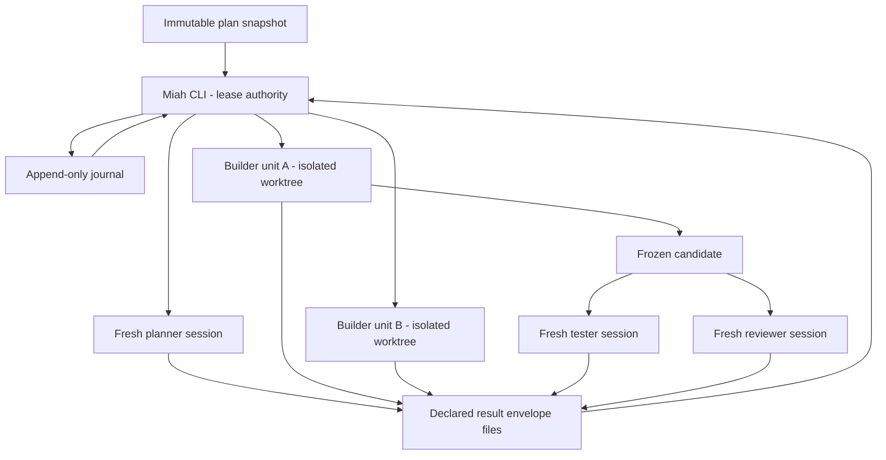

# Miah Runtime and Specialist Invocation - Plan

## Goal Capsule

- **Objective:** Decide D1, Miah's runtime and form factor, and D2, its specialist invocation mechanism, without deciding D3-D9.
- **Product authority:** `VISION.md` governs product behavior; `STRATEGY.md` supplies derived priorities; this contract supplies the approved D1/D2 direction.
- **Execution profile:** A standalone v1 CLI drives one immutable approved-plan snapshot through directly managed, isolated specialist sessions with bounded parallel dispatch.
- **Open blocker:** Live verification confirms Paseo v0.3.0-beta.2 has no per-agent duration, expiry, or budget bound; `--wait-timeout` stops only the waiter. The required mechanism is a daemon-enforced per-agent `max-duration`, modeled on Paseo schedules' existing `expiresIn`/`expiresAt` enforcement. This is feasible but unshipped, so admission must fail closed or D1/D2 must reopen until the feature exists.

---

## Product Contract

### Summary

Miah v1 is a standalone CLI/executable whose reconstructable supervisor core is the sole runtime authority.
It directly dispatches planners, builders, testers, and reviewers as isolated Paseo sessions, permits bounded parallel work only across dependency-ready units, and preserves one serialized journal authority.

### Problem Frame

Miah must recover from the death of any individual agent session or its own active process without losing workflow state, repeating an unsafe action, or confusing a specialist's claim with proof.
An agent or skill cannot own that promise because its conversation is session-bound.
A resident process alone does not solve it because memory disappears on failure.

Independence has the same structural problem.
Calling a session a tester or reviewer does not make it independent if it inherits the builder's context, authority, or mutable workspace.
The invocation mechanism must create separation that can be inspected after the fact.

### Key Decisions

- **CLI-only v1.** Governs R1-R3. (session-settled: user-directed — chosen over also shipping an agent-skill wrapper in v1: one surface keeps the unproven core narrow, while a wrapper can be added later without re-architecting because any host can drive the durable run.)
- **No observation-only sidecar.** Governs R4-R6. (session-settled: user-directed — chosen over the prior-art observer sidecar: it cannot stop runaway work, and a second long-lived process recreates the supervision regress D1 is meant to remove.)
- **Bounded parallel dispatch in v1.** Governs R12-R15. (session-settled: user-directed — chosen over prior art's sequential-only v1: `VISION.md` requires safe parallel work and progress for independent units.)
- **Miah directly owns specialist lifecycle.** Governs R7-R11, R21; specialists do not recursively create untracked workers.
- **Independence is a dispatch invariant.** Governs R9-R11; model-family diversity is defense in depth, not the definition of independence.
- **Parallel outcomes retain one journal writer.** Governs R15-R16; worker concurrency does not grant journal-write authority to specialists.

### Requirements

**Runtime authority and recovery**

- R1. Miah v1 must ship as one standalone CLI/executable surface, not as an agent, skill, daemon, or library-only product.
- R2. The CLI's supervisor core must reconstruct authoritative workflow state from the immutable plan snapshot and durable filesystem record rather than process memory or agent conversation state.
- R3. Every start or resume must acquire the run's single-writer lease, replay its durable record, reconcile previously dispatched sessions, and advance only from a recorded boundary.
- R4. Every specialist dispatch must record a hard acceptance deadline and require a Paseo daemon-enforced per-agent `max-duration`, modeled on schedules' existing expiry mechanism; until that feature ships, Miah must fail admission or reopen D1/D2.
- R5. If a specialist runs past its recorded deadline while Miah is dead, Miah must refuse all work produced after the deadline and terminate the specialist immediately on resume before deciding another transition; `--wait-timeout`, an in-memory timer, a heartbeat, or a prompt instruction does not satisfy R4.
- R6. After a crash, Miah must reconstruct agent lifecycle and work from the identity recorded before dispatch, the Paseo daemon's persisted agent record, durable activity and usage history, workspace state, and result/evidence files; missing expected records remain an explicit evidence gap and cannot support acceptance.

**Specialist creation and isolation**

- R7. Miah must directly create each planner, builder, tester, and reviewer as a separately addressable external agent session through a narrow Paseo lifecycle adapter; specialists may not recursively create untracked workers in v1.
- R8. Each planner must receive a fresh read-only session containing the immutable plan snapshot and bounded planning contract, with no authority to change scope, requirements, or acceptance criteria.
- R9. Each builder attempt must receive a fresh session, a dedicated worktree-isolated workspace, the authorized unit slice and dependencies, a bounded tool surface, and the applicable limits and result contract.
- R10. Each tester and reviewer must receive a new session with no builder conversation inheritance, a frozen candidate input, separate workspace and permissions, the authoritative unit contract, and Miah-harvested evidence.
- R11. Verification must begin with a blind first pass that excludes builder-authored persuasive narrative; labeled builder claims and provenance may be disclosed afterward for diagnosis without replacing the first-pass record.

**Parallel dispatch and dependency control**

- R12. Miah must support bounded parallel execution for units the planner marks independent; the recommended v1 concurrency-cap default is 1 so the mechanism is exercised while early runs remain simple, and D7 owns the final value.
- R13. The v1 dispatch primitive must be one asynchronous Paseo agent session per unit attempt, using a recorded unit-to-workspace mapping and a dedicated worktree-isolated workspace so concurrent builders cannot write to the same workspace.
- R14. A unit becomes dispatch-eligible only after every declared dependency reaches a terminal accepted state; completed, failed, paused, or rework states do not satisfy the gate.
- R15. The lease-holding Miah process must serialize concurrent lifecycle observations and outcomes into the canonical append-only journal.
- R16. Specialists must write file-based result envelopes to a declared path for Miah to read after termination and must never write canonical workflow state or journal entries directly; streamed or returned results are not durable because they can arrive while Miah is dead.

**Monitoring and assurance provenance**

- R17. Miah must record dispatch intent before creation, then record the returned agent and workspace identities before relying on the session.
- R18. Miah must monitor lifecycle, activity, usage, cancellation, and terminal status through the adapter and reconcile every nonterminal dispatch before creating a replacement after restart.
- R19. Agent lifecycle, stdout, chat history, logs, and self-reported completion must not advance workflow state without the required independent result and evidence.
- R20. Provider, model, session identity, workspace identity, and role must be recorded for every attempt; a checker's verdict has authority only after its profile clears the D5 calibration bar, cross-family contrast is only a hedge, and a criterion escalates to operator judgment when no profile clears the bar.
- R21. Miah must scope or disable Paseo MCP tool injection for every specialist dispatch so planners, builders, testers, and reviewers cannot access agent-orchestration tools or spawn further specialists; admission must fail when depth-1 delegation cannot be enforced.

### Actors

- A1. **Operator:** approves execution, resolves escalations, and approves or rejects final completion.
- A2. **Miah CLI:** owns the lease, dispatch eligibility, specialist lifecycle, reconciliation, and serialized journal writes.
- A3. **Planner:** derives bounded units, dependencies, and safe parallelism without changing approved intent.
- A4. **Builder:** implements one authorized unit attempt in its isolated workspace.
- A5. **Tester:** independently executes or evaluates the unit's verification work against the frozen candidate.
- A6. **Reviewer:** independently challenges conformity, evidence, and acceptance against the authoritative unit contract.
- A7. **Paseo:** supplies external session lifecycle and worktree primitives but never leads Miah's run state.

### Key Flows

- F1. **Start or resume a run**
  - **Trigger:** The operator invokes the CLI for a new or existing run.
  - **Actors:** A1, A2, A7
  - **Steps:** Miah acquires the lease, reconstructs state, reconciles recorded sessions and evidence, and stops on an unresolved conflict.
  - **Covered by:** R1-R6, R17-R19

- F2. **Prepare eligible work**
  - **Trigger:** Planning is required or accepted units unlock dependents.
  - **Actors:** A2, A3
  - **Steps:** Miah dispatches a fresh planner when needed, records the dependency graph, and marks only units satisfying R14 as eligible.
  - **Covered by:** R7-R8, R14, R17, R21

- F3. **Dispatch independent builders**
  - **Trigger:** Multiple units are eligible within the D7 concurrency cap.
  - **Actors:** A2, A4, A7
  - **Steps:** Miah creates separate worktree workspaces, records dispatch intents and identities, starts asynchronous sessions, and serializes observations as they arrive.
  - **Covered by:** R4-R5, R9, R12-R18, R21

- F4. **Verify a candidate independently**
  - **Trigger:** A builder candidate is frozen for checking.
  - **Actors:** A2, A5, A6
  - **Steps:** Miah launches fresh checker sessions on the frozen input, supplies authoritative criteria and harvested evidence, preserves the blind first pass, and records checker outputs separately from builder claims.
  - **Covered by:** R10-R11, R19-R21

- F5. **Recover an observation gap**
  - **Trigger:** The CLI restarts after a dispatch was active.
  - **Actors:** A2, A7
  - **Steps:** Miah reconciles lifecycle history, usage, results, and workspace state; it appends corroborated facts and records unknowns as evidence gaps.
  - **Covered by:** R3-R6, R16-R19

### Acceptance Examples

- AE1. **Covers R2-R6, R16-R19.** Given a specialist is active when the CLI dies, when its recorded deadline passes and the CLI later resumes, then Miah terminates the specialist, refuses to accept any work produced after the deadline, and reconciles its durable identity and artifacts before deciding the next transition.
- AE2. **Covers R12-R16.** Given two units are dependency-ready and within the cap, when both builders run concurrently, then they use different worktree-isolated workspaces and only Miah serializes their outcomes into the journal.
- AE3. **Covers R14.** Given unit U2 depends on U1 and U1 is complete but not accepted, when dispatch eligibility is evaluated, then U2 remains ineligible.
- AE4. **Covers R10-R11, R19.** Given a builder reports success, when testing begins, then the tester receives no builder conversation and evaluates the frozen candidate before any builder narrative is disclosed.
- AE5. **Covers R6.** Given the substrate and workspace cannot reconstruct what an agent did during a supervisor outage, when reconciliation completes, then Miah records an evidence gap and cannot accept the affected work from that record.
- AE6. **Covers R20.** Given no different-family reviewer is available, when a calibrated, structurally isolated same-family reviewer runs, then its provenance is recorded and its authority comes from calibration rather than being represented as cross-family corroboration.
- AE7. **Covers R20.** Given no checker profile clears the calibration bar for an acceptance criterion, when Miah reaches that criterion, then it escalates the judgment to the operator rather than deadlocking or granting an uncalibrated verdict authority.
- AE8. **Covers R21.** Given the daemon's global `daemon.mcp.injectIntoAgents` setting is enabled, when Miah prepares a specialist dispatch, then the specialist's effective tool surface excludes agent-orchestration tools or admission fails.
- AE9. **Covers R16.** Given Miah dies before a specialist terminates, when the specialist finishes, then its result envelope remains at the declared path for Miah to read after restart rather than being lost with a streamed return value.

### Alternatives Considered

**D1 alternatives**

- **Session-bound agent or skill:** rejected because its conversation would become unjournaled control state and its death could lose the supervisor loop.
- **Reusable skill wrapper around the CLI:** considered and deferred, not rejected or committed; any host can drive the durable run later, and omitting the wrapper keeps v1 to one surface while the core remains unproven.
- **Always-resident daemon as authority:** rejected because residence does not establish recovery and introduces another crash-sensitive authority; a later host may invoke the same reconstructable core.
- **Library-only component:** rejected because an unspecified caller would inherit lifecycle, operator, and single-writer responsibilities.

**D2 alternatives**

- **Native subagents in one harness session:** rejected because shared parent context and parent-session death undermine independence and recovery.
- **Lead planner recursively supervises workers:** rejected because lifecycle, limits, identity, and delegation would escape Miah's journal authority.
- **Permanent role-based worker pool:** rejected because persistent contexts accumulate contamination and add general orchestration machinery beyond one approved plan.
- **Different provider for every role as the independence rule:** rejected because model diversity does not prevent shared-context contamination; it remains optional defense in depth.
- **Observation-only sidecar:** deliberately diverged from prior art because it cannot stop runaway work and recreates the supervision regress; its evidence-continuity contribution is retained in R6.
- **Sequential-only v1:** deliberately diverged from prior art because `VISION.md:24` requires identification of safe parallel work and `VISION.md:30` requires independent units to continue safely.

### Prior-Art Cross-Check

The D1/D2 draft was completed before `docs/research/prior-art-paseo-supervisor.md` was opened.

**Agreements / corroboration**

- Both reject a prompt-only or session-owned supervisor and keep Miah, not Paseo, authoritative for run state.
- Both bind execution to an immutable plan snapshot, derive state from append-only history, and reconcile external lifecycle before advancing.
- Both use separately addressable Paseo sessions and workspaces rather than shared-context native subagents.
- Both separate agent lifecycle from work results and reject logs or a worker's final sentence as proof.
- Both require independent checking and recognize that cross-family contrast alone is insufficient assurance.

**Resolved conflicts**

- Prior art chose command plus skill; Miah v1 is CLI-only and defers the wrapper.
- Prior art required an observation-only sidecar; Miah omits it under R4-R6 and carries a reopen trigger if reconciliation cannot reconstruct the outage.
- Prior art chose sequential-only v1; Miah supports bounded parallelism under R12-R16. The prior-art digest itself marked sequential-only as a candidate for deliberate re-examination against VISION; this decision performs that re-examination.

- `prior-art adoption: none — every agreement above existed in the pre-cross-check draft; the three differing prior-art choices were resolved deliberately by the operator.`
- `prior-art divergence: omit the observation-only sidecar because it neither enforces dispatch bounds nor terminates the supervision regress; retain fail-closed evidence reconciliation and reopen if it proves insufficient.`
- `prior-art divergence: support bounded parallel dispatch because safe parallel work and progress-preserving escalation are VISION requirements; D7 owns only the concurrency cap.`
- `reopen trigger: reconsider a persistent observer or enforcement watchdog if reconcile-after-crash cannot reconstruct what a dispatched agent did during the supervisor outage.`

### Anti-Sycophancy Findings

Live verification resolved the Paseo substrate assumption: v0.3.0-beta.2 has no per-agent duration, expiry, or budget field on `agent run`, `agent update`, persisted agent records, or daemon configuration, and `--wait-timeout` bounds only the waiting CLI.
The same daemon-managed object layer already enforces schedule `expiresAt` and `maxRuns`, so a daemon-enforced per-agent `max-duration` is a precedent-backed feature ask rather than a new runtime architecture.
R4-R5 still block implementation readiness until that feature ships because a dead Miah cannot stop current agents; the exposure is bounded cost, not run correctness, because isolated workspaces and file-only results cannot write canonical run state.

The adversarial pass also changed or constrained the draft:

- "Stateless interpreter" was narrowed to a reconstructable core whose process memory is non-authoritative; external reconciliation and derived snapshots are real state.
- Fresh worktrees alone were rejected as proof of independence; R10-R11 require context, candidate, permission, and authority separation.
- Permanent redaction was rejected because it weakens custody; R11 uses blind-first evaluation followed by labeled disclosure.
- Different-family review was rejected as the definition of independence; R20 treats it as recorded defense in depth.
- The sidecar convergence was rejected because observation without enforcement does not close the crash window.
- Single-writer authority survived bounded parallelism by serializing outcomes through Miah; D4 must supply deterministic event ordering rather than granting workers write access.
- Streamed result delivery was rejected because Miah may be dead when a specialist finishes; R16 makes declared result files the durable handoff.
- Checker family was rejected as verdict authority; R20 requires a calibration bar and operator escalation when no profile clears it.

The agreements with prior art were independently earned: CLI authority follows from the resumability tension, append-only authority follows from VISION, external sessions follow from the allowed Paseo capability research, and independent checking follows directly from VISION and the context-isolation research.

**Question retained for planning:** What exact Paseo CLI/API contract will expose the daemon-enforced per-agent `max-duration` required by R4, and how will Miah keep admission closed until it is available?

### Scope Boundaries

**In scope**

- D1 runtime and v1 form factor.
- D2 specialist creation, role scoping, independence, monitoring direction, dependency gating, and parallel dispatch primitive.

**Deferred for later**

- The agent-skill wrapper is a possible later host, not a v1 commitment.
- A daemon or scheduler may later invoke the same CLI core but cannot become authoritative run state.
- D3 plan format, D4 journal schema, D5 evidence schema, D6 operator interaction details, D7 threshold values and concurrency cap, and D8 language/packaging/exact integration contracts.
- D9 plan-preflight checks and outcomes belong to Brainstorm 2.

**Outside this product's identity**

- Miah acting as an implementation, testing, or review agent.
- A general-purpose multi-project, multi-run, or recursive agent-orchestration platform.

### Forward References

- **D3:** Must make immutable snapshots, bounded unit slices, dependency declarations, and candidate inputs machine-addressable.
- **D4:** Must define lease behavior, serialized ordering for concurrent outcomes, unique event identity, dispatch intent/result boundaries, deterministic replay, and reconciliation records without granting specialists journal-write authority.
- **D5:** Must define file-based result envelopes, harvested evidence, blind-first verification records, checker calibration, model provenance, custody, and how an evidence gap blocks acceptance.
- **D6:** Must expose start, resume, status, stop, escalation, and approval through the CLI or a later non-authoritative host.
- **D7:** Must set per-agent duration values, the concurrency cap and its default after considering the R12 recommendation of 1, cancellation semantics, and calibration/escalation policy.
- **D8:** Must choose language and packaging, specify the Paseo per-agent `max-duration` feature contract required by R4, disable or scope MCP injection per R21, and plan integration of isolated unit outputs without parallel workspace collisions.
- **D9:** Admission must complete before Miah acquires the execution lease or dispatches any specialist. No preflight checks, severity behavior, or recurrence policy are decided here.

### Dependencies and Assumptions

- Paseo v0.3.0-beta.2 provides separately addressable asynchronous sessions, persistent daemon-owned agent records, durable inspection/activity data, and worktree-isolated workspaces, but no per-agent hard bound.
- The daemon persists agent lifecycle independently of Miah, so reconciliation can span a CLI outage; D4/D5 must still fail closed if an expected persisted record or result file is missing.
- The operator's daemon currently sets `daemon.mcp.injectIntoAgents: true`, so D8 must provide per-specialist tool scoping or disabling before depth-1 delegation is enforceable.
- Bounded parallel outputs can be integrated without shared-workspace writes; the integration mechanism is deferred to implementation planning.

### Outstanding Questions

**Resolve Before Planning**

- None for D1/D2 product direction.

**Deferred to Planning**

- What exact Paseo feature and CLI/API contract will deliver daemon-enforced per-agent `max-duration`? Feasibility is verified from the schedule-expiry precedent, but the agent feature is unshipped and admission remains closed until it exists.
- What event ordering and ingestion mechanism will D4 use to serialize outcomes arriving concurrently under R15?
- What exact missing persisted record or result file under R6 forces rework, re-verification, or operator escalation?
- What value will D7 set for the concurrency cap after evaluating the recommended v1 default of 1?
- Which role-to-provider/model defaults ship after D8 re-verifies the operator's current Paseo profiles?
- How will D8 override or scope the daemon's global MCP injection so specialist sessions cannot orchestrate agents?

### Sources and Research

- `VISION.md` — canonical runtime, independence, safe-parallel, recovery, and authority constraints.
- `STRATEGY.md` — durable execution, independent assurance, evidence trust, and operator-effort priorities.
- `docs/planning-brief.md` — D1/D2 decision questions, staging protocol, and forward-dependency boundaries.
- `docs/research/agent-orchestration-research.md` — deterministic control, durable execution, context isolation, external feedback, and failure modes.
- `docs/research/paseo-capabilities.md` — external sessions, asynchronous dispatch, worktree isolation, lifecycle inspection, and substrate gaps.
- `docs/research/ecosystem-grounding.md` — current operator role profiles and local Paseo environment.
- `docs/ideation/2026-08-05-open-ideation.html` — durable-run spine and mechanical-independence candidates challenged in this brainstorm.
- `docs/research/prior-art-paseo-supervisor.md` — staged predecessor read only after the draft, used for the explicit cross-check above.
- Live Paseo verification — checked 2026-08-06 against Paseo CLI v0.3.0-beta.2 and local daemon config, agent, and schedule stores under `~/.paseo/`; confirmed persistent agent lifecycle, absent per-agent bounds, waiter-only `--wait-timeout`, global MCP injection, and schedule expiry/max-run enforcement precedent.
