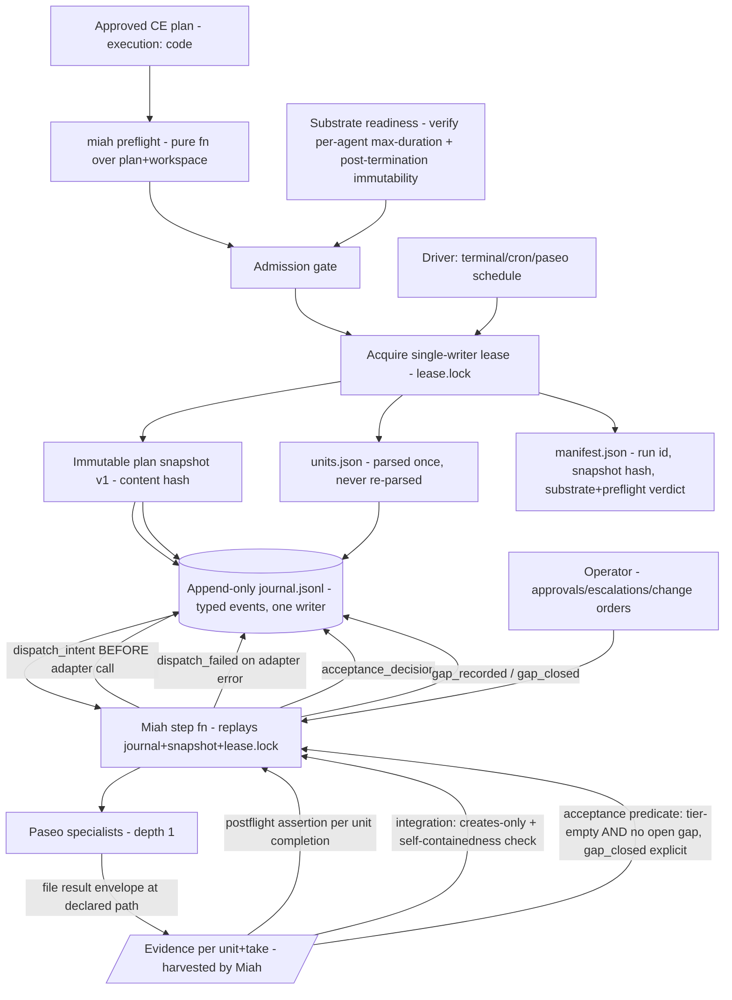

# Miah Plan, Journal, Evidence, and Preflight - Plan

## Goal Capsule

- **Objective:** Decide D3 (plan input format), D4 (journal and state schema), D5 (evidence contract), and D9 (plan preflight), without deciding D6, D7, or D8.
- **Product authority:** `VISION.md` governs product behavior; `STRATEGY.md` supplies derived priorities; the approved D1/D2 plan (`docs/plans/2026-08-06-001-feat-miah-runtime-specialist-invocation-plan.md`) supplies the runtime and substrate constraints these decisions build on. If anything here appears to conflict with `VISION.md`, the vision wins and the drift is surfaced.
- **Execution profile:** An approved CE plan becomes a content-addressed immutable snapshot in an out-of-tree, owner-only run directory; an append-only JSONL journal under a single lease-held writer makes Miah's supervisor state reconstructable from disk alone; specialists hand work to Miah through file-based result envelopes that Miah harvests; a pure plan-plus-workspace preflight function gates admission (together with a substrate-readiness probe), and a per-unit postflight assertion runs on each unit's completion.
- **Open blocker:** R4/R5 of the D1/D2 plan require a daemon-enforced per-agent `max-duration`; admission must fail closed until that mechanism is verified present, so the D9 admission gate is `preflight ∧ substrate-readiness` and never `preflight` alone.
- **Scope honesty:** Preflight rejects plans with absent or structurally inconsistent declared fields; it does not validate that a plan's units are semantically non-destructive. The judgment half of plan quality stays with the operator at the approval gate; a green preflight must not be allowed to feel like more assurance than it is (per `docs/ideation/2026-08-06-preflight-shaping.md` §"Scope limit").

---

## Product Contract

### Summary

The four durable artifacts Miah's reconstructable core rests on are the approved plan, the run journal, the evidence contract, and the admission gate. The plan is a CE `ce-unified-plan/v1` document carrying machine-parseable required fields; at admission, Miah copies it verbatim into an out-of-tree run directory, content-hashes it, and parses once into a cached machine view the entire run reads from (never re-parsing the markdown mid-run). The journal is a single append-only JSONL file of typed events under one lease-held writer; concurrent specialist outcomes live in separate result files until the lease holder serializes them into the journal — specialists never write journal or canonical state. Evidence is what Miah harvests from artifacts (diffs, exit codes, test outputs, usage deltas), never specialist prose; each artifact carries a hash-chained custody header anchored at harvest time; acceptance is a decidable predicate over gradeable evidence, and a criterion with an open evidence gap is mechanically unreadable as satisfied. The preflight command is a pure function over plan plus workspace with no run state; admission calls it plus a substrate-readiness probe and refuses on failure; per-unit completion runs a scoped postflight assertion (the `creates:` declaration plus an integration self-containedness check). The middle grading tier (`calibrated-judge`) is operator-assisted — the bar and the calibration corpus are operator-defined — not mechanical; this is the line where the D1-e principle (Miah's decisions are mechanical) hands to operator-delegated judgment and is recorded as such.

### Problem Frame

Miah's runtime decisions are mechanical (D1-e), so they must be made against artifacts whose structure is mechanical: a plan whose units carry stable IDs, declared dependencies, declared outputs, and per-criterion grading tiers; a journal whose entry types and ordering let a cold process rebuild the exact supervisor state; an evidence contract where "is this enough to accept" reduces to a clean read against declared tiers with no open gap. The shape has to survive four named failures: an adapter call that begins and fails before producing a durable handle (a `dispatch_intent` with no `dispatch_created`); a custody interval between specialist termination and Miah harvest where the workspace might not yet be frozen; a builder that completes a declared `creates:` artifact depending on smuggled-but-undeclared files in its worktree; and a plan whose units are individually well-formed but mutually destructive at the semantic level. The first three are closed mechanically by additions below; the last is not closable at admission and is owned honestly — preflight is structural and referential, the integration self-containedness check catches one mechanical projection of it, the reviewer catches another, and the residual lives with the operator at the approval gate.

### Key Decisions

- **D3 — Adopt the CE `ce-unified-plan/v1` convention with a Miah admission discipline layered on top; parse once at admission, cache the unit view, never re-parse the markdown mid-run.** Governs R22-R30.
- **D3 — Snapshot mechanics: content-hashable out-of-tree copy, not a git ref and not in the target workspace; change orders create a new snapshot version, never mutate the original.** Governs R23.
- **D4 — Single append-only JSONL journal under one lease-held writer; typed events with global monotonic sequence; the run store also includes `manifest.json` and `lease.lock`, and replay reads both; periodic state snapshots are an optimization that excludes raw contexts/secrets.** Governs R31-R42.
- **D4 — `dispatch_intent` is write-ahead and ambiguous alone; resume reconciles intent-without-`dispatch_created` against the adapter and explicitly appends `dispatch_failed` when no durable handle exists; gaps have a paired `gap_closed` event so "no open gap" is mechanical.** Governs R35-R36, R49.
- **D5 — Evidence is what Miah harvests from artifacts, never agent prose; custody is hash-chained from harvest and the T2-T3 (termination-to-harvest) interval integrity is bounded by a dual-hash check plus a substrate guarantee the readiness probe verifies.** Governs R43-R54.
- **D5 — `calibrated-judge` is an operator-assisted tier, not a mechanical one; the bar and calibration corpus are operator-defined, so D1-e's mechanical acceptance holds for the predicate structure (is there a pass above tier? with no open gap?) and not for the verdict the bar authorizes.** Governs R45-R46.
- **D9 — `miah preflight <plan>` is a pure function over plan plus workspace; admission calls it plus a substrate probe and refuses on failure; per-unit completion reuses the same referential logic at scope (`creates:` existence + integration self-containedness). Admission is not `preflight ∧ ...` until the substrate confirms per-agent `max-duration`.** Governs R55-R62.

### Requirements

The IDs continue from the D1/D2 plan (R1-R21). R22 onwards are introduced here; no D1/D2 requirement is modified.

**D3 — Plan input format**

- R22. Miah v1 must admit only CE `ce-unified-plan/v1` plan documents carrying `execution: code` in frontmatter; admission must reject `execution: knowledge-work` plans as out of scope for v1 (this is the recorded assumption matching D1/D2 A10, not a settled scope decision — see Outstanding Questions).
- R23. At admission Miah must canonicalize and copy the plan verbatim into an out-of-tree, owner-only run directory, compute the content hash of the canonicalized content, and record the hash plus source path and admission time in the run manifest; the snapshot must never be mutated in place, and a later approved change order must create a new snapshot version and a new manifest entry.
- R24. At admission Miah must parse the plan's Implementation Units into a machine-readable units view (`units.json`) keyed by U-ID, capturing per-unit `depends-on`, `creates:`, `inputs:`, and the per-criterion `tier:` of each acceptance criterion; the journal, dispatcher, and acceptance predicate must read this cached view and must never re-parse the plan markdown mid-run, so a parse-ambiguity at run time is impossible by construction (parse-once-and-cache principle).
- R25. Each Implementation Unit a Miah-admissible plan declares must carry a stable U-ID (numeric, ascending, gaps accepted, never renumbered), a `depends-on` list resolvable to other U-IDs (empty for roots), and an `Acceptance` block; admission must reject a unit missing any of these.
- R26. Each unit must declare a `creates:` field listing the repo-relative paths the unit promises to produce, even if empty, so absence is a finding rather than ambiguity; admission must reject a unit whose `creates:` field is missing.
- R27. Each unit must declare an `inputs:` field listing the repo-relative paths the unit consumes; admission must reject a unit whose `inputs:` field is missing (an empty `inputs:` is allowed, e.g., for a root unit building from scratch).
- R28. Each acceptance criterion must declare a `tier:` from the D5 grading ladder (`deterministic | calibrated-judge | human`); admission must reject any criterion with no tier or with an unrecognized tier.
- R29. The plan format must be statically checkable without dispatching any agent, acquiring a lease, reading run state, or building the target repo, so the same logic that gates admission can be invoked by the operator at drafting time.
- R30. Multiple units in the same plan version must not declare the same repo-relative path in `creates:`; admission must reject a plan with overlapping `creates:` declarations as a cross-unit creates conflict (a structural defect preflight can catch cheaply).

**D4 — Journal and state schema**

- R31. Miah's run state must live in an out-of-tree, owner-only run directory outside any worktree a specialist can write to; the directory must be `~/.miah/runs/<run-id>/` with `<run-id>` derived from the plan content hash and admission time.
- R32. The run store consists of the immutable plan snapshot (`plan-snapshot.<version>.md`), `manifest.json`, `units.json`, `journal.jsonl`, `lease.lock`, a `snapshots/` directory of periodic state files, and an `evidence/` directory keyed by `(unit, take, role)`; specialists may never hold the lease and may never write to any file in the run store.
- R33. The journal must be a single append-only file (`journal.jsonl`) of typed JSON events, one per line, each carrying a global monotonic `seq` number under the lease holder; `(run-id, seq)` uniquely identifies an event and replay is a linear scan from the latest snapshot through the tail.
- R34. Only the process holding the lease may append to the journal; concurrent specialist outcomes must be serialized by Miah from separately written result files into the journal, recording Miah's observation timestamp and a flag for outcomes that arrived during a supervisor outage (the journal durably records *Miah's processing order*, not the specialist's actual termination order across the outage gap — that ordering is unrecoverable).
- R35. The journal entry types must include: `run_start`, `lease_acquired`, `lease_renewed`, `lease_released`, `journal_snapshot`, `dispatch_intent`, `dispatch_created`, `dispatch_failed`, `dispatch_terminated`, `reconcile_record`, `evidence_harvested`, `result_envelope_observed`, `acceptance_decision`, `gap_recorded`, `gap_closed`, `rework_started`, `escalation_raised`, `escalation_resolved`, `operator_decision`, `amendment_applied`, `phase_transition`, `run_terminal`.
- R36. Miah must record `dispatch_intent` with sender role, unit id, take number, idempotency key, packet hash, deadline, and requested provider/model BEFORE the adapter call leaves; if the adapter call returns an error or no durable handle, Miah must append `dispatch_failed` shortly thereafter naming the failure reason and retaining the idempotency key so a retry is a new take; if the adapter succeeds, Miah must append `dispatch_created` carrying the actual agent id, workspace id, and base commit (read from git, not from intent), so the record is partly observed rather than wholly self-reported (per D1/D2 adversarial A6).
- R37. On every restart, Miah must identify every `dispatch_intent` whose `seq` is greater than the latest matching `dispatch_created`, `dispatch_failed`, or `dispatch_terminated` event; for each such intent, Miah must query the adapter for a handle with the matching idempotency key (or, if the adapter does not support idempotency-key lookup, by reason of the recorded target and packet hash): if a terminal session is found, append `dispatch_created` with the discovered identity followed by terminalization reconciliation; if a live session is found, append `dispatch_created` and resume polling; if no session is found and no `dispatch_failed` was journaled, append `dispatch_failed` and route the unit through rework or escalation. A `dispatch_intent` alone is never enough to advance the unit past dispatch.
- R38. On every restart with a non-terminal dispatch, Miah must append a `reconcile_record` summarizing lifecycle state read from the adapter, harvested artifacts if present, deadline status, and any evidence gap, before deciding the next transition; the resume semantics are replay-then-reconcile, never replay alone.
- R39. The lease must be a file (`lease.lock`) containing holder id, acquired-at, last-heartbeat-at, and heartbeat TTL; leaseholder identity is read from `lease.lock` on resume (the journal has lease events for audit but `lease.lock` is the authority for the current holder); a resumer takes the lease only on stale heartbeat past TTL plus a positive renewal attempt, never by stealing a fresh-heartbeat holder.
- R40. Miah must take the lease by an atomic file operation (temp-write-then-rename), heartbeat by rewriting the heartbeat field while holding the lease, and release by appending a `lease_released` event and marking `lease.lock` terminal; lease semantics must be portable to the operator's Windows 10 path and file model — no POSIX-only primitives may be load-bearing.
- R41. Miah must write a periodic state snapshot (`snapshots/state-<seq>.json`) every K journaled events (mechanism fixed, exact K deferred to D7); snapshots must store only derived state (decisions, IDs, statuses, hashes, references to evidence files), never raw tool inputs, full contexts, or specialist prose; any data excluded from snapshots (e.g., values matching operator-declared secret patterns in the manifest) must not be load-bearing for reconstruction.
- R42. Replaying `journal.jsonl` from the latest snapshot plus the tail, AND reading `lease.lock` for the current holder, must reconstruct the same supervisor-derived state every time, including unit acceptance decisions, in-flight intents (reconciled by R37), open evidence gaps (paired `gap_recorded`/`gap_closed` per R45), and run phase; the kill drill test must assert this property after a forced mid-run kill, including the intent-without-created case and the dead-past-deadline case.

**D5 — Evidence contract**

- R43. Specialists must write a result envelope as a single JSON file at a path the dispatch packet declares; the envelope must carry producer role, attempt id, take, self-claim (free-form text, never evidence), produced-file pointers with self-reported hashes, and a best-effort wall-clock estimate. The specialist's compliance with the declared path is a prompt instruction; if the envelope is absent at harvest the dispatch is not auto-failed but is recorded as the evidence gap named in R52 — the producer's not-writing is the failure that the gap mechanism exists to absorb (Miah treats the absence as a missing artifact, not as completion).
- R44. Miah must read the result envelope only after the adapter reports the specialist finished and only after deadline compliance is checked; an envelope produced after the recorded deadline must be refused per D1/D2 R5 and recorded as work-on-a-dead-dispatch (not admissible).
- R45. Miah alone must harvest evidence: the git diff of the workspace, the exit code and stdout/stderr of the verification contract commands Miah itself runs, the usage delta taken between pre-dispatch and post-termination adapter snapshots, and any result files the plan declares in `creates:` or `inputs:`; the envelope's self-reported file hashes are navigation hints, not authority. Every harvested artifact must carry a custody header (producer role, agent id, attempt id, take, harvest timestamp, hash) and be appended into a hash-chained custody sequence; a broken or missing custody chain is an evidence gap and must not support acceptance.
- R46. To close the integrity gap between specialist termination (T2) and Miah harvest (T3) when the substrate cannot guarantee post-termination workspace immutability, Miah must take a second workspace hash after harvest (or just before integration) and append a `custody_continuity_record` recording both hashes; if the two hashes differ, the harvest is recorded as an evidence gap (workspace was not frozen post-termination). The substrate readiness probe at admission must also verify (or honestly record the absence of) the Paseo guarantee that workspace state becomes read-only at terminal lifecycle status; a one-line caveat in the run manifest records the substrate's actual guarantee.
- R47. The D5 grading ladder must be `deterministic` (test/exit-code/schema/file/hash bits, highest authority), `calibrated-judge` (a reviewer profile whose verdict is an operator-assisted verdict — the operator defines the calibration corpus and the bar — that gains acceptance authority only when its calibration score clears the bar, never by family membership), and `human` (operator judgment, the natural fallback when no profile clears the bar or when the criterion declares `tier=human`). D1-e's mechanical-acceptance principle holds for the predicate structure (does a criterion have a pass at or above its declared tier with no open gap?); for the `calibrated-judge` tier, the pass itself is operator-assisted, not mechanically derived.
- R48. A checker profile must publish a calibration file of pre-labeled verdicts on example cases for the (provider, model, tier) triple; authority is granted only when the calibration clears the bar; v1 ships with profiles admitted at no verdict authority until the operator supplies calibration, with the default-empty corpus as the safer v1 posture. The bar's floor must be zero false-pass on the calibration corpus (no case where the profile passes a verdict that the labeled truth says should fail) plus an agreement threshold and a false-block cap; concrete numbers (>14/15 agreement, ≤2 false-blocks on a ≥15-case corpus are candidate defaults carried from prior art) are deferred to D7.
- R49. Verification must produce a structured verification record Miah writes (not the checker) containing the input packet hash, the blind-first-pass output recorded before any builder narrative disclosure, the disclosed-pass output recorded after disclosure (for diagnosis only), and the checker's provenance and calibration status; the blind-pass output is the one that carries verdict authority for the criterion (per D1/D2 R11).
- R50. A `gap_recorded` event and a paired `gap_closed` event must both be journal entry types; a gap is open from `gap_recorded` to `gap_closed` and the "no open gap" acceptance predicate is a mechanical read of paired entries; a `gap_closed` event must record the close reason (rework-take, re-verification-success, operator-approval, deadline-still-in-effect-cleared) so a problem cannot disappear silently (per `VISION.md`).
- R51. Acceptance of a unit must require, for every criterion on the unit, a passing evidence record at or above the criterion's declared tier with **no open evidence gap referencing that criterion**; if any criterion lacks a qualifying pass or carries an open gap, the unit must remain unaccepted and trigger bounded rework or an operator escalation.
- R52. If Miah cannot reconstruct work for a criterion — missing expected result file (including a missing envelope per R43), missing persisted record, broken custody chain, T2-T3 hash divergence per R46, or work produced after a passed deadline — Miah must record a `gap_recorded` event referencing `(unit, criterion, gap_reason)`; that criterion cannot transition to accepted until a `gap_closed` event succeeds the gap (rework, re-verification, or operator approval).
- R53. Tester-authored test code must by default be harvested evidence, not part of the unit's canonical deliverable; only paths the plan declared in the unit's `creates:` count as deliverable and are integrated into the canonical worktree when the unit is accepted. Per-unit delivvverability is a plan decision, not a runtime one.
- R54. When a unit's acceptance transition fires, Miah must run an integration self-containedness check: integrate only the accepted `creates:` files into a checkout of the canonical worktree and run the unit's verification contract commands; if any verification step fails because a `creates:` artifact depends on an undeclared file from the builder's worktree (an integration smuggle), Miah must record a `gap_recorded` event ("integration smuggle: undeclared dependency") and the unit cannot be accepted; the reviewer is not asked to regrade the unit for a mechanical integration failure.

**D9 — Plan preflight**

- R55. `miah preflight <plan>` must be a pure function over the plan artifact plus the workspace's current state; it must require no run state, no lease, no dispatched agents, no journal, and no records of prior runs; it must return a structured verdict listing failures by check class and the offending unit id (or "plan-level" for plan-wide failures).
- R56. Preflight must run three plan-and-workspace check classes:
  - **(a) Structural** — U-IDs present, unique, and ascending; `depends-on` resolves to real U-IDs; the dependency graph is acyclic; every unit carries an `Acceptance` block, `creates:` field (R26), and `inputs:` field (R27); every criterion carries a `tier:` from the D5 ladder (R28).
  - **(b) Referential** — every path a unit lists in `inputs:` resolves either to a path present in the workspace at preflight time, or to a path declared in `creates:` of a unit that is a transitive ancestor of the consuming unit in the `depends-on` closure (not merely a numerically earlier U-ID); and no two units in the plan version declare the same path in `creates:` (R30).
  - **(c) Verifiability** — every criterion declares a tier from the D5 ladder, so each criterion is gradeable.
- R57. Admission must call the same preflight implementation the operator calls at drafting time, plus a substrate-readiness probe that verifies (a) the Paseo daemon-enforced per-agent `max-duration` required by D1/D2 R4/R5 is present and reachable, and (b) the post-termination workspace immutability guarantee D5 R46 depends on (or honest record of its absence); admission must fail closed if either preflight or the substrate probe fails, and the run lease must not be acquired until both succeed.
- R58. Severity in v1 must be block-only: every preflight finding must be a refusal, with no warn-only dial and no per-check severity configuration; a finding dismissed by a hypothetical dial would re-emerge deep in the run, which is precisely what preflight exists to prevent. An operator who only wants a status without enforcement can run preflight directly without invoking admission.
- R59. A failed admission must not produce an in-place amendment of the snapshot; the operator must revise the plan, run preflight again, and submit a new snapshot; an approved change order after admission is a separate mechanism that creates a new snapshot version inside an already-running run.
- R60. Preflight does not validate semantic executability or plan correctness; a plan whose units are individually well-formed but mutually destructive at the semantic level (beyond the cross-unit creates conflict of R30 and the ancestor-resolution requirement of R56(b), which are the structural projections preflight does catch) passes preflight and is owned by the reviewer and the operator at the approval gate; a green preflight is a structural-and-referential green only.
- R61. On each unit's completion, Miah must run a scoped postflight assertion of the same referential logic as R56(b) limited to that unit: every path the unit declared in `creates:` must now exist in the post-completion workspace; a missing declared output is a deterministic mechanical failure (the artifact is not there) and must be recorded as an evidence gap and must block acceptance without spending reviewer budget on the more expensive "the artifact is wrong" question.
- R62. The postflight assertion is the v1 mechanism for catching per-unit staleness between admission and completion; no separate pre-dispatch preflight pass runs in v1. Under the admission-plus-postflight practice, the common case is covered (upstream units produce what they declared; downstream inputs resolve to those declarations or admission-time workspace paths; integration self-containedness catches smuggles). A pre-dispatch re-check is deferred to v2 if a real run hits external drift between units; not paid in v1.

### Actors

- A1. **Operator:** approves the plan (which becomes an immutable snapshot), approves change orders, resolves escalations, supplies/extends calibration corpora, approves or rejects final completion.
- A2. **Miah CLI:** owns the lease, runs preflight at admission, invokes the substrate probe, dispatches specialists, harvests evidence, evaluates the acceptance predicate, serializes outcomes into the journal, runs postflight assertions, writes the integration self-containedness check.
- A3. **Planner:** operates on the plan's own structure (via the cached `units.json`); produces its derived execution plan as a result envelope Miah reads (per D1/D2 R8).
- A4. **Builder:** writes a result envelope and changes inside its own worktree per `creates:`.
- A5. **Tester:** writes a result envelope (including any test code it produced) to its workspace; test code is harvested as evidence unless the plan declared it in the unit's `creates:`.
- A6. **Reviewer:** emits typed findings and a verdict to its result envelope; verdict authority is granted only by calibration, and for the `calibrated-judge` tier the bar is operator-assisted.
- A7. **Paseo:** supplies the durable dispatch handle, agent lifecycle records, worktree workspaces, usage snapshots, the daemon-enforced per-agent `max-duration` (once shipped), and (subject to verification) post-termination workspace immutability; never leads run state and never holds the lease.
- A8. **Run store:** the out-of-tree, owner-only filesystem control store (`~/.miah/runs/<run-id>/`) hosting manifest, snapshot versions, `units.json`, journal, lease, snapshots, and evidence; not an agent and not writable by specialists.

### Key Flows

- F6. **Preflight a plan (drafting time)**
  - **Trigger:** Operator runs `miah preflight <plan>` while drafting.
  - **Actors:** A2
  - **Steps:** Miah loads the plan, parses the CE-convention fields, walks the workspace, and emits verdicts for structural (R56(a)), referential (R56(b)), and verifiability (R56(c)) checks; no lease and no dispatch.
  - **Covered by:** R22-R30, R55-R60

- F7. **Admit a plan to a run**
  - **Trigger:** Operator runs `miah start <plan>` (or `miah run`) on an unstarted plan; admission required before any dispatch.
  - **Actors:** A2, A7, A8
  - **Steps:** Miah runs preflight (pure function), runs the substrate-readiness probe for per-agent `max-duration` and post-termination immutability (with honest record if absent), and only if both pass acquires the lease, parses units into `units.json`, copies the plan into the run store as an immutable snapshot, content-hashes it, writes the admission manifest, and appends `run_start` to the journal.
  - **Covered by:** R22-R24, R32-R33, R39-R40, R55-R59

- F8. **Reconcile a non-terminal dispatch intent after a supervisor outage**
  - **Trigger:** Miah restarts and the journal records a `dispatch_intent` with no matching `dispatch_created`/`dispatch_failed`/`dispatch_terminated`.
  - **Actors:** A2, A7, A8
  - **Steps:** Miah queries the adapter for the durable handle by idempotency key; if a terminal handle exists, appends `dispatch_created` and runs terminalization reconciliation; if a live handle exists, appends `dispatch_created` and resumes polling; if no handle exists, appends `dispatch_failed`. The reconcile_record covers intent-without-created; missing records become evidence gaps via R52.
  - **Covered by:** R33-R37, R42, R52

- F9. **Harvest evidence and run the postflight assertion for a unit's completion**
  - **Trigger:** A specialist terminates and the adapter's status is terminal.
  - **Actors:** A2, A8
  - **Steps:** Miah reads the result envelope (or records absence as evidence gap R43), harvests diff/test-output/usage-delta, takes the dual-hash for T2-T3 continuity (R46), computes custody hashes, runs verification contract commands itself, runs the postflight assertion that declared `creates:` paths exist (R61), and records `gap_recorded` entries for any missing output; the acceptance predicate is then evaluated against the harvested evidence and any open gaps.
  - **Covered by:** R43-R54, R61

- F10. **Evaluate acceptance and run the integration self-containedness check for a unit**
  - **Trigger:** Evidence harvested and postflight assertion complete for a unit.
  - **Actors:** A2, A8
  - **Steps:** For each criterion, Miah checks for a passing evidence record at or above the declared tier with no open gap; if all pass and the unit's run-phase is Implementing→Reviewing, Miah runs the integration self-containedness check R54; if both pass, Miah appends `acceptance_decision: accept`, opens a `gap_closed` event for any prior gap that the acceptance supersedes (with close reason), and integrates declared `creates:` paths into the canonical worktree; if any criterion lacks a qualifying pass OR the integration check fails, Miah appends `acceptance_decision: not_accepted` (or a `gap_recorded` integration-smuggle event) and routes the unit to bounded rework or an operator escalation per D7.
  - **Covered by:** R28, R43-R54

- F11. **Record and close an evidence gap**
  - **Trigger:** A harvested artifact is missing, a custody chain breaks, a T2-T3 hash diverges, or work is found past the deadline.
  - **Actors:** A2, A8
  - **Steps:** Miah appends a `gap_recorded` event referencing `(unit, criterion, gap_reason)`; the acceptance predicate treats any criterion with an open gap as failing; when the gap closes (rework, re-verification, or operator approval), Miah appends a `gap_closed` event with the close reason; the unit cannot transition to accepted while the gap is open.
  - **Covered by:** R35, R38, R50-R52

- F12. **Fail closed when a substrate promise is absent**
  - **Trigger:** Admission's substrate probe cannot confirm the daemon-enforced per-agent `max-duration` required by D1/D2 R4/R5 (or cannot honestly assert the post-termination immutability guarantee D5 R46 relies on).
  - **Actors:** A2, A7
  - **Steps:** Miah refuses to acquire the lease and returns a clear admission failure naming the missing mechanism; no partial run is created, no journal is opened.
  - **Covered by:** R57, R62

### Acceptance Examples

- AE10. **Covers R22-R30, R55-R60.** Given a CE plan where units U3 and U7 both declare `creates: ["src/foo.py"]`, when the operator runs `miah preflight <plan>`, then preflight returns a referential verdict naming both units with a cross-unit creates conflict and admission refuses to lease the run.
- AE11. **Covers R23, R32, R39-R40.** Given an admitted run whose lease holder is alive and heartbeating, when another process attempts to acquire the lease, then the second process fails to acquire the lease and leaves the holder's `lease.lock` untouched.
- AE12. **Covers R33-R42.** Given a supervisor mid-run with a dispatched builder, when the supervisor is forcibly killed and `miah run --once` resumes, then on resume Miah re-acquires the lease only after heartbeat expiry is detected, replays the journal from the latest snapshot plus the tail (and reads `lease.lock` for the holder), reconciles a `dispatch_intent` without `dispatch_created` by querying the adapter, refuses any work produced after the deadline, and continues from the exact recorded boundary; the kill drill asserts byte-identical supervisor-derived state after resume, including the intent-without-created case and the dead-past-deadline case.
- AE13. **Covers R36-R37, R52.** Given a builder whose `dispatch_intent` was journaled but whose adapter call failed before producing a durable handle (and Miah died before writing `dispatch_failed`), when Miah restarts, then Miah queries the adapter for the idempotency key, finds no handle, appends `dispatch_failed`, and routes the unit to rework or escalation without ever treating the orphan intent as a non-terminal dispatch that needs reconciliation as if it had been created.
- AE14. **Covers R45-R46.** Given a builder completes its unit and Miah takes a harvest-time hash followed by an integration-time hash, when the two hashes differ, then Miah records a `gap_recorded: T2-T3 continuity` event referencing the affected criterion and the unit cannot be accepted from that harvest; the substrate's post-termination immutability guarantee (or its honest-absence caveat) is visible in the run manifest.
- AE15. **Covers R47-R51.** Given a criterion declared `tier: calibrated-judge` and a reviewer profile that has not cleared the calibration bar, when that reviewer returns a pass, then Miah records the verdict as an ungraded input rather than an acceptance authorization and escalates the criterion to operator judgment rather than deadlocking or granting an uncalibrated verdict authority (mirrors AE7 of the D1/D2 plan).
- AE16. **Covers R44, R52.** Given a builder terminated after its recorded deadline passed while Miah was dead, when Miah resumes, then the result envelope is refused at harvest and a `gap_recorded: deadline-exceeded` event is recorded for the affected criterion, blocking acceptance until rework or operator approval.
- AE17. **Covers R53-R54.** Given a builder declares `creates: ["src/foo.py"]` but the file imports `src/_helper.py` that the builder wrote in its worktree without declaring in `creates:`, when the integration self-containedness check runs at acceptance, then the unit's verification commands fail in the integrated checkout, Miah records a `gap_recorded: integration smuggle` event, the unit cannot reach acceptance, and reviewer budget is not spent assessing whether the absent smuggled file is wrong.
- AE18. **Covers R53.** Given a tester authored a regression test file the plan did NOT declare in the unit's `creates:`, when the unit is accepted, then the test file is harvested as evidence and the acceptance record cites it, but it is not integrated into the canonical worktree as a unit deliverable.
- AE19. **Covers R50-R51, R61.** Given a builder completes a unit but a path declared in `creates:` does not exist in the worktree, when Miah runs the postflight assertion, then a `gap_recorded: missing declared output` event is recorded and the unit cannot reach acceptance; reviewer budget is not spent assessing whether the (absent) artifact is wrong; the gap closes only when a later take produces the path (re-verified by re-running the postflight assertion) or by operator approval which writes `gap_closed`.
- AE20. **Covers R57, R62.** Given the substrate probe cannot verify the daemon-enforced per-agent `max-duration`, when the operator runs `miah start <plan>`, then admission refuses to acquire the lease and returns an admission failure naming the missing mechanism; no journal is created.

### Alternatives Considered

**D3 alternatives**

- **A brand-new Miah-specific plan format:** rejected because the operator already drafts with the CE convention and `AGENTS.md` mandates it; a new format adds authoring mismatch and forces a translation layer that can hide meaning from the operator. Required fields are layered atop the CE convention as admission discipline, not as a new format.
- **Git ref as the immutable snapshot:** rejected because a git ref is mutable (rewritable history), the plan may live in a repo Miah cannot enforce immutability on, and run events would interleave with builder commits in the same repo history; a content-hashed copy in an out-of-tree store makes immutability enforceable without depending on the target repo's histories.
- **Snapshot stored inside the target workspace:** rejected per D1-g of the D1/D2 plan; a builder with write access to the tree could rewrite the plan or the journal.
- **`creates:` is optional, with forward references out of preflight scope:** rejected as the weaker-cheaper alternative recorded in `docs/ideation/2026-08-06-preflight-shaping.md` §"Alternatives"; without required `creates:`, referential checking could only be scoped to paths that exist at admission, and a unit referencing a path that a later unit promised to make would silently fail late. The authoring cost of declaring outputs is small, and the late-failure cost is high.
- **Re-parse markdown at every dispatch:** rejected (parse-once-and-cache principle) because a parse-ambiguity encountered mid-run (whitespace variation, encoding drift) would silently produce a different unit view from the one admission checked; caching `units.json` at admission makes the parse a one-time, auditable event the journal can reference by hash.

**D4 alternatives**

- **A single in-memory loop with snapshot by serialization:** rejected because process memory is not durable (D1-a); the journal must be the source.
- **One journal per unit (unit-scoped mini-runs) in v1:** considered and deferred; per-unit sub-journals and continue-as-new are v2 when run history grows.
- **Specialists write journal entries directly for their own outcomes:** rejected per D1/D2 R15/R16; specialists cannot hold journal authority, and serialized outcomes are what makes one writer consistent.
- **POSIX flock for the lease:** rejected because the operator's machine is Windows 10; R40 requires portable file-based heartbeat semantics.
- **Single-hash custody without a T2-T3 continuity check:** rejected after the adversarial pass; without it, the integrity void between specialist termination and Miah harvest rests on an unstated and unverified substrate guarantee.

**D5 alternatives**

- **Trust the result envelope's `done_claim` boolean:** rejected in the spirit of D1/D2 R19 and agent-orchestration §2.4; agent self-reports are inputs, not facts.
- **Harvest only on failure:** rejected; evidence must be harvested on every dispatch boundary so an empty harvest is itself a signal.
- **Cross-family verification as a tier-1 default:** rejected per D1/D2 R20; family membership is a hedge, not an authority; calibration grants authority.
- **Calibration corpus seeded with operator-judged examples or synthetic cases:** considered and deferred; v1 admits profiles at no verdict authority until the operator supplies a calibration file. Default-empty is the safer v1 posture.
- **Treat `calibrated-judge` as mechanical evidence (the draft's framing):** rejected after the adversarial pass; the bar and corpus are operator-defined, so a `calibrated-judge` pass is operator-assisted, not mechanically derived. D1-e's mechanical-acceptance principle is reframed to hold for the predicate structure, not for the verdict the bar authorizes at the middle tier.

**D9 alternatives**

- **One-time admission gate only, no postflight assertion:** rejected because per-unit-completion staleness is exactly what postflight catches cheaply, and the cheaper-mechanical-before-expensive-judgment split is too valuable to omit.
- **Pre-dispatch preflight per unit as a separate recurring pass:** considered, deferred to v2 per R62; under admission-plus-postflight (R61) plus the post-termination continuity and integration self-containedness checks (R46, R54), the common staleness case is covered.
- **Warn-only severity dial (warn vs block per check):** rejected for v1 (R58); a finding dismissed by a dial re-emerges deep in the run where it costs real budget, which is exactly what preflight is designed to prevent.
- **In-place amendment on failed admission:** rejected; a snapshot is immutable by `VISION.md`, so a failed admission rejects the snapshot wholesale; the operator revises and submits a new snapshot.
- **Standing preconditions as a first-class evaluated field rather than a postflight recurrence:** considered; `inputs:` is structurally a precondition declaration and is what preflight consumes. Promoting "preconditions" to a run-time supervisor-evaluated field is a superset, deferred to v2.
- **Treat preflight as a semantic executability validator:** rejected after the adversarial pass (the closing question); preflight validates structural and referential executability, not plan correctness. A green preflight is honestly labeled a structural-and-referential green only, not a plan-correctness green.

### Prior-Art Cross-Check

The D3/D4/D5/D9 draft was completed and frozen before `docs/research/prior-art-paseo-supervisor.md` was opened (frozen draft: `tmp/brainstorm-2-draft-pre-crosscheck.md`, git-ignored). The cross-check below concerns D3/D4/D5/D9 only; D1/D2-adjacent corroborations are context, not re-litigated.

**Agreements / corroboration (independent)**

- D3 immutable plan snapshot ↔ prior-art decision #4 ("bind each run to an immutable plan snapshot"). Same rationale, reached independently.
- D3 stable U-IDs, numeric ascending, gaps accepted, parsed once at admission into a machine view ↔ prior-art Step Extraction Contract. Same shape, reached independently.
- D4 append-only journal with derived status (snapshots on top, journal authority) ↔ prior-art #5 and #6 ("supervisor sole state authority"; "append-only journal with derived status; Paseo never leads run state"). Same rationale.
- D4 reconcile-after-restart (replay-then-reconcile handle intent-without-created) ↔ prior-art re-entry protocol. Same.
- D5 file-based result envelope (small JSON manifest + dedicated files, never parse logs or trust a worker's final sentence) ↔ prior-art delegated work result contract. Strong corroboration — two independent routes (D1/D2 derived it from detachable dispatch; prior art derived it from a control-plane/result-plane split).
- D5 independent audit required for completion (R47-R52) ↔ prior-art #7. Same.
- D5 calibration over cross-family contrast (R47-R48) ↔ prior-art #9. Same.
- D5 fail-closed on gap and unresolved uncertainty (R52, R57) ↔ prior-art #10. Same.
- D4/D5 hash-chain tamper evidence (R45) ↔ prior-art #12. Same.
- D9 substrate readiness + safety-configuration validation at admission (R57) ↔ prior-art #2 ("ship setup with supervision"). Same shape.

**Prior-art adoptions (things the draft did not have and is taking, with justification)**

- `prior-art adoption — parse-once-and-cache principle (R24).` The draft copied the plan at admission; the prior-art Step Extraction Contract specifies that admission parses `## Implementation Units` H3 headings (`U<number>. <title>`), numeric ascending, gaps accepted, required fields Goal/Files/Approach, deferred units excluded by title, and the result is stored as `steps.json` and never re-parsed mid-run. Adopted (under the name `units.json`) because it makes the parse a one-time auditable event and eliminates a class of mid-run re-parse-ambiguity bugs.
- `prior-art adoption — calibration bar defines a zero-false-pass floor plus agreement threshold plus false-block cap (R48).` The draft said "clears the bar" without defining the bar; prior-art #9 specifies zero false-pass on a 15-case corpus (≥14/15 agreement, ≤2 false blocks). The metric shape is adopted; concrete numbers (>14/15, ≤2 false-blocks on a ≥15-case corpus) are recorded as candidate defaults and deferred to D7 because D7 owns threshold values. Zero false-pass is falsification-floor discipline the draft lacked.
- `prior-art adoption — explicit run-phase FSM recorded as journal events (R35 includes phase_transition).` The draft enumerated journal events without recording the run's phase explicitly; prior-art's supervision lifecycle enumerated 9 phases (Admitting, Ready, Implementing, Reviewing, AwaitingApproval, StepComplete, Attention, Stopping, Complete). Adopted the *principle* of explicit phase transitions recorded as `phase_transition` events; the exact phase enum is deferred to implementation. Justification: makes the run's phase derivable and auditable, aids the operator status surface (D6), aligns with `VISION.md`'s run steps.

**D1/D2-adjacent corroboration (context for D8 planning, not adopted into D4/D5)**

- Prior-art #12 mentions "worker env scrubbed of secrets" alongside the hash-chain tamper evidence. The D1/D2 plan and this artifact do not adopt env-secret-scrubbing; it is a dispatch-configuration concern belonging to D2/D8 implementation. Recorded here so D8 planning can consider it.

**Resolved conflicts**

- None for D3/D4/D5/D9. Where the prior-art plan and this artifact diverge on D1/D2 specifics (sequential-only execution; command-plus-reusable-skill vs CLI-only), those conflicts were already resolved in the D1/D2 plan's cross-check and are not re-litigated here.

**Deliberate divergences**

- `prior-art divergence — postflight assertion per unit completion (R56/R61) is novel.` Prior art specifies admission-time validation only and does not address per-unit postflight. Miah adds it (derived from `docs/ideation/2026-08-06-preflight-shaping.md` §"postflight mirror", not from prior art) because it subsumes the common staleness case for free.
- `prior-art divergence — integration self-containedness check at acceptance (R54).` Novel to both the draft and prior art; arose in the adversarial pass (Probe-3) as the closes-known-mechanical projection of the "units individually well-formed but mutually destructive" semantic problem.
- `prior-art divergence — block-only severity in v1, no dial (R58).` Prior art does not discuss severity dials; this is a novel specification.
- `prior-art divergence — `creates:` required at admission (R26).` Prior-art's required-fields spec is Goal/Files/Approach; this is a stronger contract so forward-reference referential checking is possible.

### Anti-Sycophancy Findings

The anti-sycophancy skill (`C:\Users\rmicua\.agents\skills\heypogi\joel-salinas\anti-sycophancy\SKILL.md`) is installed on this machine, unlike Brainstorm 1's environment. The adversarial pass was therefore dispatched to a FRESH thinker subagent (`deepseek-v4-pro` for deliberate reasoning) that had not seen how the decisions were reached, and read only the frozen draft plus `VISION.md`, the D1/D2 plan, and the D1/D2 decision record. Its agreements count as INDEPENDENT (fresh context), with two caveats the subagent itself named: its PROBE-2 finding overlaps with D1/D2 adversarial A1 (no-progress detection not journal-derivable) since A1 was in the context it read, but its extension to the `dispatch_intent`-without-`dispatch_created` case is new; its PROBE-3 and PROBE-4 findings are independent (no prior treatment of the T2-T3 integrity gap or the `calibrated-judge`-as-judgment-laundry reframing appears in the supplied documents).

Probe-by-probe findings and the resolutions absorbed into the artifact:

- **PROBE-1 (D3/D9 circularity):** the subagent argued the preflight checks field presence, not field-value mutual destructiveness; specifically (a) two units both declaring `creates: ["src/foo.py"]` would pass structural and (b) an `inputs:` resolution to a `creates:` of a non-ancestor would pass referential. The strongest version of the closing question: "where is the MACHINE that catches a plan whose units are individually well-formed but mutually destructive?" Resolution absorbed:
  - R30 makes a cross-unit `creates:` conflict a referential preflight failure (closes (a) mechanically).
  - R56(b) clarifies that `inputs:` must resolve to a transitive ancestor's `creates:` (closes (b) mechanically).
  - R60 records honestly that preflight validates structural and referential executability only, not plan correctness; the residual is owned by the reviewer and the operator at the approval gate.
  - The Problem Frame now says a green preflight is not a correctness assertion.

- **PROBE-2 (journal reconstructability):** the subagent enumerated five holes; the load-bearing ones and their resolutions:
  - `dispatch_intent` without `dispatch_created` conflated failed-adapter-call with killed-mid-call → absorbed by R35 (`dispatch_failed` event type), R37 (resume reconciliation distinguishes the two by querying the adapter), R42 (kill drill asserts the case).
  - No `gap_closed` event → "no open gap" was implicit and violated `VISION.md`'s "problems cannot disappear silently" → absorbed by R50 (`gap_closed` event with close reason) and R51 (mechanical read).
  - Lease holder lived in `lease.lock`, not the journal, contradicting R39 of the draft → absorbed by R39 (clarified) and R42 (replay reads `lease.lock` explicitly).
  - Snapshot "secrets exclusion" lacked a definition → R41 sharpened to store only derived state (decisions, IDs, statuses, hashes, file references), never raw contexts or prose; D8 owns a secret-pattern list if needed.
  - Observation timestamp across the supervisor outage is recovery-time reconstruction → R34 records this honestly with an `observed_during_recovery` flag; the journal durably records Miah's processing order, not the unverifiable specialist finish order.

- **PROBE-3 (evidence contract without write-authority leakage):** three sub-finds:
  - Envelope path compliance is prompt-instructed, not enforced — same trust class the draft elsewhere rejects → absorbed by R43 being honest that "must" means prompt-instructed and that absence is the evidence gap named in R52, not auto-failure or auto-completion.
  - Integration smuggle: builder declares `creates: src/foo.py` which imports an undeclared `src/_smuggled_helper.py`; postflight would pass (foo.py exists), integration would copy only foo.py, downstream checkout would break → absorbed by R54 (integration self-containedness check at acceptance, recording `gap_recorded: integration smuggle` on failure).
  - Custody chain's T2-T3 (termination-to-harvest) interval is an integrity void unless the substrate guarantees post-termination immutability → absorbed by R46 (dual-hash continuity check plus substrate-readiness probe at admission, with honest record if the guarantee is absent) and R45's hash-chained custody beginning at harvest (still honest: end-to-end integrity requires the substrate guarantee, now verified, not silently assumed).

- **PROBE-4 (additional flaw not named by the commissioner):** the subagent argued the `calibrated-judge` tier is judgment laundry — the operator defines the calibration corpus and the bar, so a profile's verdict looks mechanical but is operator-judgment-by-proxy, contradicting D1-e's "Miah's decisions are mechanical." Resolution absorbed: R47 reframes `calibrated-judge` as operator-assisted (not mechanical); D1-e's principle explicitly holds for the predicate structure (does a criterion have a pass above its tier with no open gap?), not for the verdict the bar authorizes.

**Honest framing positions the adversarial pass hardened**
- Preflight is structural-and-referential, not semantic (R60, Problem Frame).
- `calibrated-judge` is operator-assisted, not mechanical (R47, Key Decisions).
- Custody covers T2-T3 only via dual-hash + substrate verification, not by assumption (R46).
- "No open gap" is mechanical via paired events, not implicit (R50-R51).
- "Must" on envelope path is prompt-instructed + absent-becomes-gap, not enforced authority (R43).

### Scope Boundaries

**In scope**

- D3 plan input format and admission-discipline fields (R22-R30); D4 journal and state schema, the run store layout, the kill drill acceptance, and the gap-closure pairing (R31-R42); D5 evidence contract, custody, grading ladder, calibration mechanism (with operator-assisted honesty), gap-blocks-acceptance, post-termination continuity, integration self-containedness (R43-R54); D9 preflight pure function, admission gate (with substrate readiness), per-unit postflight assertion, severity and resubmission policy, and honest scope-of-preflight framing (R55-R62).

**Deferred for later**

- D6 operator interface (commands, approval surfaces, escalation surfaces); D7 threshold values (snapshot cadence K, lease heartbeat TTL, calibration bar numbers, per-agent `max-duration` value, concurrency cap default, no-progress detection thresholds); D8 language/packaging/exact contracts.
- Sub-journals and continue-as-new for long run histories (v2). Pre-dispatch preflight recurrence (v2). Worker env secret-scrubbing (D2/D8 implementation consideration flagged in cross-check).
- Knowledge-work plans as an execution class (v1 scoping is assumed; the operator may widen; recorded as Outstanding Question).

**Outside this product's identity**

- Miah interpreting or authoring the plan; Miah acting as a reviewer with subjective verdict authority; a general-purpose, multi-project, or multi-run orchestration platform; a warn-only linter people read but enforcement skips.

### Forward References

- **D6 (operator interface):** Must expose `miah preflight`, `miah start`/`miah run`, `miah status` (which would surface the run-phase FSM recorded as `phase_transition` events per the prior-art-adopted R35 entry), `miah stop` (recorded as a journaled decision not a bare signal), `miah escalate`, and the final approval package. Operator-approved change orders (new snapshot version inside a running run) need a D6 interface built on the `amendment_applied` event.
- **D7 (thresholds and limits):** Must set the journal snapshot cadence K, the lease heartbeat TTL and lease deadline, the calibration bar numbers per grading tier (carrying prior-art candidate defaults: ≥15-case corpus, >14/15 agreement, ≤2 false-blocks, zero false-pass floor), the per-agent `max-duration` value, the concurrency cap default (recommended 1 per D1/D2 R12), and the no-progress detection thresholds (with D1/D2 A1's downtime ambiguity as input). R4/R5 admission-fail-closed dependency closes when D8 ships the per-agent `max-duration` substrate feature.
- **D8 (tech stack and delivery):** Must choose language/packaging, implement the portability R40 requires on Windows 10, ship the substrate probe for the Paseo per-agent `max-duration` AND the post-termination immutability guarantee (per R57; stale by one Paseo minor version per D1/D2 ecosystem-grounding §5, must be re-verified against v0.3.0-beta.2), implement the hash-chained custody layer and the integration step that moves accepted `creates:` paths from a unit worktree into the canonical worktree, and consider worker env secret-scrubbing on specialist dispatch (flagged in cross-check).

### Dependencies and Assumptions

- D1/D2 is settled: Miah is a standalone CLI whose reconstructable core is the sole runtime authority; specialists are independently dispatched Paseo sessions; results are file-based; check is blind-first; checker authority comes from calibration; depth-1 delegation only with MCP injection scoped off.
- The D1/D2 admission dependency on a daemon-enforced per-agent `max-duration` (R4/R5) is the same dependency D9's substrate probe satisfies: admission remains closed until verified.
- An operator-authored CE plan in `ce-unified-plan/v1` form is the input; Miah v1 consumes `execution: code` plans only (recorded assumption matching D1/D2 A10, not a settled scope decision — see Outstanding Questions).
- Paseo provides durable agent lifecycle records and `LastUsage` usage telemetry (PascalCase, deltas not cumulatives); per D1/D2 ecosystem-grounding §5 these need re-verification against v0.3.0-beta.2.
- Miah alone integrates accepted `creates:` paths into the canonical worktree; specialists write only inside their worktrees.
- The T2-T3 (termination-to-harvest) integrity gap is bounded by a dual-hash check plus (verified or honestly absent) substrate-immutability — not by assumption.

### Outstanding Questions

**Resolve before planning**

- None for D3/D4/D5/D9 product direction; the substrate probe lives at admission and the dependency is inherited from D1/D2.

**Deferred to planning**

- What numerics does D7 set for the snapshot cadence K, the lease heartbeat TTL, the per-agent `max-duration` value, and the calibration bar per grading tier (carrying prior-art candidate defaults)?
- What exact CLI/API contract will D8 expose for the substrate probe (queries Paseo daemon for per-agent `max-duration` readiness AND post-termination immutability)? Both must be re-verified against v0.3.0-beta.2.
- How does the operator seed the calibration corpus in v1 (supply a calibration file format; default-empty until supplied)?
- How are operator-approved change orders represented in manifest and journal — a new `plan-snapshot.<version>.md` plus an `amendment_applied` event, with re-preflight scoped to affected units? Direction recorded; D6 owns the interface, D4 owns the journal-side shape.

**Operator question (surfaced, not decided)**

- Whether v1 also supervises `execution: knowledge-work` plans. A10 of the D1/D2 decision record raised this; v1 is assumed scoped to `execution: code` on the same basis (the independence, custody, and integration machinery is code-shaped — diffs, worktrees, commits, test exit codes). The operator may widen the scope; the widening decision belongs to the operator, not to this brainstorm.

### Sources and Research

- `VISION.md` — immutable snapshot, append-only journal, durable filesystem state, validate for executability, escalate without blocking unrelated work.
- `STRATEGY.md` — durable execution and recovery, independent assurance, corroborated proof rate.
- `docs/planning-brief.md` — D3/D4/D5/D9 questions, staged prior-art protocol, preflight candidate direction.
- `docs/plans/2026-08-06-001-feat-miah-runtime-specialist-invocation-plan.md` — settled D1/D2 constraints these decisions build on (R1-R21, out-of-tree control store, single-writer journal, file-based results, blind-first verification, calibration over family, depth-1 delegation, admission hard-bound on per-agent max-duration, crash recovery drill).
- `docs/decisions/2026-08-06-d1-d2-runtime-and-agent-invocation.md` — D1-a..g, D2-a..k and adversarial findings A1-A10 carrying into the artifact decisions, especially A6 (record partly observed not self-report), A10 (`execution: code` assumption).
- `docs/research/agent-orchestration-research.md` — durable execution mechanisms (WAL + snapshots, idempotency, lease, reconcile-on-resume), grader triage (deterministic > LLM-judge > human), evaluator failure modes, recovery pitfalls (resume path bugs), no-progress-detection subtleties.
- `docs/research/paseo-capabilities.md` — output-schema and result-file precedent, agent lifecycle durability, MCP injection considerations.
- `docs/research/ecosystem-grounding.md` — CE `ce-unified-plan/v1` convention and bounded-unit packet, the operator's role→model preferences, existing evidence conventions, v0.2.3 → v0.3.0-beta.x re-verification caveat.
- `docs/ideation/2026-08-05-open-ideation.html` — durable-run spine (survivor 1), evidence spine (survivor 2), and amendment path (survivor 4) frames.
- `docs/ideation/2026-08-06-preflight-shaping.md` — preflight candidate shape, recurrence question, postflight mirror, alternatives to weigh, "Scope limit worth keeping in view" (preflight catches unexecutable, not wrong). Discussion input only, not authority.
- `docs/research/prior-art-paseo-supervisor.md` — staged prior-art digest, opened only after the draft was frozen (per protocol); adoptions recorded inline in the Prior-Art Cross-Check section.
- Anti-sycophancy adversarial pass — dispatched to a fresh thinker subagent against the frozen draft; findings absorbed per the Anti-Sycophancy Findings section. The draft itself is preserved at `tmp/brainstorm-2-draft-pre-crosscheck.md` (git-ignored; recorded here for audit-trail honesty about the pre-cross-check state).