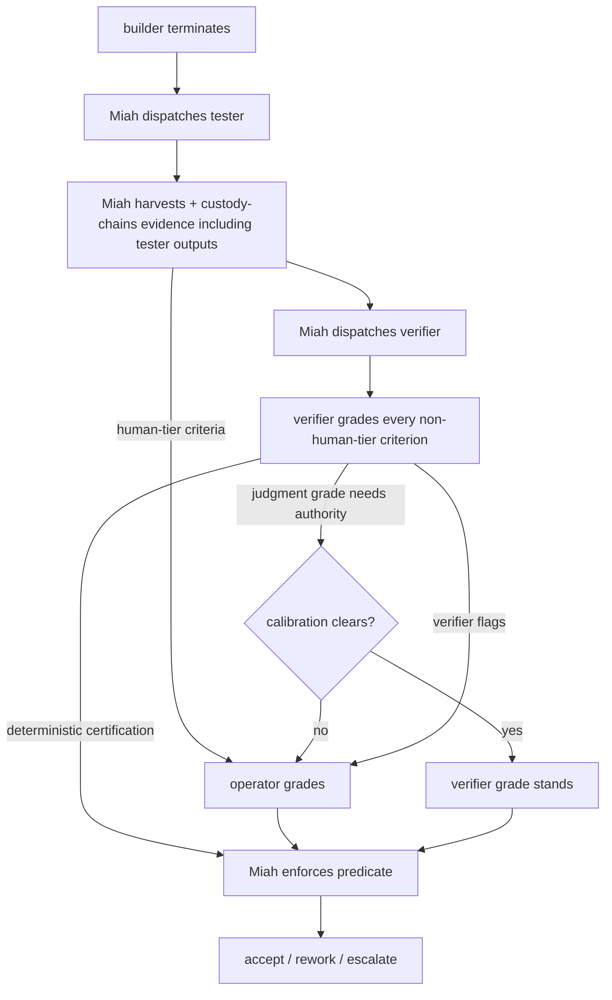

# Independent Verifier Role - Plan

## Goal Capsule

- **Objective:** Move grading out of Miah into a dedicated verifier specialist (operator-graded when verification warrants human judgment), with verification contracts generated up front and frozen before implementation begins.
- **Product authority:** `VISION.md` steps 2, 5-7 (updated 2026-08-09); `STRATEGY.md` Independent assurance track.
- **Open blockers:** None. Two confirmed scope defaults: deterministic certification needs no calibration authority; contract presence is enforced, contract quality is gated only by operator approval.

---

## Product Contract

### Summary

Miah stops judging. A verifier specialist grades every non-human-tier acceptance criterion — deterministic and calibrated-judge — against the harvested evidence, and the operator grades anything that warrants human judgment. Verification contracts are drafted by the planner at plan-prep and approved with the plan, frozen before any builder works.

### Problem Frame

Today Miah both senses and judges: it runs the verification-contract commands and mechanically grades deterministic criteria from exit codes (`src/grading.ts:133-141`), while a separate reviewer grades judgment criteria with calibration-gated authority. The operator's research (atlas agentic-loop work) says the controller that decides should not be the mechanism that judges: the verifier is a distinct mechanism, the checker must not be the maker, and "a verifier that always passes is worse than no verifier." Concentrating judgment in the orchestrator also means Miah's own evidence discipline is applied by a single party with no second set of eyes. Contracts authored after implementation let the checks chase the work; the checks must exist and freeze before the maker starts.

### Key Decisions

- KD1. **Verifier grades every non-human-tier criterion — deterministic and calibrated-judge** (session-settled: user-directed — chosen over verifier-for-judgment-only and deterministic-mechanical-plus-human-judgment: grading is the verifier's job, not Miah's). Governs R1-R4.
- KD2. **Miah senses, verifier judges** (session-settled: user-directed — chosen over the verifier running the checks itself and over operator-authored frozen checks with a judgment-only verifier: keeps the sensor observable and custody-chained without losing verifier independence). Governs R2, R3, R15.
- KD3. **Reviewer merged into verifier** (session-settled: user-directed — chosen over keeping the reviewer separate for conformity assessment: one checker role, fewer per-unit dispatches; conformity assessment is part of grading). Governs R12-R14, R17.
- KD4. **Human grading when tiers declare it or the verifier flags it** (session-settled: user-directed — chosen over tier-only and verifier-discretion-only: up-front declaration plus runtime discretion). Governs R5-R7, R16.
- KD5. **Contracts drafted by the planner at plan-prep, operator-approved with the plan, required per unit** (session-settled: user-directed — chosen over planner-only and operator-authored: operator control without the authoring burden; fail-closed admission). Governs R8-R11, R15.
- KD6. **Deterministic certification needs no calibration authority** (session-settled: user-approved — agent proposed, operator assented: custody already proves evidence integrity; calibration gates judgment grades only). Governs R3.

### Actors

- A1. **Operator** — approves the plan (including verification contracts), grades human-warranted criteria, resolves escalations, final approval.
- A2. **Planner** — drafts per-unit verification contracts at plan-prep.
- A3. **Builder** — implements units in isolated worktrees.
- A4. **Tester** — evaluates completed work independently; test code remains evidence, never a deliverable.
- A5. **Verifier** — assesses output, evidence, and conformity with the approved plan; grades every non-human-tier criterion; may flag criteria for human judgment.
- A6. **Miah** — runs the frozen contract commands (sensor), harvests and custody-chains evidence, enforces the acceptance predicate, routes rework and escalation; never grades.

### Requirements

**Grading ownership**

- R1. The verifier grades every acceptance criterion on a unit except those declared `human` tier — deterministic and calibrated-judge — against the harvested evidence; `human`-tier criteria go to the operator from the start (R5, R16). Miah itself produces no grades; the only grading inputs to the acceptance predicate are verifier grades and operator grades (R5-R7).
- R2. Miah never grades: it runs the unit's frozen verification-contract commands as the sensor, harvests and custody-chains evidence, enforces the acceptance predicate, and routes accept / bounded rework / escalation, but makes no pass/fail judgment itself.
- R3. The verifier certifies deterministic criteria from the mechanical evidence — contract commands all-passed, evidence genuine and complete — with no calibration authority required; certification is a completeness/genuineness check over custody-verified artifacts.
- R4. The verifier's judgment grades carry authority only when its profile clears the calibration bar (the operator-configured bar — defaults corpus ≥ 15, agreement > 14/15, false-blocks ≤ 2 — with the unconditional zero-false-pass floor; `src/calibration.ts:108-150`); otherwise the criterion is ungraded and escalates.

**Human grading**

- R5. Criteria declared `human` tier in the plan are graded by the operator from the start.
- R6. The verifier may flag any criterion — including a deterministic one whose evidence it judges complete but materially inadequate — as warranting human judgment; the criterion escalates to the operator and blocks until resolved.
- R7. An operator grade resolves any criterion awaiting human judgment — tier-declared (R5), verifier-flagged (R6), or left ungraded because the verifier's profile did not clear the bar (R4) — and closes the escalation.
- R16. A `human`-tier criterion is satisfied only by an operator grade; the acceptance predicate's at-or-above-tier substitution (deterministic > calibrated-judge > human) does not apply to `human`-tier criteria.

**Verification contracts**

- R8. At plan-prep, the planner drafts a verification contract for every unit — the frozen checks the work will be graded against — before any implementation begins.
- R9. The operator approves the contracts as part of plan approval; contracts ride in the immutable plan snapshot.
- R10. A unit whose verification contract is absent or empty (zero commands) at approval fails admission (fail-closed).
- R11. Changing a unit's verification contract after approval is a scope change and requires operator approval.
- R15. The sensor's commands are sourced from the approved unit's frozen verification contract in the immutable plan snapshot, not from a runtime default, and are supplied through the existing `verificationCommandsFor` seam.

**Roles and authority**

- R12. The reviewer role is merged into the verifier: the verifier assesses output, evidence, and conformity with the approved plan, and grades every non-human-tier criterion.
- R13. The verifier is read-only, dispatched per unit against the frozen-candidate worktree and the harvested evidence package, with the same independence guarantees specified for today's checkers (fresh context, isolated worktree, no run-store writes; `docs/plans/2026-08-06-001-feat-miah-runtime-specialist-invocation-plan.md` R10), and inherits the reviewer's read-only authority bounds (`src/packet.ts:42-54`).
- R14. The verifier follows the D8-i role→model convention (`docs/architecture/design-decisions.md`; defaults at `src/types.ts:316-324`): audit paseo role, operator's orchestration-preferences override, defaults replacing the reviewer's entry.
- R17. `verifier` replaces `reviewer` as a specialist role identifier. Existing journals and snapshots containing `reviewer` remain readable and replayable; the `Reviewing` phase name is unchanged. The rename updates `SpecialistRole` (`src/types.ts:306`), the `D8I_ROLE_DEFAULTS` key (`src/types.ts:316-324`), and the read-only authority test (`src/packet.ts:44`); the corresponding prose in `docs/architecture/design-decisions.md` §14 and `docs/architecture/state-machine-reference.md:19` is updated to match.

### Key Flows

- F1. Per-unit verification (after a builder terminates):
  - **Trigger:** Builder termination is detected by the step loop.
  - **Actors:** Miah, tester, verifier, operator (when a criterion warrants human judgment).
  - **Steps:** Miah dispatches the tester against the frozen candidate; after the tester finishes, Miah harvests the evidence package (diff vs base, contract-command results, tester outputs, envelope, usage delta) and custody-chains it; Miah dispatches the verifier with the package, the frozen contract, and the unit's criteria; the verifier grades every non-human-tier criterion and returns its envelope; Miah enforces the acceptance predicate; route accept / bounded rework / escalate — human-warranted criteria wait for the operator. Tester dispatch is pre-existing product scope specified in `docs/plans/2026-08-06-001-feat-miah-runtime-specialist-invocation-plan.md` R10/A5 and is not yet implemented — `src/step.ts:548-554` currently harvests the builder envelope and runs acceptance directly, with no tester or reviewer dispatch. This feature does not build tester dispatch; the verifier dispatch occupies the position the reviewer dispatch was specified to hold in the `Reviewing` phase (`src/fsm.ts:16`).
  - **Covered by:** R1-R7, R13, R15-R17.

- F2. Contract generation at plan-prep:
  - **Trigger:** Planner prepares execution for an approved plan.
  - **Actors:** Planner, operator.
  - **Steps:** The planner drafts each unit's verification contract; the operator approves them with the plan; contracts freeze in the immutable snapshot; admission refuses any unit without one.
  - **Covered by:** R8-R11, R15.

### Acceptance Examples

- AE1. **Deterministic + judgment criteria, profile cleared.** A unit's deterministic criterion is certified from all-passed contract evidence; its judgment criterion is graded with a cleared-profile verdict. Predicate passes; unit accepted. **Covers R1, R3, R4.**
- AE2. **Profile not cleared.** Default-empty corpora: the judgment criterion is ungraded and escalates; deterministic criteria still certify. The unit blocks until the operator grades. **Covers R4, R7.**
- AE3. **Verifier flags a criterion.** The verifier judges a criterion warrants human judgment (e.g., high-severity impact); the run escalates and pauses in Attention until the operator resolves. **Covers R6, R7.**
- AE4. **Contractless unit.** The plan admits a unit without a verification contract; admission is refused, naming the unit. **Covers R10.**
- AE5. **Mid-run contract change.** A contract change is requested after approval; it is refused as a scope change until the operator approves it. **Covers R11.**
- AE6. **Human-tier criterion.** A `human`-tier criterion is graded by the operator; at-or-above-tier substitution cannot satisfy it, and the unit passes with the operator grade. **Covers R5, R7, R16.**
- AE7. **Miah senses without grading.** Miah sources and runs the approved unit's frozen contract commands, harvests and custody-chains the resulting evidence, and — given a verifier `fail` grade on one criterion — records a not-accepted predicate decision and routes bounded rework, without producing any grade of its own. **Covers R2, R15.**
- AE8. **Single verifier role and model routing.** A unit is verified by a single read-only verifier dispatch using the `audit` paseo role from the D8-i defaults, with no separate reviewer dispatch; an operator orchestration-preferences override takes precedence. Existing journals and snapshots carrying `role: "reviewer"` remain readable and replayable, and the phase remains named `Reviewing`. **Covers R12-R14, R17.**

### Scope Boundaries

- **Deferred:** a ground-truth benchmark pool scoring the verifier layer's stack false-pass rate (atlas verifier-benchmark-recipe). The calibration bar remains the authority mechanism; benchmarking the stack is future work.
- **Deferred:** contract-quality scoring. Fail-closed enforces contract presence, not quality; operator review at plan approval is the only quality gate.
- **Outside:** tester role redesign; changes to Miah's custody-chaining primitives and hash-chain mechanics. In scope: supplying the snapshot's frozen contract commands to the existing `verificationCommandsFor` seam, and composing the verifier's evidence package from already-harvested per-role artifacts (`src/evidence.ts:355-385`). The integration self-containedness check (`docs/plans/2026-08-06-002-feat-miah-artifacts-plan.md` R54) remains outside — it re-runs the frozen contract in the canonical checkout and stays Miah's mechanical duty (sensing, not grading).

### Dependencies / Assumptions

- Calibration corpora remain operator-supplied at the config calibration path; default-empty means no verifier judgment authority until supplied (existing fail-closed behavior carries over).
- The verifier-flag escalation reuses the existing escalation machinery (stable esc-<seq> id, Attention pause, resolve) with a new reason; no new mechanism.
- The tester's role is unchanged; when tester outputs are present in the evidence package, the verifier grades them among the other evidence (see the sequencing dependency below).
- Sequencing dependency: F1 assumes tester dispatch lands separately. If it has not landed when this feature is implemented, the verifier grades an evidence package containing no tester outputs; the plan's requirements hold unchanged in that case.
- The evidence package contents (exact artifacts the verifier receives) and the envelope's per-criterion grade shape are planning decisions.
- Verified code anchors for planning: current deterministic grading `src/grading.ts:133-141` (to be replaced by enforcement); sensor `src/evidence.ts:365-377`; `verificationCommandsFor` default `src/step.ts:95-96`; role→model defaults `src/types.ts:316-324`; calibration bar `src/calibration.ts:108-150`; authority bounds `src/packet.ts:42-54`; escalation ids `src/escalation.ts:89-103`.

### Outstanding Questions

- **Deferred to planning:** which artifacts compose the verifier's evidence package (raw tester output vs Miah's harvested record).
- **Deferred to planning:** the result-envelope shape for per-criterion grades (each grade's basis and evidence pointer).
- **Deferred to planning:** escalation reason naming and payload for verifier flags.
- **Deferred to planning:** the verification-contract artifact shape (commands, and whether criterion→command mapping and tier declarations are part of the contract) and its location in the immutable plan snapshot.

### Sources / Research

- Atlas feedback-control concept (sensor/verifier/controller separation): `C:\Users\rmicua\myrepo\atlas\spaces\ai_lab\wiki\concepts\feedback-control-model-for-agent-loops.md`
- Atlas first-loop-program (freeze the checker, maker-checker at design time): `C:\Users\rmicua\myrepo\atlas\docs\howto\first-loop-program.md`
- Atlas verifier-benchmark-recipe (verifier-layer quality evidence): `C:\Users\rmicua\myrepo\atlas\docs\howto\verifier-benchmark-recipe.md`
- Product grounding: `VISION.md` (steps 2, 5-7), `STRATEGY.md` (Independent assurance), updated 2026-08-09.
