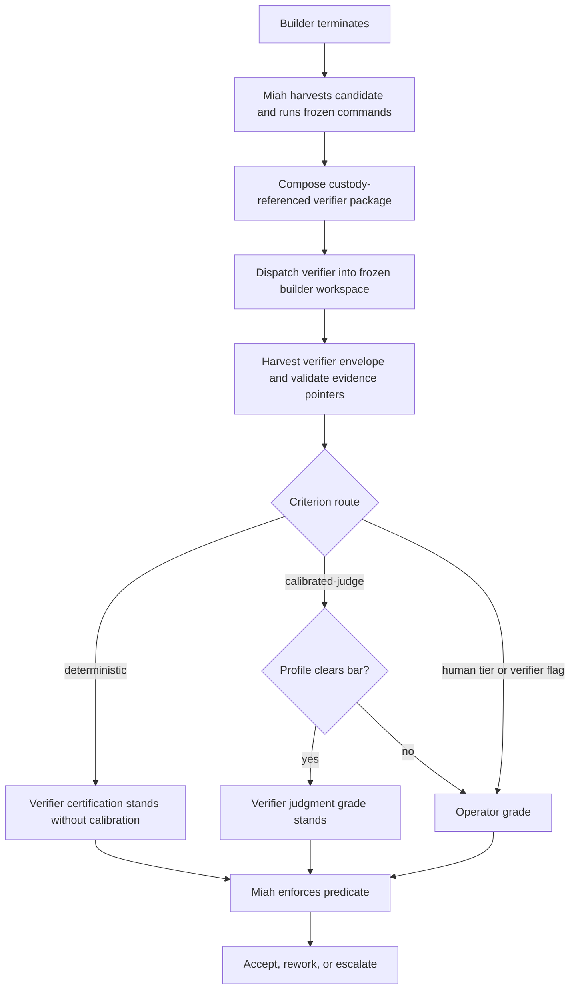
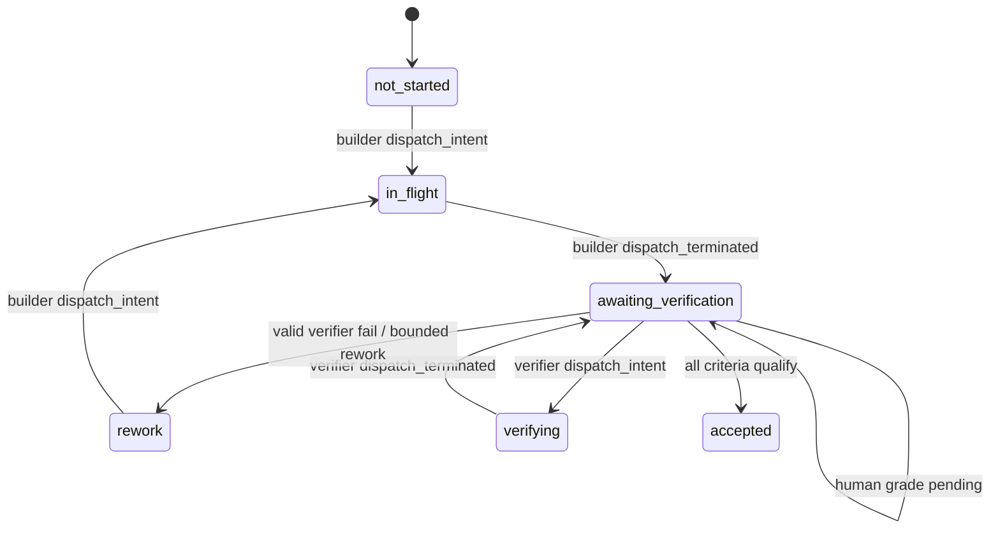

# Independent Verifier Role - Plan

## Goal Capsule

- **Objective:** Move grading out of Miah into a dedicated verifier specialist, route human-warranted criteria to the operator, and freeze planner-authored verification contracts before builder work begins.
- **Product authority:** `VISION.md` steps 2 and 5-7 govern; `STRATEGY.md` supplies the Independent assurance track; the Product Contract below preserves KD1-KD6 and R1-R17 from the requirements-only origin.
- **Execution profile:** Deep, cross-cutting TypeScript change across plan parsing, durable replay, specialist dispatch, evidence custody, grading authority, operator resolution, tests, and maintained architecture documentation.
- **Stop conditions:** Stop rather than inventing behavior if implementation would require changing KD1-KD6, building tester dispatch, weakening fail-closed contract admission, changing the hash-chain custody model, or allowing Miah to synthesize a grade.
- **Tail ownership:** The implementing workflow owns code, tests, documentation, and full-suite verification; the operator retains plan approval, human criterion grades, escalation resolution, and final completion approval.
- **Product Contract preservation:** Product Contract unchanged from `docs/plans/2026-08-09-001-feat-independent-verifier-role-plan.md`; its four planning questions are resolved in KTD1-KTD7 without changing product scope.

---

## Product Contract

### Summary

Miah stops judging. A verifier specialist grades every non-human-tier acceptance criterion - deterministic and calibrated-judge - against the harvested evidence, and the operator grades anything that warrants human judgment. Verification contracts are drafted by the planner at plan-prep and approved with the plan, frozen before any builder works.

### Problem Frame

Today Miah both senses and judges: it runs the verification-contract commands and mechanically grades deterministic criteria from exit codes (`src/grading.ts:133-141`), while a separate reviewer is specified to grade judgment criteria with calibration-gated authority. The controller that decides should not be the mechanism that judges. Concentrating grading in the supervisor gives Miah's evidence discipline no independent second set of eyes, while contracts authored after implementation let checks chase the work instead of freezing the target before the maker starts.

### Key Decisions

- KD1. **Verifier grades every non-human-tier criterion - deterministic and calibrated-judge** (session-settled: user-directed - chosen over verifier-for-judgment-only and deterministic-mechanical-plus-human-judgment: grading is the verifier's job, not Miah's). Governs R1-R4.
- KD2. **Miah senses, verifier judges** (session-settled: user-directed - chosen over the verifier running the checks itself and over operator-authored frozen checks with a judgment-only verifier: keeps the sensor observable and custody-chained without losing verifier independence). Governs R2, R3, R15.
- KD3. **Reviewer merged into verifier** (session-settled: user-directed - chosen over keeping the reviewer separate for conformity assessment: one checker role, fewer per-unit dispatches; conformity assessment is part of grading). Governs R12-R14, R17.
- KD4. **Human grading when tiers declare it or the verifier flags it** (session-settled: user-directed - chosen over tier-only and verifier-discretion-only: up-front declaration plus runtime discretion). Governs R5-R7, R16.
- KD5. **Contracts drafted by the planner at plan-prep, operator-approved with the plan, required per unit** (session-settled: user-directed - chosen over planner-only and operator-authored: operator control without the authoring burden; fail-closed admission). Governs R8-R11, R15.
- KD6. **Deterministic certification needs no calibration authority** (session-settled: user-approved - agent proposed, operator assented: custody already proves evidence integrity; calibration gates judgment grades only). Governs R3.

### Actors

- A1. **Operator** - approves the plan and verification contracts, grades human-warranted criteria, resolves escalations, and gives final approval.
- A2. **Planner** - drafts per-unit verification contracts at plan-prep.
- A3. **Builder** - implements units in isolated worktrees.
- A4. **Tester** - evaluates completed work independently; test code remains evidence, never a deliverable.
- A5. **Verifier** - assesses output, evidence, and conformity with the approved plan; grades every non-human-tier criterion; may flag criteria for human judgment.
- A6. **Miah** - runs frozen contract commands as the sensor, harvests and custody-chains evidence, enforces the acceptance predicate, and routes rework and escalation; never grades.

### Requirements

**Grading ownership**

- R1. The verifier grades every acceptance criterion on a unit except those declared `human` tier - deterministic and calibrated-judge - against the harvested evidence; `human`-tier criteria go to the operator from the start. Miah itself produces no grades; the only grading inputs to the acceptance predicate are verifier grades and operator grades.
- R2. Miah never grades: it runs the unit's frozen verification-contract commands as the sensor, harvests and custody-chains evidence, enforces the acceptance predicate, and routes accept, bounded rework, or escalation, but makes no pass/fail judgment itself.
- R3. The verifier certifies deterministic criteria from the mechanical evidence - contract commands all-passed, evidence genuine and complete - with no calibration authority required; certification is a completeness and genuineness check over custody-verified artifacts.
- R4. The verifier's judgment grades carry authority only when its profile clears the calibration bar: the operator-configured bar defaults to corpus >= 15, agreement > 14/15, and false-blocks <= 2, with the unconditional zero-false-pass floor in `src/calibration.ts:108-150`; otherwise the criterion is ungraded and escalates.

**Human grading**

- R5. Criteria declared `human` tier in the plan are graded by the operator from the start.
- R6. The verifier may flag any criterion, including a deterministic one whose evidence it judges complete but materially inadequate, as warranting human judgment; the criterion escalates to the operator and blocks until resolved.
- R7. An operator grade resolves any criterion awaiting human judgment - tier-declared, verifier-flagged, or left ungraded because the verifier's profile did not clear the bar - and closes the escalation.
- R16. A `human`-tier criterion is satisfied only by an operator grade; the acceptance predicate's at-or-above-tier substitution does not apply to `human`-tier criteria.

**Verification contracts**

- R8. At plan-prep, the planner drafts a verification contract for every unit - the frozen checks the work will be graded against - before any implementation begins.
- R9. The operator approves the contracts as part of plan approval; contracts ride in the immutable plan snapshot.
- R10. A unit whose verification contract is absent or empty, with zero commands, fails admission.
- R11. Changing a unit's verification contract after approval is a scope change and requires operator approval.
- R15. The sensor's commands are sourced from the approved unit's frozen verification contract in the immutable plan snapshot, not from a runtime default, and are supplied through the existing `verificationCommandsFor` seam.

**Roles and authority**

- R12. The reviewer role is merged into the verifier: the verifier assesses output, evidence, and conformity with the approved plan, and grades every non-human-tier criterion.
- R13. The verifier is read-only, dispatched per unit against the frozen-candidate worktree and the harvested evidence package, with fresh context, no code-writing authority, and no run-store writes; writing its declared result envelope under `.miah/` is the sole output exception.
- R14. The verifier follows the D8-i role-to-model convention in `docs/architecture/design-decisions.md`: Paseo `audit` role, operator orchestration-preferences override, and defaults replacing the reviewer's entry.
- R17. `verifier` replaces `reviewer` as a specialist role identifier. Existing journals and snapshots containing `reviewer` remain readable and replayable; the `Reviewing` phase name is unchanged. The rename updates `SpecialistRole`, `D8I_ROLE_DEFAULTS`, read-only authority, and maintained architecture prose.

### Key Flows

- F1. Per-unit verification after builder termination
  - **Trigger:** Builder termination is detected by the step loop.
  - **Actors:** A5-A6 and A1 when a criterion warrants human judgment; A4 participates only through already-harvested tester records when another feature has produced them.
  - **Steps:** Miah harvests the frozen builder candidate, runs its approved verification-contract commands, custody-chains the evidence, composes the verifier package, and dispatches the verifier against the builder workspace. The verifier returns per-criterion grades for all non-human criteria. Miah validates and custody-chains that result, applies calibration as an authority gate, combines it with durable operator grades, and enforces the predicate. The route is accept, bounded rework, or escalation.
  - **Sequencing dependency:** Tester dispatch is specified in `docs/plans/2026-08-06-001-feat-miah-runtime-specialist-invocation-plan.md` R10/A5 but remains unimplemented in `src/step.ts`. This feature does not build it. Until it lands, the verifier package explicitly records `tester_records: []` and the verifier grades without tester outputs.
  - **Covered by:** R1-R7, R12-R17.
- F2. Contract generation at plan-prep
  - **Trigger:** The planner prepares execution for an approved plan.
  - **Actors:** A1, A2.
  - **Steps:** The planner gives each unit explicit criterion IDs, declares tiers in Acceptance, drafts at least one frozen command, and maps each criterion to commands and evidence sources. The operator approves the plan; admission parses the unit contract into `units.json` and refuses absent or zero-command contracts. Amendments compare contract content and require operator approval.
  - **Covered by:** R8-R11, R15.

### Acceptance Examples

- AE1. **Deterministic and judgment criteria, profile cleared.** The verifier certifies the deterministic criterion from complete all-passed contract evidence and returns a judgment pass backed by a cleared profile. The predicate accepts the unit. Covers R1, R3, R4.
- AE2. **Profile not cleared.** The verifier's judgment verdict remains an ungraded input and escalates; deterministic certification still stands. The operator grade resolves the criterion. Covers R4, R7.
- AE3. **Verifier flags a criterion.** The verifier returns `flagged_for_human: true`; Miah raises `verifier-flagged-for-human-judgment`, pauses affected work in Attention, and waits for a criterion-level operator grade. Covers R6, R7.
- AE4. **Contractless unit.** Preflight and admission refuse a unit with no contract or zero commands and name its U-ID. Covers R10.
- AE5. **Mid-run contract change.** `miah amend` detects a contract-only change, snapshots the operator-approved amendment, and marks the unit and dependents affected before further dispatch. Covers R11.
- AE6. **Human-tier criterion.** Only an operator grade satisfies the criterion; a deterministic or calibrated verifier pass cannot substitute. Covers R5, R7, R16.
- AE7. **Miah senses without grading.** Miah runs snapshot-sourced commands and records a verifier `fail`; it routes rework without creating a pass or fail grade of its own. Covers R2, R15.
- AE8. **Single verifier role and model routing.** One read-only verifier dispatch uses the D8-i `audit` default unless operator preferences override it; there is no reviewer dispatch. Historical `reviewer` records replay, and the phase remains `Reviewing`. Covers R12-R14, R17.

### Scope Boundaries

- **Deferred:** A ground-truth benchmark pool scoring the verifier layer's stack false-pass rate. Calibration remains the authority mechanism.
- **Deferred:** Contract-quality scoring. Admission enforces presence and machine validity; operator plan approval remains the quality gate.
- **Outside:** Tester dispatch or tester-role redesign. This plan consumes already-harvested tester records only when another change has made them available.
- **Outside:** Changes to custody-header chaining or SHA-256 hash-chain mechanics. This plan adds package and verifier-result artifacts to the existing chain and extends the existing T2-T3 workspace hash exclusion set to ignore `.miah/` transport files.
- **Outside:** Changes to the integration self-containedness check. It continues to run approved frozen commands in the canonical checkout as Miah's mechanical duty.

### Dependencies / Assumptions

- Current runtime fact: `src/step.ts:463-468` dispatches only builders, and `src/step.ts:548-554` harvests the builder then calls acceptance directly. Verifier dispatch is new; tester dispatch remains separately owned and absent.
- Paseo's existing `workspaceId` launch option can attach the verifier to the builder's existing workspace. The implementation must use the builder dispatch's observed workspace identity, not the run-wide default workspace setting.
- Existing journals may omit `role` on `dispatch_created` and `dispatch_terminated`. Replay correlates those events with the preceding intent; if no role can be recovered, the historical default is `builder`.
- Existing admitted runs may have persisted `units.json` entries without verification contracts. Resume must fail closed before sensing or verifier dispatch by raising `scope-change-needed` for the affected unit and requiring an operator-approved `miah amend` to a contract-bearing snapshot; it must never run an implicit zero-command contract.
- Existing result-envelope v1 remains valid for planner, builder, and tester outputs. The verifier is the only role required to emit v2.
- Exact helper names may change during implementation, but the artifact schemas, durable event semantics, compatibility defaults, and unit file ownership below are fixed planning decisions.

### Planning Questions Resolved

- **Evidence package:** Use Miah's harvested records, never uncustodied raw tester output. KTD2 defines the exact package.
- **Per-criterion result shape:** Use result-envelope v2 with criterion ID, declared tier, D5 verdict, basis, human flag, and custody-hashed evidence pointers. KTD4 defines the envelope.
- **Verifier flag escalation:** Use trigger `verifier-flagged-for-human-judgment` and the audit payload in KTD7.
- **Verification-contract artifact:** Put a machine-parseable block inside each unit in the immutable plan snapshot; parse it into `units.json`. KTD1 defines commands, criterion mapping, tier ownership, and amendment behavior.

### Sources / Research

- `VISION.md` steps 2 and 5-7 and `STRATEGY.md` Independent assurance.
- `CONCEPTS.md` entries for Verifier, Verification contract, custody chain, gaps, and run-phase FSM.
- `docs/architecture/design-decisions.md` sections 5, 9-10, 14-19, and 21-23.
- `docs/architecture/state-machine-reference.md` for current phases, statuses, journal events, and escalation triggers.
- `docs/solutions/patterns/miah-checker-dispatch-is-builder-only.md` for the verified tester/reviewer dispatch gap.
- `docs/solutions/patterns/cross-family-verifier-audit-g-criteria.md` for evidence-anchored criterion grading.
- `docs/solutions/patterns/kill-drill-byte-identical-resume-verification.md` for replay and recovery proof.
- Operator-provided Atlas feedback-control, first-loop, and verifier-benchmark research named in the origin plan.

---

## Planning Contract

### Key Technical Decisions

- KTD1. **Each unit owns one parsed verification contract in the immutable plan snapshot.** The unit's Acceptance bullets use explicit stable IDs such as `U1.AC1` and remain the sole owner of tier declarations. The `Verification Contract` block declares one or more command IDs such as `U1.CMD1` and maps every criterion ID to command IDs plus named evidence sources. Deterministic criteria require at least one mapped command; calibrated-judge and human criteria may map zero commands but still name their evidence source. The parser stores `{commands, criterion_map}` in `PlanUnit.verificationContract`; preflight rejects an absent block, zero total commands, duplicate IDs, unknown criterion/command references, or a deterministic criterion with no command. `verificationCommandsFor` reads only this parsed field. `miah amend` includes normalized contract content in unit diffs. A resumed legacy unit without this field raises existing trigger `scope-change-needed` and remains blocked until an operator-approved amendment supplies a valid contract. Implements KD5 and R8-R11/R15.
- KTD2. **The verifier package is a versioned manifest over Miah-harvested evidence.** `miah/verifier-package/v1` contains the unit and builder attempt identity, candidate workspace ID and content hash, frozen criterion and contract data, builder `evidence.json`, `diff.patch`, `verification.json`, `usage-delta.json`, the builder envelope tagged `producer-self-report`, and the relevant custody-chain slice with prior and last hashes. If tester evidence exists, the package includes tester `evidence.json` records and their custody references; it never copies or trusts raw tester output that Miah has not harvested. If none exists, it records an empty list. Every entry carries a package-relative path and SHA-256 hash. Implements KD2 and R2-R3/R13/R15.
- KTD3. **The verifier attaches to the frozen builder workspace and may write only its declared `.miah` envelope.** Dispatch uses the observed builder `workspace_id`, not a new worktree and not the run-wide default workspace. Miah writes the package under `.miah/verifier/<unit>/<builder-attempt>/`, extends the existing `workspaceHash` exclusion set from `.git/` to `.git/` plus `.miah/`, and compares that same T2-T3 hash after verifier termination and before integration. Source changes create an evidence gap; package and envelope transport files do not. Custody-header and hash-chain semantics remain unchanged. Implements KD2-KD3 and R12-R14.
- KTD4. **Result-envelope v2 is role-discriminated and evidence-anchored.** The existing v1 shape remains accepted for non-verifier roles. A verifier must emit v2 with `candidate_attempt`, `candidate_take`, `evidence_package_sha256`, and exactly one grade for each non-human criterion. Each entry is `{criterion_id, declared_tier, verdict, basis, flagged_for_human, evidence}` where `verdict` uses the existing D5 values `pass | fail | ungraded`; `basis` is non-empty; and each evidence pointer is `{source_role, source_take, artifact, sha256, pointer}` with a package-relative artifact and optional JSON pointer. Human-tier criteria must be omitted. Unknown, duplicate, missing, stale-candidate, wrong-tier, wrong-package, or non-custodied pointers fail closed as ungraded evidence. The verifier result itself is harvested and appended to custody before acceptance reads it. Implements KD1/KD4/KD6 and R1/R3-R7/R16.
- KTD5. **Journal replay becomes role-aware and carries a durable awaiting-verification candidate.** `dispatch_created`, `dispatch_failed`, and `dispatch_terminated` gain or recover role, attempt, and take correlation through their intent. Successful builder termination preserves the observed candidate handle and derives unit status `awaiting_verification`; verifier intent derives `verifying` without incrementing builder takes; verifier termination returns to `awaiting_verification` until grade ingestion and acceptance complete. Replay can resume builder harvest, package composition, verifier dispatch, verifier result harvest, or acceptance from journal and evidence paths without rebuilding. Historical roleless events correlate to their intent and default to builder only when correlation is impossible; `reviewer` remains an accepted replay string. Verifier launch failures and invalid verifier results - missing or malformed envelope, bad evidence pointer, candidate mismatch, or stale candidate - are failed verifier attempts on the same frozen candidate, counted separately from builder takes and rework cycles. A valid verifier `fail` grade routes to bounded builder rework; failed verifier attempts retry verification until the existing operator-configured `run.max_takes` ceiling raises `repeatedly-fails` with a verifier-dispatch reason. Implements R13/R17 and the repository's resume-is-the-only-implementation rule.
- KTD6. **Miah validates authority but never creates a grade.** Verifier envelope entries and operator decisions are the only sources of `CriterionGrade`. Miah verifies package identity, custody pointers, criterion coverage, and deterministic command mappings; it applies the existing calibration profile as an authority gate to calibrated-judge verdicts. A failed calibration gate records the verifier verdict as ungraded rather than replacing it with a Miah verdict. Acceptance requires an operator-sourced human grade for declared human criteria regardless of tier rank. Criterion grades are durable journal references so resume can re-evaluate without parsing specialist prose. Implements KD1/KD2/KD4/KD6 and R1-R7/R16.
- KTD7. **Verifier flags use one explicit criterion-level escalation.** `flagged_for_human: true` raises trigger `verifier-flagged-for-human-judgment` with `{unit_id, criterion_id, criterion, declared_tier, verifier_attempt, verifier_provider, verifier_model, basis, evidence_package_sha256, evidence}`. Declared human criteria use `missing-access-or-judgment`; uncleared calibration uses `no-checker-profile-clears-calibration-bar`. For an escalation with a criterion, `miah resolve --decision approve|rework` records an operator pass/fail grade for that criterion, closes its gaps and escalation, then re-evaluates all criteria. For a verifier operational escalation with `criterion: null`, `approve` resets the verifier-attempt counter and retries the same frozen candidate, while `rework` starts a new builder take. Neither path short-circuits the whole unit to accepted. Implements KD4 and R5-R7/R16.
- KTD8. **`verifier` replaces the active role identifier while durable readers remain permissive.** `SpecialistRole` and D8-i defaults expose `verifier`, packet authority makes it read-only, and new dispatches cannot use `reviewer`. Replay and artifact readers keep role fields as strings and accept historical `reviewer`; compatibility does not reintroduce reviewer dispatch. The phase remains `Reviewing`. Implements KD3 and R12-R14/R17.

### High-Level Technical Design

The implementation separates the current synchronous `harvestAndAccept` path into durable stages. Builder termination first yields an awaiting-verification candidate. Miah harvests the builder evidence and frozen commands, composes the verifier package, and dispatches a verifier into the same Paseo workspace. Verifier termination yields a custodied v2 envelope. Grade ingestion validates the envelope and applies authority gates before the existing acceptance and integration machinery runs.

### Sequencing

1. U1 freezes the plan artifact shape and shared machine types before runtime code consumes contracts or criterion IDs.
2. U2 makes dispatch and replay role-aware so later verifier work is resumable and does not spend builder budgets.
3. U3 builds the custody-referenced package and frozen-candidate transport on U1-U2 foundations.
4. U4 replaces the role identifier and introduces the versioned verifier envelope and packet context.
5. U5 wires the durable builder-to-verifier lifecycle and grade authority into acceptance.
6. U6 changes operator escalation resolution from whole-unit override to criterion-level grading.
7. U7 proves the assembled behavior through E2E and kill drills, then updates maintained user and architecture documentation.

### Risks and Mitigations

- **Candidate/grade mismatch:** A stale verifier result could be applied after rework. Bind package and envelope to builder attempt, take, workspace, and package hash; reject any mismatch.
- **Crash gap after builder termination:** The current role-agnostic replay resets the unit to `not_started`. U2 makes termination itself durable enough to resume harvest and verifier dispatch without another builder take.
- **False continuity gaps from Miah transport files:** `.miah/` changes are expected infrastructure output. Extend the existing T2-T3 `workspaceHash` exclusion set to `.miah/` while retaining custody hashes for package and envelope artifacts.
- **Unbounded or invalid verifier attempts:** Launch failures and invalid results retry verification without spending builder takes. Count those attempts per candidate against `run.max_takes` and raise `repeatedly-fails` at the ceiling; only a valid fail grade starts builder rework.
- **Whole-unit operator bypass:** Current resolve accepts a unit and closes every gap. U6 records one operator grade and re-runs the predicate so unresolved criteria remain blocking.
- **Contract drift on amend:** Current `diffUnits` ignores contract content. U1 normalizes and compares the parsed contract so contract-only amendments affect the unit and dependents.
- **Vacuous verifier command success:** Generic evidence harvest reports `all_passed` for an empty command list. Verifier-result harvesting is role-specific and never treats its own zero-command harvest as unit verification evidence.

---

## Implementation Units

### U1. Freeze verification contracts in the machine plan

- **Goal:** Extend the unified-plan parser, machine view, preflight, amendment diff, and command seam so every admitted unit has an immutable, non-empty, criterion-mapped verification contract.
- **Requirements:** R8-R11, R15; F2; AE4-AE5; KTD1.
- **Files:** `src/types.ts`, `src/parser.ts`, `src/preflight.ts`, `src/commands/amend.ts`, new `src/verification-contract.ts`, `test/parser.test.ts`, `test/preflight.test.ts`, `test/amend.command.test.ts`, `test/fixtures/valid-plan.md`, `test/fixtures/test-plan.md`, `test/fixtures/test-plan-bad.md`.
- **creates:** `src/types.ts`, `src/parser.ts`, `src/preflight.ts`, `src/commands/amend.ts`, `src/verification-contract.ts`, `test/parser.test.ts`, `test/preflight.test.ts`, `test/amend.command.test.ts`, `test/fixtures/valid-plan.md`, `test/fixtures/test-plan.md`, `test/fixtures/test-plan-bad.md`
- **inputs:** `docs/plans/2026-08-11-001-feat-independent-verifier-role-implementation-plan.md`
- **depends-on:** none
- **Approach:** Add explicit criterion IDs and a `VerificationContract` machine type. Parse command IDs, command strings, criterion mappings, and evidence-source declarations from each unit block. Normalize ordering for equality and hashing. Add structural/verifiability findings for absent or invalid contracts. Make contract content part of amendment change detection. Export the production `verificationCommandsFor(unit)` implementation from the parsed contract rather than retaining an empty runtime default.
- **Patterns to follow:** `src/parser.ts:91-152` field parsing; `src/preflight.ts:84-183` fail-closed structural findings; `src/commands/amend.ts:70-111` changed/affected unit propagation; `docs/architecture/design-decisions.md` section 5 parse-once machine view.
- **Execution note:** Implement parser and pure validation tests first. Do not score whether commands are good; enforce only presence, references, mapping completeness, and the deterministic-criterion command rule.
- **Acceptance:**
  - U1.AC1. A valid unit contract is parsed into `units.json` shape with stable criterion IDs, commands, criterion mappings, and evidence sources. - `tier: deterministic`
  - U1.AC2. Preflight names the unit and refuses absent contracts, zero-command contracts, duplicate IDs, unknown references, and deterministic criteria without mapped commands. - `tier: deterministic`
  - U1.AC3. A contract-only amendment marks its unit and transitive dependents affected while an identical normalized contract does not. - `tier: deterministic`
  - U1.AC4. The production command seam returns the parsed snapshot commands in declared order. - `tier: deterministic`
- **Test Scenarios:** Parse a mixed deterministic/judgment/human unit; reject each malformed contract independently; prove tier ownership remains in Acceptance; compare whitespace/order normalization; amend only a command string and only a criterion mapping; verify historical contractless fixtures now fail with the new code.
- **Verification Contract:**
  - **Commands:** `U1.CMD1` = `npm test -- test/parser.test.ts test/preflight.test.ts test/amend.command.test.ts`
  - **Criterion mapping:** `U1.AC1` -> `U1.CMD1`; `U1.AC2` -> `U1.CMD1`; `U1.AC3` -> `U1.CMD1`; `U1.AC4` -> `U1.CMD1`.
  - **Evidence sources:** `verification`, changed fixture contents, and parsed-unit assertions.
- **Verification:** `U1.CMD1` exits 0 and the failing fixtures assert the specific new preflight codes.

### U2. Make dispatch and replay role-aware

- **Goal:** Preserve a terminated builder candidate durably, correlate all dispatch events by role and attempt, and keep verifier work outside builder take and rework budgets.
- **Requirements:** R2, R13, R17; F1; KTD5, KTD8.
- **Files:** `src/dispatch.ts`, `src/replay.ts`, `src/run-store.ts`, `test/dispatch.test.ts`, `test/replay.test.ts`, `test/kill-drill-v2.test.ts`.
- **creates:** `src/dispatch.ts`, `src/replay.ts`, `src/run-store.ts`, `test/dispatch.test.ts`, `test/replay.test.ts`, `test/kill-drill-v2.test.ts`
- **inputs:** `src/types.ts`, `src/verification-contract.ts`, `docs/architecture/state-machine-reference.md`
- **depends-on:** U1
- **Approach:** Add role, take, attempt, and observed workspace identity to created, failed, and terminated event correlation. Match every follow-up to its intent instead of the last unit-only intent. Derive `awaiting_verification` after builder termination and `verifying` during verifier intent. Preserve candidate metadata needed to recover the handle and evidence stage. Count takes only for builder intents and verifier attempts separately per candidate. Treat historical roleless terminal events by intent correlation, then builder fallback. Keep `reviewer` readable as a historical string but never dispatch it.
- **Patterns to follow:** intent-before-launch in `src/dispatch.ts:304-385`; journal-only reconstruction in `src/replay.ts:81-287`; intent reconciliation in `src/dispatch.ts:509-643`; `docs/solutions/patterns/kill-drill-byte-identical-resume-verification.md`.
- **Execution note:** Extend events additively; do not rewrite journals or snapshots. Assert byte-identical derived state from full replay and snapshot-plus-tail replay for every new state.
- **Acceptance:**
  - U2.AC1. Builder termination derives an awaiting-verification candidate with recoverable attempt, agent, workspace, base commit, and take. - `tier: deterministic`
  - U2.AC2. Verifier intent and termination derive verifying then awaiting-verification without incrementing builder takes or rework cycles. - `tier: deterministic`
  - U2.AC3. Roleless historical events and `role: reviewer` journals remain readable and replayable. - `tier: deterministic`
  - U2.AC4. A kill after builder termination resumes at verification rather than dispatching a new builder. - `tier: deterministic`
- **Test Scenarios:** Current event payloads; roleless legacy payloads; historical reviewer role; interleaved units; crash after builder terminal; crash with verifier intent before created; crash with verifier terminal before acceptance; snapshot-plus-tail equality; verifier launch failure without builder-budget consumption.
- **Verification Contract:**
  - **Commands:** `U2.CMD1` = `npm test -- test/dispatch.test.ts test/replay.test.ts test/kill-drill-v2.test.ts`
  - **Criterion mapping:** `U2.AC1` -> `U2.CMD1`; `U2.AC2` -> `U2.CMD1`; `U2.AC3` -> `U2.CMD1`; `U2.AC4` -> `U2.CMD1`.
  - **Evidence sources:** `verification`, replay snapshots, and journal event assertions.
- **Verification:** `U2.CMD1` exits 0 with a regression proving no second builder dispatch after the crash boundary.

### U3. Compose and freeze the verifier evidence package

- **Goal:** Give the verifier a durable, custody-referenced package and read-only access to the exact builder candidate without treating raw specialist output as authority.
- **Requirements:** R2-R3, R13, R15; F1; AE7; KTD2-KTD3.
- **Files:** new `src/verifier.ts`, `src/evidence.ts`, `test/evidence.test.ts`, new `test/verifier.test.ts`.
- **creates:** `src/verifier.ts`, `src/evidence.ts`, `test/evidence.test.ts`, `test/verifier.test.ts`
- **inputs:** `src/types.ts`, `src/dispatch.ts`, `src/verification-contract.ts`, `src/custody.ts`
- **depends-on:** U1, U2
- **Approach:** Define and validate `miah/verifier-package/v1`. Compose it only after builder harvest from hashed artifact files and the applicable custody slice. Copy package files under the candidate's `.miah/verifier/...` transport directory, hash the manifest, and attach optional tester records only when role-scoped harvested evidence exists. Extend `workspaceHash` to exclude `.miah/` alongside `.git/`, and use it for the post-verifier T2-T3 comparison that opens a gap on source mutation. Add a verifier-result harvest that custodies the envelope, usage delta, continuity comparison, and result record without running the unit contract again or deriving vacuous `all_passed`.
- **Patterns to follow:** `src/evidence.ts:192-221` existing workspace hash; `src/evidence.ts:301-514` artifact hashing and custody order; `src/evidence.ts:522-540` fail-closed chain verification; `src/evidence.ts:310-323` infrastructure-path filtering; `docs/solutions/patterns/cross-family-verifier-audit-g-criteria.md` evidence pointer discipline.
- **Execution note:** Keep custody-header format and chain linkage unchanged. The extended workspace hash remains a continuity view, not a replacement for artifact hashes.
- **Acceptance:**
  - U3.AC1. The package contains all KTD2 builder artifacts, contract and criteria, package hash, candidate identity, and a verifiable custody slice. - `tier: deterministic`
  - U3.AC2. Unharvested raw tester output is excluded; harvested tester records are included when present and absence is explicit. - `tier: deterministic`
  - U3.AC3. Builder self-claims are tagged untrusted and cannot satisfy an evidence pointer without the harvested artifact hash. - `tier: deterministic`
  - U3.AC4. Source mutation during verification opens a gap while `.miah/` package and envelope writes do not create a false continuity failure. - `tier: deterministic`
  - U3.AC5. Verifier-result harvest never runs contract commands or reports zero-command `all_passed`. - `tier: deterministic`
- **Test Scenarios:** Complete builder package; absent builder envelope; broken custody link; tampered package artifact; tester record present/absent; uncustodied tester file; source edit; `.miah`-only edit; verifier envelope and usage harvest; Windows path normalization.
- **Verification Contract:**
  - **Commands:** `U3.CMD1` = `npm test -- test/evidence.test.ts test/verifier.test.ts`
  - **Criterion mapping:** `U3.AC1` -> `U3.CMD1`; `U3.AC2` -> `U3.CMD1`; `U3.AC3` -> `U3.CMD1`; `U3.AC4` -> `U3.CMD1`; `U3.AC5` -> `U3.CMD1`.
  - **Evidence sources:** `verification`, package fixtures, custody headers, and candidate-hash assertions.
- **Verification:** `U3.CMD1` exits 0 and includes tamper-negative tests for every accepted pointer source.

### U4. Replace reviewer with the verifier envelope and packet contract

- **Goal:** Make `verifier` the active read-only specialist role and define a backward-compatible result-envelope v2 with complete per-criterion grades and package binding.
- **Requirements:** R1, R3-R4, R6, R12-R14, R17; AE8; KTD4, KTD8.
- **Files:** `src/envelope.ts`, `src/packet.ts`, `test/envelope.test.ts`, `test/packet.test.ts`.
- **creates:** `src/envelope.ts`, `src/packet.ts`, `test/envelope.test.ts`, `test/packet.test.ts`
- **inputs:** `src/types.ts`, `src/verifier.ts`, `src/verification-contract.ts`
- **depends-on:** U1, U2, U3
- **Approach:** Change active role typing/defaults from reviewer to verifier while preserving permissive historical role reads. Make packet composition role-aware: verifier packets carry the package path/hash, candidate identity, criterion IDs, and contract summary, and explicitly allow only the declared `.miah` envelope write. Introduce a discriminated v1/v2 envelope union. Validate exact non-human criterion coverage, stable IDs, tier match, D5 verdict, non-empty basis, human flag, candidate/package binding, and evidence pointer shape before returning a verifier envelope.
- **Patterns to follow:** `src/envelope.ts:20-106` schema-as-packet-contract and fail-closed validator; `src/packet.ts:41-109` authority and packet composition; `src/packet.ts:139-193` rendered prompt; D8-i resolution in `src/dispatch.ts:258-280`.
- **Execution note:** V1 callers must compile without pretending they contain grades. Do not preserve `reviewer` in `SpecialistRole` or D8-i active defaults; compatibility belongs in durable readers.
- **Acceptance:**
  - U4.AC1. Verifier defaults to Paseo `audit` with operator preferences overriding provider, model, and role. - `tier: deterministic`
  - U4.AC2. Verifier packets are read-only except for the declared envelope and include candidate/package/contract context. - `tier: deterministic`
  - U4.AC3. Valid v1 non-verifier envelopes remain accepted and valid v2 verifier envelopes return a discriminated grade shape. - `tier: deterministic`
  - U4.AC4. Missing, duplicate, human-tier, stale, wrong-tier, wrong-package, empty-basis, and malformed-pointer grades fail closed. - `tier: deterministic`
- **Test Scenarios:** Every active role authority; reviewer compile-time removal; historical strings handled outside role typing; v1 builder envelope; valid mixed-tier verifier v2; all invalid v2 cases; packet prompt contains no run-store write authority.
- **Verification Contract:**
  - **Commands:** `U4.CMD1` = `npm test -- test/envelope.test.ts test/packet.test.ts`
  - **Criterion mapping:** `U4.AC1` -> `U4.CMD1`; `U4.AC2` -> `U4.CMD1`; `U4.AC3` -> `U4.CMD1`; `U4.AC4` -> `U4.CMD1`.
  - **Evidence sources:** `verification`, packet snapshots, and envelope validation tables.
- **Verification:** `U4.CMD1` exits 0 with explicit v1 compatibility and v2 rejection matrices.

### U5. Run the resumable verifier lifecycle and enforce its grades

- **Goal:** Replace Miah's internal grading path with builder harvest, verifier dispatch, custodied grade ingestion, calibration authority gating, and predicate enforcement.
- **Requirements:** R1-R4, R12-R15; F1; AE1-AE2, AE7-AE8; KTD3-KTD6.
- **Files:** `src/step.ts`, `src/grading.ts`, `src/acceptance.ts`, `src/calibration.ts`, `src/driver.ts`, `src/commands/run.ts`, `test/step.test.ts`, `test/grading.test.ts`, `test/acceptance.test.ts`, `test/calibration.test.ts`, `test/run.command.test.ts`, `test/helpers/step-harness.ts`.
- **creates:** `src/step.ts`, `src/grading.ts`, `src/acceptance.ts`, `src/calibration.ts`, `src/driver.ts`, `src/commands/run.ts`, `test/step.test.ts`, `test/grading.test.ts`, `test/acceptance.test.ts`, `test/calibration.test.ts`, `test/run.command.test.ts`, `test/helpers/step-harness.ts`
- **inputs:** `src/types.ts`, `src/dispatch.ts`, `src/replay.ts`, `src/verifier.ts`, `src/envelope.ts`, `src/verification-contract.ts`
- **depends-on:** U1, U2, U3, U4
- **Approach:** Split `harvestAndAccept` into idempotent role-aware stages driven from replay. Builder termination recovers or harvests evidence, composes the package, and dispatches the verifier to the observed workspace. Verifier termination validates/custodies v2 and maps its records into `CriterionGrade` without manufacturing verdicts. Deterministic entries pass through after command/pointer validation; judgment entries receive the existing profile lookup and become authority-bearing only when the bar clears. Persist grade references before predicate evaluation. Enforce exact operator source for human-tier criteria. Default the production run path to `verificationCommandsFor(unit)` from U1 instead of an empty option. Fail closed with `scope-change-needed` if a legacy persisted unit lacks a contract. Retry invalid verifier results on the same candidate; only a valid fail grade enters bounded builder rework. Continue using existing integration machinery after the predicate decides.
- **Patterns to follow:** `src/step.ts:372-583` replay-first step order; `src/step.ts:611-716` current harvest/accept boundaries to split; `src/grading.ts:149-167` calibration authority gate; `src/acceptance.ts:80-139` decidable predicate; `docs/solutions/patterns/disk-first-paseo-loop.md`.
- **Execution note:** Characterize the current builder-only lifecycle before changing it. Keep step stages idempotent so replayed evidence or grades do not duplicate custody headers, gaps, or acceptance decisions.
- **Acceptance:**
  - U5.AC1. Miah permits one successful verifier dispatch per frozen builder candidate; launch failures may retry only that candidate within the separate verifier-attempt ceiling, and Miah never dispatches a reviewer. - `tier: deterministic`
  - U5.AC2. Every non-human criterion reaches the predicate only from a valid custodied verifier grade; Miah produces no pass or fail grade. - `tier: deterministic`
  - U5.AC3. Deterministic certification needs no profile, while calibrated judgment is ungraded and escalates until the verifier profile clears. - `tier: deterministic`
  - U5.AC4. Human-tier criteria cannot be satisfied by verifier grades or tier substitution. - `tier: deterministic`
  - U5.AC5. Verifier launch failure, missing/malformed envelope, bad pointer, candidate mismatch, or stale candidate retries verification without spending a builder take and raises `repeatedly-fails` at the verifier-attempt ceiling; only a valid fail grade routes builder rework. - `tier: deterministic`
  - U5.AC6. With no tester records, the lifecycle still completes against an explicit empty tester package. - `tier: deterministic`
  - U5.AC7. The production run path sources commands from the parsed contract, and a resumed legacy contractless unit raises `scope-change-needed` before any command or verifier dispatch. - `tier: deterministic`
- **Test Scenarios:** Deterministic pass/fail; judgment pass/fail with cleared profile; missing and malformed profiles; mandatory zero-false-pass floor; human tier; verifier flag handoff; missing envelope; stale grade; bad custody pointer; source mutation; verifier launch and invalid-result retries; `run.max_takes` verifier-attempt exhaustion; valid fail builder rework; no tester; synthetic harvested tester record; concurrency cap; production run command wiring; pre-feature contractless run-store resume.
- **Verification Contract:**
  - **Commands:** `U5.CMD1` = `npm test -- test/step.test.ts test/grading.test.ts test/acceptance.test.ts test/calibration.test.ts test/run.command.test.ts`
  - **Criterion mapping:** `U5.AC1` -> `U5.CMD1`; `U5.AC2` -> `U5.CMD1`; `U5.AC3` -> `U5.CMD1`; `U5.AC4` -> `U5.CMD1`; `U5.AC5` -> `U5.CMD1`; `U5.AC6` -> `U5.CMD1`; `U5.AC7` -> `U5.CMD1`.
  - **Evidence sources:** `verification`, journal traces, custody records, and scripted adapter calls.
- **Verification:** `U5.CMD1` exits 0 and no production call site grades deterministic criteria directly from `all_passed`.

### U6. Record verifier flags and operator grades per criterion

- **Goal:** Route declared-human, verifier-flagged, and calibration-ungraded criteria through auditable criterion-level operator grades without accepting a whole unit by shortcut.
- **Requirements:** R5-R7, R16; AE2-AE3, AE6; KTD6-KTD7.
- **Files:** `src/escalation.ts`, `src/commands/resolve.ts`, `test/escalation.test.ts`, `test/resolve.command.test.ts`.
- **creates:** `src/escalation.ts`, `src/commands/resolve.ts`, `test/escalation.test.ts`, `test/resolve.command.test.ts`
- **inputs:** `src/acceptance.ts`, `src/grading.ts`, `src/replay.ts`, `src/verifier.ts`, `src/verification-contract.ts`
- **depends-on:** U5
- **Approach:** Add the KTD7 trigger and preserve its structured payload through summaries/status. Change criterion-bearing resolve approval/rework into an operator pass/fail grade. Journal the grade and explicit gap closures before resolving the escalation, then invoke shared predicate re-evaluation using all durable verifier/operator grade references. For a null-criterion verifier operational escalation, approve resets the verifier-attempt counter and retries the same candidate; rework starts a builder take. Wire resolve-time integration to the shared parsed-contract command helper. Recover the builder candidate by role/attempt for eventual integration; never use the most recent dispatch blindly because it may be the verifier. Leave unrelated open criteria and gaps blocking.
- **Patterns to follow:** stable escalation IDs in `src/escalation.ts:89-103`; explicit close-before-supersede in `src/commands/resolve.ts:98-128`; `docs/solutions/patterns/explicit-gap-close-before-supersede.md`; state-aware Attention resume in `docs/solutions/patterns/state-aware-fsm-transition-guards.md`.
- **Execution note:** Preserve the CLI's existing `approve|rework` decision vocabulary. The semantic change is criterion-level authority and predicate re-evaluation, not a new command.
- **Acceptance:**
  - U6.AC1. A verifier flag raises exactly `verifier-flagged-for-human-judgment` with the complete KTD7 payload. - `tier: deterministic`
  - U6.AC2. Declared-human and uncleared-calibration escalations keep their distinct existing trigger meanings. - `tier: deterministic`
  - U6.AC3. Operator approve records a pass for only the escalated criterion, closes its paired gaps, and re-evaluates all criteria. - `tier: deterministic`
  - U6.AC4. Operator rework records a fail/rework route without erasing unrelated grades or gaps. - `tier: deterministic`
  - U6.AC5. Integration after eventual acceptance always uses the builder candidate, not the later verifier dispatch workspace. - `tier: deterministic`
  - U6.AC6. A null-criterion verifier operational escalation supports same-candidate retry on approve and builder rework on rework, and neither decision accepts the unit. - `tier: deterministic`
  - U6.AC7. Resolve-time integration sources the frozen commands from the parsed contract helper. - `tier: deterministic`
- **Test Scenarios:** Flagged deterministic criterion; flagged judgment criterion; declared human; calibration failure; one of multiple pending criteria; approve with another criterion failing; rework; null-criterion operational approve/rework; explicit gap-close ordering; Attention to Ready; builder workspace recovery after verifier dispatch; resolve-time parsed command wiring.
- **Verification Contract:**
  - **Commands:** `U6.CMD1` = `npm test -- test/escalation.test.ts test/resolve.command.test.ts`
  - **Criterion mapping:** `U6.AC1` -> `U6.CMD1`; `U6.AC2` -> `U6.CMD1`; `U6.AC3` -> `U6.CMD1`; `U6.AC4` -> `U6.CMD1`; `U6.AC5` -> `U6.CMD1`; `U6.AC6` -> `U6.CMD1`; `U6.AC7` -> `U6.CMD1`.
  - **Evidence sources:** `verification`, ordered journal events, escalation summaries, and integration source assertions.
- **Verification:** `U6.CMD1` exits 0 and asserts that resolving one criterion cannot append whole-unit `acceptance_decision: accept` while another criterion remains unsatisfied.

### U7. Prove recovery, integration, and maintained documentation

- **Goal:** Verify the complete independent-verifier flow across real run boundaries and update all maintained operator and architecture references from reviewer/Miah grading to verifier grading.
- **Requirements:** R1-R17; F1-F2; AE1-AE8; KTD1-KTD8.
- **Files:** `test/e2e/full-run.test.ts`, `test/e2e/kill-drill.test.ts`, `test/e2e/helpers/e2e-harness.ts`, `src/fsm.ts`, `src/postflight.ts`, `README.md`, `OPERATOR.md`, `docs/architecture/design-decisions.md`, `docs/architecture/state-machine-reference.md`, `docs/architecture/evidence-and-acceptance.md`, `docs/architecture/dispatch-and-isolation.md`, `docs/architecture/data-and-security.md`.
- **creates:** `test/e2e/full-run.test.ts`, `test/e2e/kill-drill.test.ts`, `test/e2e/helpers/e2e-harness.ts`, `src/fsm.ts`, `src/postflight.ts`, `README.md`, `OPERATOR.md`, `docs/architecture/design-decisions.md`, `docs/architecture/state-machine-reference.md`, `docs/architecture/evidence-and-acceptance.md`, `docs/architecture/dispatch-and-isolation.md`, `docs/architecture/data-and-security.md`
- **inputs:** `src/step.ts`, `src/replay.ts`, `src/dispatch.ts`, `src/verifier.ts`, `src/envelope.ts`, `src/acceptance.ts`, `src/commands/resolve.ts`
- **depends-on:** U1, U2, U3, U4, U5, U6
- **Approach:** Extend `test/e2e/helpers/e2e-harness.ts` and its generated fake-agent behavior to produce a builder v1 envelope and verifier v2 envelope in the same candidate workspace. Run the complete deterministic/judgment/human paths, including an operator resolution and integration from the builder worktree. Add kill points after builder terminal, after package write, with verifier in flight, after verifier terminal, and after grade recording; compare byte-identical derived state and prove no duplicate builder/verifier dispatch or custody artifact. Update maintained docs and source comments to the new role, status/event fields, package/envelope schemas, authority flow, and tester-dispatch caveat.
- **Patterns to follow:** `test/e2e/full-run.test.ts` end-to-end run assertions; `test/e2e/kill-drill.test.ts` real resume proof; `docs/solutions/patterns/kill-drill-byte-identical-resume-verification.md`; architecture authority hierarchy in `docs/architecture/README.md`.
- **Execution note:** Documentation must describe shipped behavior, not the earlier intended tester/reviewer flow. Keep `Reviewing` as the phase name and state tester dispatch is separately specified but absent unless it has actually landed by implementation time.
- **Acceptance:**
  - U7.AC1. Full run proves contract admission, builder harvest, verifier dispatch, deterministic and calibrated grading, operator criterion grade, acceptance, and integration. - `tier: deterministic`
  - U7.AC2. Every kill point resumes to byte-identical derived state with no extra builder take, stale grade, duplicate custody entry, or lost escalation. - `tier: deterministic`
  - U7.AC3. A no-tester run succeeds with an empty tester-record list and no code path dispatches a tester as part of this feature. - `tier: deterministic`
  - U7.AC4. Maintained docs consistently say verifier, Miah senses/enforces but never grades, and historical reviewer records remain replay-compatible. - `tier: deterministic`
  - U7.AC5. `npm test` and `npm run build` pass from a clean checkout. - `tier: deterministic`
- **Test Scenarios:** Cleared and uncleared calibration; verifier flag; human tier; verifier fail/rework; no tester; historical reviewer replay fixture; each kill boundary; final package and approval evidence pointers; integration source identity; operator preference override.
- **Verification Contract:**
  - **Commands:** `U7.CMD1` = `npm test -- test/e2e/full-run.test.ts test/e2e/kill-drill.test.ts`; `U7.CMD2` = `npm test`; `U7.CMD3` = `npm run build`.
  - **Criterion mapping:** `U7.AC1` -> `U7.CMD1`, `U7.CMD2`; `U7.AC2` -> `U7.CMD1`; `U7.AC3` -> `U7.CMD1`; `U7.AC4` -> `U7.CMD2`, `U7.CMD3`; `U7.AC5` -> `U7.CMD2`, `U7.CMD3`.
  - **Evidence sources:** `verification`, E2E run store, journal, custody chain, integrated git tree, and documentation grep.
- **Verification:** All three commands exit 0; inspect the final run record to confirm verifier and operator grades are the only grade sources.

---

## Verification Contract

The per-unit `Verification Contract` blocks above are the machine-owned contracts frozen in the immutable plan snapshot and parsed into `units.json`. This section is the executor-facing command index and final quality gate; it does not override a unit block.

| Command | Units | Purpose |
| --- | --- | --- |
| `npm test -- test/parser.test.ts test/preflight.test.ts test/amend.command.test.ts` | U1 | Contract parsing, fail-closed admission, and contract amendment scope |
| `npm test -- test/dispatch.test.ts test/replay.test.ts test/kill-drill-v2.test.ts` | U2 | Role-aware durable dispatch and recovery |
| `npm test -- test/evidence.test.ts test/verifier.test.ts` | U3 | Package custody, tester-record policy, and candidate continuity |
| `npm test -- test/envelope.test.ts test/packet.test.ts` | U4 | Active role, packet authority, and envelope v1/v2 schemas |
| `npm test -- test/step.test.ts test/grading.test.ts test/acceptance.test.ts test/calibration.test.ts test/run.command.test.ts` | U5 | Verifier lifecycle, production command wiring, authority gates, and predicate behavior |
| `npm test -- test/escalation.test.ts test/resolve.command.test.ts` | U6 | Verifier flags and criterion-level operator grades |
| `npm test -- test/e2e/full-run.test.ts test/e2e/kill-drill.test.ts` | U7 | Complete flow and crash recovery |
| `npm test` | U7 / final | Full regression suite |
| `npm run build` | U7 / final | TypeScript compile and package build |

Quality gates:

- Every feature-bearing unit adds or updates its named test files; no unit relies only on the final suite.
- Every accepted evidence pointer resolves to a package artifact whose SHA-256 appears in the applicable custody slice.
- The codebase has no production path that turns `verification.all_passed` directly into a Miah-authored grade.
- No active `reviewer` role/default/dispatch remains; historical replay fixtures are the compatibility exception.
- Tester dispatch remains absent from this change. If another branch lands it first, U3/U5 consume its harvested records without redesigning or reimplementing tester dispatch.
- The E2E kill drill is non-negotiable because the feature adds a durable stage between builder termination and acceptance.

---

## Definition of Done

- [ ] `artifact_readiness: implementation-ready`, all U1-U7 contracts, and the Product Contract remain intact in the approved immutable snapshot.
- [ ] R8-R11/R15: each unit contract parses into `units.json`, zero-command or malformed contracts fail closed, commands come from the snapshot seam, and contract-only amendments require operator approval.
- [ ] Legacy admitted units without a persisted contract raise `scope-change-needed` and require operator-approved amendment before sensing or verifier dispatch.
- [ ] R12-R14/R17: `verifier` is the only active conformity/grading role, uses read-only `audit` defaults with operator override, and historical `reviewer` journals/snapshots replay without migration.
- [ ] R2-R3: Miah runs commands and custody-chains evidence but never creates a pass/fail grade; deterministic certification comes from the verifier without calibration.
- [ ] R1/R4: every non-human criterion has exactly one valid verifier grade, and calibrated-judge authority requires the configured bar plus zero false-passes.
- [ ] R5-R7/R16: human-tier, verifier-flagged, and calibration-ungraded criteria receive durable criterion-level operator grades; human criteria cannot pass by tier substitution.
- [ ] R13: each verifier is attached to the exact frozen builder candidate, can write only its `.miah` envelope, and any source mutation becomes a blocking gap.
- [ ] Evidence package uses Miah-harvested builder/tester records and custody references; raw uncustodied tester output is never authoritative; no-tester packages are explicit and valid.
- [ ] Result-envelope v2 binds grades to candidate attempt/take and package hash, carries basis and hashed evidence pointers, and fails closed on incomplete, duplicate, stale, malformed, or human-tier entries; v1 remains accepted for non-verifier roles.
- [ ] `verifier-flagged-for-human-judgment` carries the complete KTD7 payload and pauses only affected work under existing Attention semantics.
- [ ] Resume works at every U7 kill point with byte-identical derived state, no duplicate custody entries, no stale grades, and no extra builder takes.
- [ ] Verifier launch failures and invalid results retry only the same frozen candidate, do not spend builder budgets, and raise `repeatedly-fails` when their separate attempt count reaches `run.max_takes`; only a valid fail grade starts builder rework.
- [ ] Bounded rework, integration self-containedness, final approval packaging, and operator preference overrides still work.
- [ ] `npm test` passes.
- [ ] `npm run build` passes.
- [ ] `README.md`, `OPERATOR.md`, source comments, and architecture references describe the shipped verifier behavior and accurately state tester dispatch status.
- [ ] No abandoned helpers, compatibility shims without a persisted-data need, dead reviewer dispatch code, temporary fixtures, or experimental paths remain in the diff.
