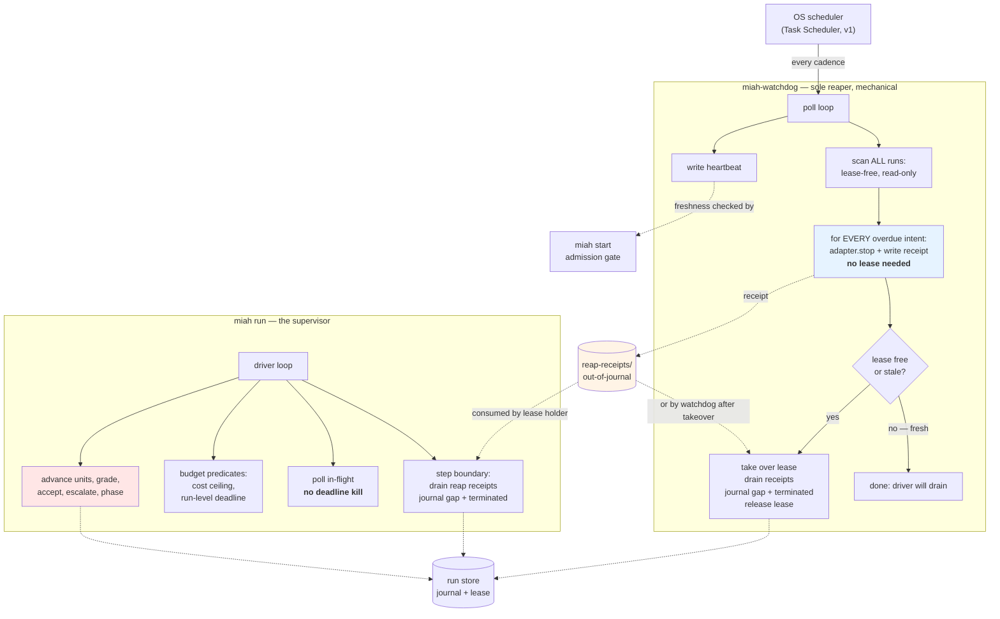
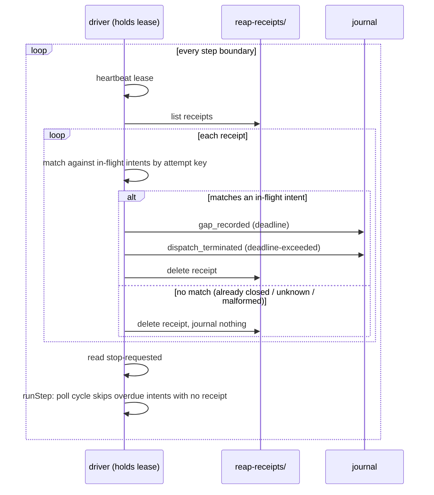
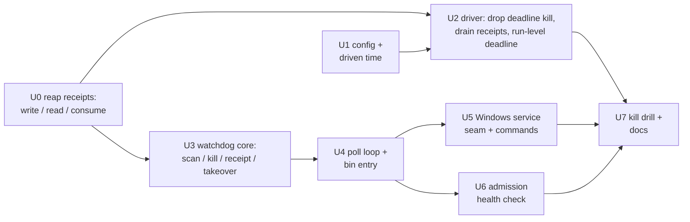

# Miah Watchdog Daemon - Plan

> **Revision 2 (2026-08-21) — the watchdog is the sole reaper.** The original plan made the
> watchdog a *fallback*: it stood down whenever a driver's lease was fresh, on the reasoning that a
> live driver reaps its own deadlines. The operator has since decided the watchdog owns **all**
> deadline termination, whether or not a driver is alive. This revision splits **the kill** from
> **the record**: the watchdog kills every overdue dispatch without needing the lease and writes an
> out-of-journal *reap receipt*; whoever legitimately holds the lease — the driver at its next step
> boundary, or the watchdog itself after a stale takeover — converts that receipt into the journal
> events. The single-writer invariant is untouched. See `## Revision 2 rationale` for why the kill
> is lease-free and the record is not.

> **Revision 3 (2026-08-21) — code-review fixes from the GPT 5.6 Sol review of revision 2.** All
> changes are clarifications, additions to test scenarios, or pinning of previously-implicit
> contracts. No requirements were removed and no key decisions were changed. Reviewer flags are
> recorded inline at the affected site and indexed below.

| Fix | Where | What changed |
| --- | --- | --- |
| F1 | U2, U3 | Reconcile path no longer terminates past-deadline intents — it appends a `reconcile_record` with `finding: "deadline-passed-defer-to-watchdog"` and leaves the intent in-flight, deferring to the watchdog's reap receipt. |
| F2/F10 | U0 | Receipt filename sanitization specified: lowercase ASCII, control/invalid chars to `-`, reserved Windows device names prefixed with `receipt-`, 255-char cap, intent-hash suffix for collision resistance. |
| F3 | U2 | Driver drain point corrected: drain sits at the step-boundary stop check (`src/driver.ts:396`), not inside `stopAndRelease`; resume drain sits after `store.replay()` and before the `readStopRequested` check at `src/driver.ts:356`. |
| F4 | U0 | Characterization gate added proving `refusePastDeadline` can be split before the split is performed. |
| F5/F12 | U0 | `RunStoreLayout.reapReceiptsDir` specified as `path.join(root, "reap-receipts")`; layout is `<run-root>/reap-receipts/<safe-intent-label>-<intent-hash>.json`; writers create the directory lazily, readers treat absence as empty. |
| F6 | U3 | Explicit verification added that `readOnlyState` works while another holder owns the lease without acquiring, repairing, or altering the lease. |
| F7 | R14, KTD9 | "Driver does no reaping" clarified: reaping = per-dispatch deadline termination only; run-level escalation to Attention is supervisory, not reaping, and remains in the driver. |
| F8 | U0 | Crash-consistent consumption sequence specified: read → append gap → append terminated → delete, with attempt-correlation recovery so a crash between any pair of steps re-consumes without duplicate outcomes. |
| F9 | U0 | Receipt schema pinned to `miah/reap-receipt/v1` with a full field list. |
| F11 | U4, U6, U7, Risks | Test timing standardized on 60-second cadence; residual mentions of 300s refer to the historical default from revision 1 and are not test values. |
| F13 | U3 | U3 precondition added verifying `InFlightIntent` carries nullable `agent_id` and `workspace_id` at `src/types.ts:331-344`. |
| F14 | U4 | One-tick process model justified: Task Scheduler is the sole clock and restart authority; resident loop is a verified fallback only. |

## Goal Capsule

- **Objective:** Give Miah a hard wall-clock guarantee that does not depend on a Miah process being alive — a small, non-supervisory watchdog that is the *sole* enforcer of per-dispatch deadlines, killing every overdue specialist on a tight cadence whether or not a driver is running — and close the run-level deadline gap in the driver itself.
- **Product authority:** `docs/decisions/2026-08-18-d1-revision-add-watchdog-daemon.md` governs; it rescinds D1's "not a daemon" clause while preserving D1-a through D1-g. `VISION.md` architectural invariants (one active plan, append-only journal, role separation, claim-is-not-fact) are unchanged by this work — in particular the append-only journal keeps exactly one writer, the lease holder.
- **Execution profile:** Deep, cross-cutting TypeScript change across config, journal-derived time accounting, a new out-of-journal durable artifact, the step function's poll cycle and budget predicates, the driver's step boundary, a new standalone component with its own bin entry, OS service registration, the admission gate, and maintained architecture/operator documentation.
- **Stop conditions:** Stop rather than inventing behavior if implementation would require the watchdog to make an acceptance, grading, escalation-resolution, or unit-advancement decision; to drive the supervisor loop; to **append to a journal whose lease it does not hold**; or to weaken the fail-closed admission posture. The kill is lease-free; the journal append never is.
- **Tail ownership:** The implementing workflow owns code, tests, documentation, and full-suite verification. The operator retains the install decision (install is opt-in), cadence configuration, escalation resolution, and plan approval.
- **Phase context:** AGENTS.md Phase 4 (Operating). Miah v1 is live; every change here is a change to a maintained system and carries verify/test/document obligations.

---

## Revision 2 rationale — why the kill is lease-free and the record is not

This section exists because the sole-reaper architecture looks, at first glance, like a violation of
the single-writer invariant. It is not, and the reason is worth recording before the requirements so
a reviewer can challenge the reasoning rather than reconstruct it.

**The insight: `adapter.stop(handle)` and "journal the termination" are two different operations
with two different safety requirements.**

| Operation | Needs the lease? | Why |
| --- | --- | --- |
| `adapter.stop(handle)` | **No** | Idempotent and best-effort. Stopping an already-stopped agent is a no-op; two processes stopping the same agent is a no-op. It mutates no Miah-owned state. The driver already treats it as best-effort — `refusePastDeadline` swallows adapter errors today. |
| Write a reap receipt | **No** | The receipt lives *outside* the journal, in a per-run `reap-receipts/` directory, written by atomic temp-write-then-rename. It is a durable message, not a state mutation. |
| Append `gap_recorded` + `dispatch_terminated` | **Yes, always** | These mutate the journal and the derived state folded from it. |

**Why bypassing the lease for the journal would not be safe.** The single-writer invariant is not
one policy that could be granted a watchdog exception — it is three concrete data structures that
each break under concurrent writers:

1. **`Journal.lastSeq` is a per-instance in-memory cache.** Two `Journal` instances each believe
   they know the next sequence number. Concurrent appends produce duplicate or non-monotonic `seq`
   values, and nothing in the append path detects it — the corruption is silent.
2. **`RunStore.state` folding and snapshot writes.** `RunStore.append` folds each event into a
   private `state` field and writes a derived-state snapshot every `K`th event. Two writers hold two
   divergent in-memory states and race on the same `snapshots/` directory; a later replay resumes
   from whichever snapshot landed last, silently discarding the other writer's view.
3. **`replay({ truncate: true })` mutates the journal.** The resumer's repair path truncates a
   crash-torn tail. Run concurrently with a live writer, it can truncate a line that writer is in the
   middle of appending.

Making concurrent journaling safe means a real multi-writer journal — file locking, an on-disk
sequence authority, and a repair path that can distinguish "torn by a crash" from "in flight by a
peer." That is a rewrite, not a watchdog exception, and it is out of scope.

**Precedent.** `miah stop` (`src/commands/stop.ts`) already does exactly this shape: it writes
`stop-requested.json` unconditionally, without the lease, and the lease-holding driver consumes the
flag at its next step boundary (`src/driver.ts:396`). Reap receipts are the same pattern applied to
a different signal, with one addition — the receipt carries a payload the consumer journals, where
the stop flag carries only a boolean.

**Consequence accepted deliberately:** because only a lease holder may journal, the *record* of a
reap can lag the *kill* by up to one driver step boundary (driver alive) or one watchdog tick
(driver dead). The specialist is dead the moment the watchdog acts; the journal catches up shortly
after. Termination latency is bounded by the watchdog cadence; recording latency is not the
guarantee this feature exists to provide.

---

## Product Contract

### Summary

Miah can already refuse late work and terminate a runaway specialist, but only while a driver
process is alive to observe the deadline. This plan adds `miah-watchdog`: a plain, non-LLM
background process, installed opt-in and registered with the OS scheduler, that wakes on a tight
cadence, scans **every** run lease-free and read-only, and terminates **every** dispatch past its
recorded deadline — regardless of whether a driver is alive. Each kill leaves an out-of-journal
*reap receipt*. When the lease is free or stale the watchdog takes it over, converts the run's
receipts into journal events, and releases. When the lease is fresh it stops after the kill and the
receipt; the live driver drains the receipt at its next step boundary and journals it. Deadline
termination therefore has exactly one implementation and one enforcement point, alive or dead.
Separately, this plan closes a real gap the decision document assumed was already filled: run-level
deadline enforcement, which does not exist in the code today.

### Problem Frame

Deadline enforcement in Miah is entirely driver-resident. `src/step.ts` evaluates `isPastDeadline`
against each in-flight intent during its poll cycle (`src/step.ts:717`), and `src/dispatch.ts`
refuses and terminates past-deadline work (`refusePastDeadline`, `src/dispatch.ts:485`). Both run
only inside `runDriver`. When the driver dies — crash, closed terminal, or simply never invoked
again — an overdue specialist keeps running, unbounded, and no durable record of the overrun is ever
written. `docs/solutions/patterns/paseo-per-agent-hard-bound-verification.md` established that Paseo
v0.3.0-beta.2 has no daemon-enforced per-agent bound to fall back on, which is why admission fails
closed on `max-duration-absent` today and why no run can currently be admitted at all.

Revision 1 of this plan addressed that by making the watchdog a *fallback* — it stood down while the
lease was fresh. That leaves deadline enforcement with **two implementations of the same rule** in
two processes, differing in when they run and in what they can see, and it makes the guarantee
conditional on correctly detecting which of the two is in charge. The stand-down predicate becomes a
safety-critical branch whose failure modes are silent in both directions: reaping a live driver's
dispatch, or standing down when nobody is driving. Making the watchdog the sole reaper deletes that
branch. There is one killer, one code path, and one cadence, and the driver's liveness stops being an
input to whether a deadline is enforced at all.

A second gap surfaced during planning. The decision document specifies the watchdog enforcing
`run.max_duration_s`, but that field does not exist: `RunConfig` in `src/types.ts` carries
`concurrency_cap`, `max_takes`, `max_rework_cycles`, and an optional `cost_ceiling_usd`, and there is
no run-level wall-clock bound anywhere in the config or the driver. Run-level enforcement is net-new
work, not a re-use of existing machinery.

### Key Decisions

- KD1. **The watchdog is the sole reaper of per-dispatch deadlines, and the kill is split from the record** (operator-settled, 2026-08-21 — chosen over revision 1's "watchdog stands down while the lease is fresh"). The watchdog calls `adapter.stop` on every overdue intent in every run regardless of lease state, and writes an out-of-journal reap receipt for each. The lease holder — the driver at its step boundary, or the watchdog itself after a stale takeover — converts receipts into `gap_recorded` + `dispatch_terminated`. The driver no longer terminates for deadline reasons. Governs R1-R9 and R23-R27. Rationale, including why the journal append still requires the lease, is in `## Revision 2 rationale`.
- KD2. **Run-level deadline enforcement ships as part of this work, in the driver only, measured as driven time** (session-settled: user-directed — chosen over deferring run-level enforcement to follow-up, and over calendar-time measurement: driven time counts only active supervision, resets on resume, and permits a safe shipped default). Governs R10-R14. Run-level enforcement stays with the driver under revision 2 because it is an **escalation, not a termination** — it asks the operator to decide, which is authority the watchdog does not have and does not gain.
- KD3. **Windows-first service registration behind an abstraction seam** (session-settled: user-directed — chosen over implementing all three OS service managers at once: the operator's environment is Windows 10, and the seam keeps `systemd`/`launchd` a drop-in addition). Governs R15-R18.
- KD4. **Admission health is a freshness signal the watchdog itself writes, not a service-registration query** (session-settled: user-directed — chosen over querying the OS service manager for task state: a heartbeat proves the poll loop is actually executing, whereas a registration query passes for a service that is installed but wedged). Governs R19-R22. Revision 2 raises the stakes on this decision: with the watchdog as sole reaper, a wedged watchdog means *no* deadline enforcement anywhere, not merely a lost fallback.

### Actors

- A1. **Operator** — decides whether to install the watchdog, configures its cadence and the run-level deadline, and resolves the escalations run-level enforcement raises.
- A2. **Driver** (`miah run`) — the live supervisor loop. Owns all *supervisory* decisions and is the sole enforcer of the run-level deadline (by escalation). It **no longer terminates specialists for deadline reasons**; it drains reap receipts at each step boundary and journals them under its lease.
- A3. **Watchdog** (`miah-watchdog`) — a non-supervisory background process and the **sole reaper**. Terminates every overdue dispatch in every run on a fixed cadence, alive driver or not, and records each kill as an out-of-journal receipt. Journals only when it legitimately holds the lease. Makes no acceptance, grading, or escalation decisions and never advances a unit.
- A4. **OS scheduler** — Windows Task Scheduler in v1. Invokes the watchdog on the configured cadence as the logged-in user.
- A5. **Specialist** — a dispatched Paseo agent (builder or verifier) whose runtime the deadline bounds.

### Requirements

**Watchdog reaping authority**

- R1. On each tick the watchdog enumerates **every** run under the run store and, for each, reads derived state through the existing read-only reconstruction path — no lease acquired, no journal repair, no driver launched. The scan is unconditional: lease state does not exclude a run from being scanned.
- R2. For **every** in-flight dispatch intent whose recorded deadline has passed at the current time — **regardless of the run's lease state** — the watchdog terminates the specialist through the Paseo adapter using the recorded agent identity. There is no stand-down from the kill. A fresh lease held by a live driver does not exempt that run's overdue dispatch from termination.
- R3. For every specialist it terminates, the watchdog writes a durable **reap receipt** to the run's out-of-journal `reap-receipts/` directory before doing anything else with that run's lease. The receipt is the durable record that the kill happened, and it survives the watchdog process, the driver process, and the machine.
- R4. When the run's lease is free, released, or stale, the watchdog acquires it by the existing stale-takeover path, **consumes the run's receipts** — journaling a deadline gap and a `dispatch_terminated` with a `deadline-exceeded` outcome for each — and then releases the lease so the next driver resumes immediately.
- R5. When the run's lease is fresh and held by another holder, the watchdog stops after the kill and the receipt. It does not acquire the lease and appends nothing. The live driver drains the receipt at its next step boundary (R25).
- R6. The watchdog never appends to a journal whose lease it does not hold. If takeover fails because a driver acquired the lease in the interval between scan and act, the watchdog leaves its receipts in place — they are not lost, and the driver that won the lease will drain them — and moves on without error. The kill has already happened and is neither retried nor rolled back.
- R7. The watchdog makes no acceptance decision, records no grade, resolves no escalation, advances no unit, and never transitions the run phase. It does not drive the supervisor loop.
- R8. The watchdog makes no LLM calls and dispatches no agents. It does not write the `stop-requested` flag: requesting a stop ends the whole run, which is a supervisory decision outside its authority. Its reach is one overdue dispatch at a time.
- R9. A failure while processing one run — unreadable journal, adapter error, lease contention, unwritable receipt directory — is contained to that run and does not prevent the remaining runs from being processed on the same tick. An adapter failure on one overdue intent does not prevent the remaining overdue intents in the same run from being killed.

**Reap receipts and the driver's drain**

- R23. A reap receipt is a single JSON file under `<run-root>/reap-receipts/`, written by atomic temp-write-then-rename so a crash mid-write never leaves a torn file for the consumer to read. It records at minimum: a schema version, the run id, the unit id, the role, the take, the attempt (idempotency key), the recorded agent id and workspace id, the intent's recorded deadline, the reap timestamp, the adapter outcome (`terminated`, `adapter-failed`, or `no-recorded-agent`), and the identity and version of the watchdog that wrote it.
- R24. Receipts are keyed by the dispatch attempt, so re-reaping the same overdue intent on a later tick overwrites the existing receipt rather than accumulating duplicates. Writing a receipt for an intent that already has one is idempotent and is not an error.
- R25. The driver drains reap receipts at every step boundary and on resume before it reconciles in-flight intents. For each receipt that matches a currently in-flight intent, it journals the same `gap_recorded` + `dispatch_terminated` pair the watchdog would have journaled, then deletes the receipt. Draining happens under the lease the driver already holds; no new lease interaction is introduced.
- R26. The driver performs **no** deadline termination. It never calls `adapter.stop` because a deadline passed. An in-flight intent that is past its deadline with no receipt yet present is skipped for that poll cycle — not terminated, not journaled, and not counted toward the no-progress predicate — and is picked up once its receipt arrives.
- R27. A receipt that does not match a currently in-flight intent (already-closed dispatch, unknown attempt key, malformed contents, unparseable file) is discarded without journaling anything. Exactly one `dispatch_terminated` is ever produced per dispatch attempt, whichever side records it. The fields of the journaled events are taken from the in-flight intent, not from the receipt; the receipt contributes only reap provenance.

**Run-level deadline**

- R10. `RunConfig` carries a `max_duration_s` run-level wall-clock bound with a shipped default of 28800 seconds (8 hours of driven time), operator-overridable in the config file.
- R11. Driven time for a run is the sum of the intervals during which the run's lease was actually held, derived from the `lease_acquired` / `lease_renewed` / `lease_released` events already present in the journal.
- R12. An interval left open by a crash — a `lease_acquired` with no matching `lease_released` — closes at the last observed activity within that lease epoch, never at the timestamp of the next acquisition. **"Last observed activity" is defined as the timestamp of the last journal event of any type appended under that holder's lease epoch** — the most recent `lease_renewed`, the most recent `dispatch_intent`, the most recent `evidence_appended`, or any other event the journal accepts, whichever is latest. It is not necessarily a `lease_renewed` event: heartbeat-style renewals are a sufficient but not necessary signal. Wall-clock time during which nobody was driving must not count as driven time.
- R13. The driver evaluates the run-level deadline in its budget-predicate block, alongside the existing cost ceiling. When driven time exceeds the bound it raises a `run-deadline-exceeded` escalation and moves the run to Attention for the operator to resolve. It does not terminate the run outright, and it does not terminate any in-flight specialist — per-dispatch termination belongs to the watchdog (R2, R26); the run-level bound is an escalation, which is the driver's authority alone. **Stacking policy:** when the run is already in Attention because of a unit-level escalation, a new `run-deadline-exceeded` **supersedes** the prior run-level reason — the new reason replaces the run's current reason rather than appending a second one, so the operator sees the most binding condition first and is never asked to choose between two simultaneously-current reasons on the same run. The prior unit-level escalation remains in the journal history (every escalation ever raised is still queryable for audit and post-mortem) but is no longer the run's "current" reason until resolved. The supersede is implemented by overwriting the run-level escalation slot in the run's current escalation record; the existing `raiseEscalationSummary` shape is reused rather than introducing a parallel "stacked" field. Justification: a unit-level escalation cannot be resolved productively once the run is past its bound, so promoting the run-level reason to the front matches the operator's actual decision surface; the journal's append-only nature keeps the audit trail intact.
- R14. The watchdog does not enforce the run-level deadline. Its sole-reaper authority covers **per-dispatch** deadlines only. Run-level enforcement raises an escalation for the operator, and raising an escalation is supervisory authority the watchdog does not hold (R7). Driven time also only accrues while a lease is held, so a run with no live driver is not accruing toward its bound. **(F7) "Reaping" and "escalation" are distinct authorities and the plan uses the words that way:** *reaping* means per-dispatch deadline termination (killing an overdue specialist through the adapter and recording the kill, R2); *escalation* means raising a condition that asks the operator to make a decision, which is supervisor-loop authority. The driver performs no reaping — it never calls `adapter.stop` because a deadline passed (R26) — but it does own run-level escalation to Attention, because that is a supervisory decision the watchdog does not have authority to make. The watchdog owns reaping; the driver owns escalation; the two never conflate.

**Install surface and OS registration**

- R15. Installation is opt-in. Installing the `miah` package does not register or start the watchdog; the operator runs an explicit command.
- R16. The command surface provides install, uninstall, and status operations for the watchdog, and uninstall removes the OS registration cleanly.
- R17. OS registration sits behind an interface whose operations are install, uninstall, and query-registration-state, with a Windows Task Scheduler implementation in v1 and unimplemented platforms failing with a clear, named error rather than a silent no-op.
- R18. The watchdog runs as the logged-in user, since it needs that user's home directory and that user's credentials for the Paseo CLI.

**Health and admission**

- R19. The watchdog writes a heartbeat artifact on every tick, including ticks where it finds nothing to reap, recording at minimum the tick timestamp, the watchdog version, and the configured cadence.
- R20. The watchdog is healthy when its heartbeat exists and is no older than twice the configured cadence.
- R21. The admission gate's max-duration check is satisfied by either a native Paseo per-agent bound or a healthy watchdog, and reports which source satisfied it. With neither, admission fails closed exactly as it does today.
- R22. The admission refusal message for an absent or stale watchdog names the install command, so a fresh install has an actionable path to its first admitted run.

### Key Flows

- F1. **Quiet tick.** Scheduler invokes the watchdog → it enumerates every run → no run has an overdue in-flight intent → it writes its heartbeat → exits. No lease is touched on any run.
- F2. **Reap while the driver is alive.** Driver is mid-poll holding a fresh lease → watchdog tick finds an overdue in-flight intent in that run → terminates the specialist through the adapter → writes a reap receipt → does **not** take the lease and appends nothing → driver reaches its next step boundary, drains the receipt, journals the deadline gap and `dispatch_terminated`, deletes the receipt → the unit is eligible for its next take.
- F3. **Reap after a crash.** Driver dies mid-dispatch → the next watchdog tick finds the overdue in-flight intent → terminates the specialist → writes a receipt → sees the lease is stale (or released, or absent) → takes it over → drains the receipt → journals the gap and `dispatch_terminated` → releases the lease → writes its heartbeat. The specialist is dead on the same tick that discovered it, before the lease is ever considered.
- F4. **Race at takeover.** Watchdog kills an overdue specialist and writes the receipt while the lease is stale → a driver resumes and acquires the lease in the same instant → the watchdog's takeover is refused with `fresh-heartbeat` → it leaves the receipt in place and moves on → the resuming driver drains the receipt at its resume boundary. Neither the kill nor the record is lost, and neither is duplicated.
- F5. **Run-level deadline.** Driver loop begins a step → computes driven time from the journal → finds it above `run.max_duration_s` → raises `run-deadline-exceeded` → run moves to Attention → operator resolves.
- F6. **Fresh install admission.** Operator installs Miah → `miah start` refuses with a watchdog-absent reason → operator runs the watchdog install command → watchdog registers and its first tick writes a heartbeat → `miah start` admits.

### Acceptance Examples

- AE1. Given a run whose lease is stale and one in-flight builder intent whose deadline passed 10 minutes ago, when a watchdog tick runs, then the specialist is terminated through the adapter, a reap receipt is written, the lease is taken over, the run's journal gains a deadline gap and a `dispatch_terminated` carrying the `deadline-exceeded` outcome, the receipt is deleted, and the lease is released.
- AE2. Given the same run but with a lease heartbeat 5 seconds old held by a live driver, when a watchdog tick runs, then **the specialist is still terminated through the adapter** and a reap receipt is written, but no lease is acquired, no event is appended to that run's journal, and the lease holder and heartbeat are unchanged.
- AE3. Given the run from AE2 with its receipt on disk, when the live driver reaches its next step boundary, then it journals the deadline gap and the `dispatch_terminated` with the `deadline-exceeded` outcome, deletes the receipt, and the intent is no longer in-flight.
- AE4. Given a driver polling an in-flight intent that is past its deadline with no reap receipt present, when the driver runs its poll cycle, then no `adapter.stop` call is made, no `dispatch_terminated` is appended for that intent, the intent stays in-flight, and its no-progress counter is not advanced.
- AE5. Given a reap receipt whose attempt key matches a dispatch that is already terminated in the journal, when the driver drains receipts, then the receipt is deleted and no second `dispatch_terminated` is appended.
- AE6. Given a journal containing a `lease_acquired` at T, `lease_renewed` at T+60s, then no further lease events and a later `lease_acquired` at T+2h, when driven time is computed, then it counts approximately 60 seconds for the first epoch, not 2 hours.
- AE7. Given `run.max_duration_s` set to 60 and a journal whose driven time is 120 seconds, when the driver begins a step, then it raises a `run-deadline-exceeded` escalation and the run phase becomes Attention.
- AE8. Given a watchdog heartbeat written 20 minutes ago with a configured cadence of 60 seconds, when `miah start` runs, then admission fails closed naming the stale watchdog and the install command.
- AE9. Given a watchdog heartbeat written 30 seconds ago with a cadence of 60 seconds and a plan that passes preflight, when `miah start` runs, then admission proceeds and the manifest records that the max-duration gate was satisfied by the watchdog.
- AE10. Given a driver process killed mid-dispatch with a real run store on disk, when the watchdog's tick is invoked, then the recorded agent is terminated on that tick, and after the lease goes stale and the watchdog takes over, the resulting journal replays to a consistent state with no duplicate or lost events.

### Scope Boundaries

**In scope**

- The `miah-watchdog` component: unconditional scan, kill, receipt write, stale-lease takeover and drain, heartbeat, poll loop, and its own bin entry.
- The reap-receipt artifact: format, atomic write, read, match, and consume — plus its directory in the run-store layout.
- Removing deadline termination from the driver and adding the receipt drain to its step boundary.
- Run-level deadline: config field, driven-time computation, driver-loop enforcement by escalation.
- Windows Task Scheduler registration behind a platform seam, plus install/uninstall/status commands.
- Admission health check replacing the single-source max-duration check.
- Kill-drill verification test, proving sole-reaper behavior in both the driver-alive and driver-dead cases.
- Documentation updates to `OPERATOR.md`, `README.md`, `CONCEPTS.md`, `docs/risks.md`, and the affected `docs/architecture/` sections.

**Deferred to follow-up work**

- `systemd` and `launchd` implementations of the service-registration interface.
- A watchdog-side view of run-level deadlines, should driven time ever be superseded by a calendar-time bound.
- Any watchdog reporting surface beyond the heartbeat artifact and `status` output — including an in-band signal to an already-running driver that the watchdog has gone unhealthy (named in Risks).
- A multi-writer journal. The receipt pattern exists precisely so this is not needed; see `## Revision 2 rationale`.

**Non-goals — outside this component's identity**

- Any supervisory authority: advancing units, grading, accepting evidence, resolving escalations, or transitioning phases.
- Driving the supervisor loop. A run nobody is driving stays paused (D1-c).
- Journaling without the lease. The watchdog kills without the lease; it never writes the journal without it.
- LLM calls or agent dispatch of any kind.
- Replacing the Paseo native per-agent max-duration feature ask; the watchdog makes admission possible without it, and does not close it.

### Dependencies / Assumptions

- The Paseo CLI is installed and authenticated for the user the watchdog runs as, since termination shells out to it. **Revision 2 raises the severity of this dependency:** the watchdog is now the only thing that terminates overdue specialists, so a Paseo CLI that cannot authenticate in the scheduled context means no deadline enforcement at all, not a degraded fallback. U5's verification step is correspondingly load-bearing.
- Lease events are journaled today — confirmed at `src/lease.ts:190`, `:217`, `:238`, `:268` — which is what makes driven time computable without new instrumentation.
- `adapter.stop` is best-effort and idempotent, and the current driver already treats it that way (`refusePastDeadline` swallows its errors, `src/dispatch.ts:490`). This is what makes the lease-free kill sound.
- In-flight intents carry `agent_id` and `workspace_id` (`InFlightIntent`, `src/types.ts:331`), which is enough to construct a `PaseoHandle` (`{ agentId, cwd, workspaceId }`, `src/adapter/paseo.ts:52`) for `stop` without an `inspect` round-trip. The watchdog therefore needs no live handle cache and no network call to decide whom to kill.
- Adding a field to `RunConfig` is safe for existing on-disk configs because `loadConfig` deep-merges the file over `DEFAULT_CONFIG` (`src/config.ts`).
- Adding a directory to `RunStoreLayout` is additive; existing run directories gain it lazily on first write, and its absence means "no receipts", never an error.
- Adding a field to the manifest's probe verdicts is additive; existing manifests remain readable.
- **Assumption carried at planning time:** Windows Task Scheduler can register a per-user, short-interval repeating task without elevation. This was not externally verified — see Sources / Research — and U5 must verify it before building on it. Revision 2's tighter cadence makes the minimum supported repeat interval part of that verification.

### Planning Questions Resolved

- **Who kills** → KD1. The watchdog, always, for per-dispatch deadlines. No liveness detection gates the kill.
- **Who records** → KD1. Whoever holds the lease. The receipt carries the message across the process boundary.
- **Why not let the watchdog journal directly** → `## Revision 2 rationale`. Three concrete data structures break under concurrent writers; the fix is a journal rewrite, not an exception.
- **Whether run-level deadlines are in scope** → KD2. In scope, driver-only, driven time, escalation not termination.
- **OS coverage** → KD3. Windows first, behind a seam.
- **What "healthy" means** → KD4. A freshness signal the watchdog writes, checked at twice the cadence.
- **How the watchdog sees in-flight dispatches, given they are derived by replay and not stored** → KTD1 below. It reuses the read-only reconstruction path `miah status` already uses.

### Open item carried to the operator — cadence drift from the decision document

`docs/decisions/2026-08-18-d1-revision-add-watchdog-daemon.md`, open item 2, settled the default
cadence at **5 minutes**, reasoning that "a unit or run can run up to ~5 minutes past its deadline
before being reaped under the default." That reasoning was written when the watchdog was a fallback
and a live driver did the reaping in the common case, so the 5-minute exposure applied only to the
crashed-driver case.

Under revision 2 the cadence is the **only** bound on deadline overrun in every case, including the
common one where Miah is running normally. A 5-minute default would make every ordinary dispatch
overrun by up to 5 minutes where today it is caught within one driver poll interval — a regression in
the normal path, traded for the guarantee in the crash path.

This plan therefore specifies a **60-second default**, operator-configurable, on the grounds that the
tick is cheap: a directory listing, one read-only replay per run, and no network call at all unless
something is actually overdue. **This is a deviation from a settled item in the governing decision
document and is surfaced here rather than absorbed silently.** If the operator prefers to keep 300s,
U4 changes one default constant and nothing else in this plan moves. The decision document should be
amended to record whichever value stands.

### Sources / Research

- `docs/decisions/2026-08-18-d1-revision-add-watchdog-daemon.md` — the governing decision.
- Operator decision of 2026-08-21 making the watchdog the sole reaper, converged on independently by two brainstorm agents (Claude Opus 5 and GPT 5.6 Sol), both arriving at the split-kill-from-record architecture with out-of-journal receipts.
- `docs/solutions/patterns/paseo-per-agent-hard-bound-verification.md` — why the bound is absent and admission fails closed.
- `docs/architecture/design-decisions.md` §1, §12, §26 — already carry "Revised 2026-08-18" pointers to the decision; §12 states the current deadline posture this plan replaces.
- Direct source reading: `src/lease.ts`, `src/driver.ts`, `src/step.ts`, `src/dispatch.ts`, `src/replay.ts`, `src/run-store.ts`, `src/admission.ts`, `src/substrate-probe.ts`, `src/config.ts`, `src/types.ts`, `src/adapter/paseo.ts`, `src/commands/stop.ts`, `src/commands/status.ts`, `test/kill-drill-v1.test.ts`, `test/kill-drill-v2.test.ts`.
- **Research gap, recorded honestly:** three background research agents (repo patterns, learnings store, and Windows service-registration best practices) were dispatched during revision 1 and all three terminated on an API session limit before returning findings. The Windows Task Scheduler research in particular did not complete, so this plan's Windows registration approach (U5) rests on general knowledge rather than verified current documentation. U5 carries an explicit verification step for exactly this reason, and the learnings store beyond the files already read was not swept.
- **Provenance caveat — `ce-plan-bootstrap` is a process label, not a validated technical contract.** The front matter's `product_contract_source: ce-plan-bootstrap` names the planning skill that produced this document; it is not an externally-validated artifact contract binding this plan's interface, types, or behaviors to a separately-checked specification. The only operative technical authority for scope, requirements, key decisions, and stop conditions is `docs/decisions/2026-08-18-d1-revision-add-watchdog-daemon.md` as amended by the operator's 2026-08-21 sole-reaper decision, which the implementing workflow follows directly. If implementation discovers a discrepancy between this plan and the decision, the decision governs; if implementation discovers a discrepancy between either and the code, the code governs after a decision is sought.

---

## Planning Contract

### Key Technical Decisions

- KTD1. **The watchdog reads run state through the existing read-only reconstruction path, not a new on-disk dispatch index.** There is no stored in-flight dispatch record: the run store holds manifest, plan snapshot, `units.json`, journal, lease, state snapshots, evidence, and approval package, and in-flight intents are derived by replay. Rather than add a sidecar index that could drift from the journal, the watchdog uses the same lease-free reconstruction `miah status` already performs (`readOnlyState` in `src/commands/status.ts:86`), which is a pure function over durable files. This satisfies the constraint to reuse existing machinery rather than duplicate it, and it is why "the watchdog cannot see in-flight dispatches" is not in fact a blocker. Governs R1, R2.
- KTD2. **Scanning and killing are both lease-free; only journaling takes the lease.** The scan path must not repair the journal tail or acquire the lease, because doing so on every tick for every run would contend with live drivers and mutate runs the watchdog has no business touching. The kill is likewise lease-free — see `## Revision 2 rationale` for why that is sound. Takeover happens only when the lease is already free or stale *and* there are receipts to convert. Governs R1, R2, R4, R6.
- KTD3. **Handle reconstruction needs no `inspect` round-trip.** `PaseoHandle` is `{ agentId, cwd, workspaceId }` and `adapter.stop` uses the agent id; `InFlightIntent` already carries `agent_id` and `workspace_id`. The watchdog constructs the handle directly from the recorded intent with `cwd: null`, rather than following `recoverHandle`'s `inspect`-then-construct path (`src/step.ts:355`), which exists to recover a `cwd` the driver needs for envelope reading. The watchdog reads no envelopes, so it needs no `cwd`, and skipping `inspect` keeps the tick cheap and removes a failure mode between deciding to kill and killing. An intent with a null or empty `agent_id` cannot be killed; the watchdog writes a `no-recorded-agent` receipt so the lease holder still closes the dispatch. Governs R2, R23.
- KTD4. **`refusePastDeadline` is split into a kill half and a record half, and both consumers use the record half.** `src/dispatch.ts:485` currently bundles `adapter.stop` with the two journal appends. Revision 2 separates them: a new `recordDeadlineRefusal(ctx, ref, identity)` performs only the `gap_recorded` + `dispatch_terminated` appends, and the `adapter.stop` call moves to the watchdog. Both the driver's receipt drain and the watchdog's post-takeover drain call `recordDeadlineRefusal`, so the artifacts are identical by construction rather than by careful imitation — the same guarantee revision 1's KTD4 sought, now enforced by a shared function instead of a shared call site. `refusePastDeadline` itself is retained only for `pollUntilTerminal` (`src/dispatch.ts:519`), which is exercised solely by `test/dispatch.test.ts` and is **not** on the driver's production path (verified: the only production caller of the deadline-termination path was `src/step.ts:717`, which U2 removes). It must not be reintroduced into the driver. Governs R4, R25, R26.
- KTD5. **The receipt is the sole trigger for a deadline-exceeded journal record.** Neither side journals a deadline close from observing the deadline directly — only from consuming a receipt. This is what makes "exactly one `dispatch_terminated` per attempt" hold without cross-process coordination: there is one producer of the record's trigger (the watchdog's kill) and the consumer is idempotent by construction (R24 keys receipts by attempt; R27 discards a receipt with no matching in-flight intent). The rejected alternative — the driver journaling on its own observation *and* draining receipts — produces a double close whenever both fire, and the window in which both fire is exactly the normal case. Governs R25, R26, R27.
- KTD6. **Receipts follow the `stop-requested.json` precedent, extended with a payload.** `src/commands/stop.ts` already writes a durable out-of-journal signal without the lease and the driver consumes it at its step boundary (`src/driver.ts:396`). Receipts reuse that shape and its idioms: the same atomic temp-write-then-rename as `Lease.atomicWrite` (`src/lease.ts:129`), the same tolerant reader that treats absent/unparseable as "nothing to do" rather than throwing (`readStopRequested`, `src/driver.ts:64`), and the same delete-after-honoring (`clearStopRequested`, `src/driver.ts:87`). The one addition is that a receipt carries fields the consumer acts on, so the consumer validates them against the in-flight intent before use (R27). Governs R23, R25.
- KTD7. **The driver drains at the same two places it reads `stop-requested`.** `src/driver.ts:356` (resume, after `store.replay()` and before the first `runStep`) and `src/driver.ts:396` (the step-boundary check inside the loop). Draining at resume-before-reconcile matters: `reconcileIntents` runs once per session inside the first `runStep` (`src/step.ts:453-456`), and a reaped intent must already be closed by then so reconcile never sees it and never tries to recover a handle for an agent the watchdog already killed. Governs R25.
- KTD8. **Driven time closes crash-open intervals at last observed activity.** An open `lease_acquired` with no `lease_released` must close at the timestamp of the last journal event of any type appended within that lease epoch — not specifically a `lease_renewed`, and not the wall-clock time of the next acquisition. The implementation tracks the maximum event timestamp seen while a holder is current (the per-epoch "last activity"), and uses that timestamp to close any epoch that has no matching `lease_released`. Closing at the next `lease_acquired` instead would silently count abandoned wall-clock time as supervision, which is precisely the failure mode driven time exists to avoid. When the current lease is fresh and open, the interval closes at the injected `now`. Governs R11, R12.
- KTD9. **Run-level enforcement escalates rather than terminates (F7).** The existing cost-ceiling predicate raises an escalation and moves to Attention; the run-level deadline follows the same shape for consistency and because ending a run is an operator decision. This is also why run-level enforcement stays in the driver under sole-reaper: the watchdog's new authority is *reaping* (per-dispatch deadline termination, R2), and an *escalation* is not a reaping — it is a request to the operator to make a decision, which is supervisor-loop authority the watchdog does not hold (R7). The plan distinguishes the two terms carefully: reaping = `adapter.stop` + receipt for a per-dispatch deadline; escalation = `raiseEscalationSummary` + `ensurePhase(store, "Attention")` for any condition the operator must resolve. The driver is forbidden from reaping (R26) and authoritative for escalation (R13, R14); the watchdog is authoritative for reaping (R2) and forbidden from escalation (R7). The two authorities meet only through the receipt, which is a data dependency, not a control dependency. Governs R13, R14.
- KTD10. **The max-duration probe verdict gains a satisfying-source field rather than being replaced.** Keeping the `max_duration` verdict name preserves the manifest's `probe_verdicts` shape and the existing admission failure path, while an added field records whether a native Paseo bound or the watchdog satisfied it. This keeps the Paseo feature ask alive as a future upgrade path instead of erasing it. Governs R21.
- KTD11. **The watchdog ships as a second bin entry in the same package.** It shares the run store readers, lease manager, adapter, and config loader; a separate package would duplicate all of them and introduce a version-skew hazard between the two halves of one guarantee. Under sole-reaper this is stronger still — the receipt format is now a contract between the two bins, and a shared package means it cannot version-skew. Governs R15, R18, R23.
- KTD12. **A run-scoped failure is caught and contained per run, and an intent-scoped failure per intent.** The watchdog's whole value is that it runs unattended; one malformed run must not silently disable enforcement for every other run, and one un-killable agent must not prevent its siblings from being killed. Governs R9.

### High-Level Technical Design

Authority boundary — what each actor may do:



The red box is the authority the watchdog must never acquire. The blue box is its unconditional
reach — it needs no permission from anyone to execute it. The amber box is the bridge between the
two processes: a durable message, not shared mutable state.

Per-run tick decision:

```mermaid
sequenceDiagram
    participant W as watchdog
    participant P as Paseo
    participant R as reap-receipts/
    participant L as lease.lock
    participant J as journal

    W->>J: readOnlyState (no lease, no repair)
    W->>W: any in-flight intent past deadline?
    alt none
        W-->>W: nothing to do for this run
    else one or more
        loop every overdue intent
            W->>P: stop(agentId from intent)
            Note over W,P: best-effort; failure is recorded, not fatal
            W->>R: write receipt (atomic, keyed by attempt)
        end
        W->>L: read lease
        alt lease fresh, another holder
            W-->>W: done: the driver drains at its next boundary
        else lease free, released, or stale
            W->>L: acquire (stale-takeover)
            alt refused (driver just took it)
                W-->>W: leave receipts in place; that driver drains them
            else acquired
                loop each receipt matching an in-flight intent
                    W->>J: gap_recorded (deadline)
                    W->>J: dispatch_terminated (deadline-exceeded)
                    W->>R: delete receipt
                end
                W->>L: release
            end
        end
    end
```

Driver step boundary, revision 2:



Driven time, and why the crash case matters:

```
lease_acquired --renewed--renewed--X CRASH        lease_acquired --renewed-- (now)
      T0                    T0+90s                      T0+3h          T0+3h5m

  |<--- counted: 90s --->|      not counted      |<--- counted: 5m --->|
                          (nobody was driving)

  driven_time = 90s + 5m   --   NOT (T0+3h5m - T0) = 3h5m
```

Directional only; the exact interval-walk lives in U1.

### Sequencing

U0 is new in revision 2 and comes first: both the driver (U2) and the watchdog (U3) depend on the
receipt artifact, so it is built and tested once, on its own, before either consumer exists. U1 and
U2 form the run-level-deadline-plus-driver-drain track. U3 is the watchdog's testable core. U4 wraps
it in a process, U5 registers that process with the OS, U6 gates admission on it, and U7 proves the
whole thing under a kill and updates the maintained docs. U6 depends on U4 because the heartbeat
artifact must exist before admission can check it; U7 depends on everything.

Unit numbering is preserved from revision 1 so existing cross-references stay valid; the new receipt
unit is numbered U0 and sequenced ahead of U1 rather than renumbering U1-U7.



### Risks and Mitigations

- **The watchdog is now a single point of failure for deadline enforcement.** Under revision 1 a dead or wedged watchdog cost only the crash-case guarantee; under revision 2 it costs *all* deadline enforcement, because the driver no longer reaps. Mitigation: KD4's heartbeat means a wedged watchdog fails the admission gate rather than silently passing, so new runs cannot start under an unenforced posture. **Accepted residual:** runs already in flight when the watchdog wedges lose deadline enforcement until it recovers, with no in-band signal to the running driver. U7's documentation must state this plainly, and an in-band health signal for in-flight runs is a named follow-up.
- **Cadence is now the sole bound on deadline overrun, in every case rather than only after a crash.** Mitigation: the 60s default (see the cadence open item above), plus `status` output surfacing the effective cadence so a loosened setting is visible rather than hidden.
- **A double close if the driver both observes and drains.** If the driver's poll cycle keeps any deadline-triggered journaling alongside the receipt drain, a dispatch gets two `dispatch_terminated` events and replay folds a nonsense state. Mitigation: KTD5 makes the receipt the sole trigger, R26 makes the poll cycle skip overdue intents outright, and U2 carries a direct test for the double-close case.
- **A receipt orphaned by a race.** The watchdog kills and writes a receipt, then loses the lease race; or a driver dies between draining and deleting. Mitigation: receipts are never deleted before their journal events are appended, are keyed by attempt so a re-drain is detectable, and R27 makes a receipt with no matching in-flight intent a silent discard. Both orderings converge on exactly one `dispatch_terminated`.
- **Latency between kill and record widens the window in which state on disk disagrees with reality.** A `miah status` run between the kill and the drain shows a dispatch still in-flight whose agent is already dead. Mitigation: bounded by the driver's step-boundary cadence, and the receipt is on disk and inspectable. Accepted rather than mitigated further; adding a `status`-side receipt read is a follow-up, not a v1 requirement.
- **The Windows registration approach is unverified.** External research did not complete. If a per-user short-interval task requires elevation, or has a minimum repeat interval above the chosen cadence, U5's approach changes. Mitigation: U5 opens with an explicit verification step against live `schtasks` behavior on the target machine before the implementation is built out, and the platform seam means a change of mechanism does not ripple outward.
- **Task Scheduler does not run tasks on battery power by default.** A laptop on battery would silently stop enforcing — and under sole-reaper that means stop enforcing entirely. Mitigation: U5 sets the power conditions explicitly at registration, and U5's status output surfaces the registered power settings.
- **Fail-closed admission plus opt-in install means a fresh install admits nothing.** This is intended and recorded in the decision document, but it is a sharp edge. Mitigation: R22 requires the refusal message to name the install command.
- **Overlapping ticks** if a tick outruns the cadence — more likely at 60s than at 300s (the 300s value is the historical default from the decision document; see the cadence open item above, and the F11 test-timing convention in U4). Mitigation: U4 makes the loop single-instance, and the kill path is idempotent (stopping a stopped agent is a no-op, and R24 makes the receipt write an overwrite).
- **Clock skew** between the deadline recorded at dispatch and the watchdog's clock could reap early. Mitigation: deadlines are ISO timestamps compared against local time exactly as the driver already does; the watchdog introduces no new clock authority.

---

## Security Considerations

The watchdog is the only Miah component that runs unattended on a cadence, so its threat surface is qualitatively different from the driver — the driver is operator-invoked and operator-supervised; the watchdog is not. Revision 2 widens that surface in two specific ways: the watchdog now terminates agents in runs that a live driver is actively supervising, and it introduces a new file-based channel (`reap-receipts/`) whose contents one process writes and another acts on. This section records the security posture explicitly so implementation does not silently introduce a new privilege, an untrusted input path, or a denial-of-service vector, and so a security review can find and challenge the posture rather than reconstructing it from code.

- **Privilege.** The watchdog runs as the same logged-in user that runs `miah run` (R18). Task Scheduler is configured to run the task as that user with no elevation prompt, no `Run as administrator` flag, and no `Highest Privileges` toggle. The watchdog therefore inherits the user's existing token — the same Paseo CLI credentials, the same run-store read/write access, the same filesystem boundaries — and acquires no new authority the user does not already hold. A successful exploitation of the watchdog cannot escalate to anything the operator does not already have; the worst case is "operator-initiated damage on the operator's own runs", which is the threat model `miah run` already operates under. The Windows Task Scheduler registration does not include elevation flags, and U5's verification (Step 1, Paseo CLI section) confirms non-interactive invocation does not silently require elevation; if verification fails, the deviation is documented rather than absorbed by adding elevation.
- **The lease-free kill is not a privilege escalation.** Terminating an agent the same user launched, through the same CLI that launched it, is authority the user already holds and the watchdog already needed for the crashed-driver case. What revision 2 changes is *when* it is exercised, not *what* it can reach. The watchdog cannot terminate anything outside the run store's recorded dispatches: the agent ids come from journaled `dispatch_intent` events, and an intent with no recorded agent id produces a `no-recorded-agent` receipt, never a guessed target.
- **Receipts are a new input path into the journal — treat them as such.** The driver acts on a file another process wrote. Both processes run as the same user, so no privilege boundary is crossed, but a malformed, stale, or hand-edited receipt must not be able to produce a malformed journal event or close a dispatch it has no business closing. The mitigation is R27: a receipt is matched against the currently in-flight intents by attempt key, and the journaled event's fields are taken from **the in-flight intent** — the record the driver itself wrote under lease — not from the receipt. The receipt contributes only provenance: reap timestamp, adapter outcome, reaping watchdog identity. A receipt that matches nothing is deleted and journals nothing. This makes the receipt a *trigger*, not a *payload source*, which is the property that keeps it from being an injection sink.
- **Injection / untrusted input.** The watchdog's only inputs are durable files under `~/.miah/` that it owns or that it reads by replay over the run store (manifest, plan snapshot, `units.json`, journal, lease). The Paseo agent ids it passes to `paseo agent stop` come from the journal's recorded dispatch intents, which were written by the driver and validated through the lease and admission gates at write time — not from network input, environment variables, CLI arguments from the operator at tick time, or anything else the operator can influence by running the bin. There is no free-text argument parsing on the watchdog's hot path: cadence is read once from the config file at process start, not per-tick from argv. The Paseo CLI invocation passes the recorded agent id as a single argument using the same shell-escape pattern the existing adapter uses (`src/adapter/paseo.ts`); the bin entry never composes shell strings from journal fields. A malformed journal field therefore causes a per-run skip (R9), not a command-injection sink.
- **Resource exhaustion / denial of service.** The watchdog runs at a fixed cadence and exits; it does not accumulate state across ticks beyond the heartbeat artifact and the receipts it writes. Receipts are bounded by the number of overdue dispatch attempts, are keyed by attempt so re-reaps overwrite rather than accumulate (R24), and are deleted by the lease holder on drain — a run cannot accumulate unbounded receipts unless no lease holder ever appears, in which case the watchdog itself takes over and drains on its next tick. U4's single-instance guard (Step 6) prevents overlapping ticks if a tick outruns the cadence — the second tick sees the guard and exits cleanly rather than running concurrently and double-reaping. Per-run processing is bounded by the number of run directories under `~/.miah/runs/`, which is bounded by operator activity; the watchdog does not enumerate any other directory tree. The watchdog makes no outbound network calls beyond the single Paseo CLI termination request per overdue dispatch — no polling, no telemetry upload, no LLM call (R8). A misconfigured cadence (operator sets it to one second) is the operator's choice and the same threat exists in any cron-driven tool; U4's `status` output surfaces the effective cadence so it is visible, not hidden.
- **Termination mechanism.** The watchdog terminates specialists by shelling out to the Paseo CLI with the recorded agent id, not by directly issuing `kill`/`taskkill` against a process. This is deliberate: the Paseo CLI is the authority the specialist's lifecycle was created under, it returns the structured outcome the receipt records, and it does not require the watchdog to know the specialist's host process id or workspace layout. If the Paseo CLI is unavailable or refuses, the receipt records an `adapter-failed` outcome and the lease holder still closes the dispatch as `deadline-exceeded` — the same best-effort posture the driver has today when its adapter call fails, with the failure now durably recorded rather than swallowed. The watchdog never obtains a process handle for the specialist through any other channel.
- **Failure mode honesty.** Because the watchdog writes the heartbeat regardless of whether work was done (R19, U4 Step 4), a healthy heartbeat proves the loop is executing rather than that the loop is succeeding — and an unhealthy heartbeat proves the watchdog is missing rather than that the system is healthy. Admission (U6) checks heartbeat freshness, not success counters, so a degraded watchdog is visible at the admission gate, not silently masked. The watchdog's `status` output reports registration state and heartbeat freshness independently (U5 Step 7), so registered-but-stale is distinct from absent — the failure mode KD4 exists to catch. Under revision 2 this honesty matters more: the driver no longer provides a second enforcement path that could mask a broken watchdog.

If any of the above posture items must change during implementation (because U5 verification forces a privilege change, because the Paseo CLI exposes a new attack surface, or because the single-instance guard proves insufficient), the deviation is recorded in this section and surfaced to the operator before the change is committed.

---

### U0. Reap receipts — the out-of-journal artifact both sides share

**Goal:** A durable, atomically-written, idempotent message that carries "this specialist was killed for running past its deadline" across a process boundary, with no lease involved.

**New in revision 2.** This unit exists because the sole-reaper architecture splits the kill from the record; the receipt is the seam between them. Building it first means both consumers (U2's driver drain, U3's watchdog) code against a tested artifact rather than inventing it twice.

**Requirements:** R23, R24, R27, plus the shared drain helper that R4 (watchdog side) and R25 (driver side) both depend on. Advances KD1 via KTD4, KTD5, KTD6.

**Dependencies:** none.

**Files:**
- `src/run-store.ts` — add `reapReceiptsDir` to `RunStoreLayout` and `resolveRunLayout`. **Do not** create the directory in `createRunStoreDirs` — writers create it lazily on first write (F5/F12).
- `src/watchdog/receipts.ts` — new: the receipt type and schema, the `safeReceiptFilename` sanitizer, write, list, read, match, the `consume` helper with crash-consistent ordering (F8), and the shared `drainReapReceipts` both consumers call.
- `src/dispatch.ts` — split `refusePastDeadline` into `recordDeadlineRefusal` (journal only) and the retained combined function; export the record half. The split is gated on the characterization fixture produced by Step 7 of the approach.
- `test/watchdog.receipts.test.ts` — new. Includes the characterization-fixture test, the sanitizer test matrix (F2/F10), the crash-consistent-consumption test matrix (F8), the schema-version enforcement test (F9), and the existing round-trip / match / drain scenarios.
- `test/watchdog.receipts.characterization.test.ts` — new, dedicated fixture file committed to the repo. Records the pre-split behavior of `refusePastDeadline` so the split's behavior-preservation is asserted against a fixed expected value rather than a re-derived one.

**Approach:**
1. **Layout (F5/F12).** Add `reapReceiptsDir: path.join(layout.root, "reap-receipts")` to `RunStoreLayout` and `resolveRunLayout`. **Writers create the directory lazily on first write** (`fs.mkdirSync(layout.reapReceiptsDir, { recursive: true })` inside the receipt-write path), so `createRunStoreDirs` does not need to touch it; this keeps the directory's existence on disk aligned with "this run has at least one receipt ever written" rather than "this run is new." **Readers treat absence as empty**: a missing `reap-receipts/` directory returns an empty list with no error, because every pre-existing run and every run that has never been reaped has no such directory. The full per-file layout is `<run-root>/reap-receipts/<safe-intent-label>-<intent-hash>.json`, where `<safe-intent-label>` is a sanitized, length-bounded form of the intent's attempt key and `<intent-hash>` is a short content hash that prevents two distinct attempts from sanitizing to the same filename.
2. **Filename sanitization (F2/F10).** The intent's attempt key is opaque and can contain any character the dispatch layer passed through; on Windows, a filename must avoid `<>:"/\|?*`, control characters (0x00-0x1F), reserved device names (`CON`, `PRN`, `AUX`, `NUL`, `COM1`-`COM9`, `LPT1`-`LPT9`), and trailing dots/spaces. Specify the sanitizer as a single pure function `safeReceiptFilename(attempt: string): string` with the following contract, applied in order:
   1. Lowercase the entire string.
   2. Replace every character that is not `[a-z0-9_-]` (i.e., anything outside lowercase ASCII alphanumerics plus `_` and `-`, which includes uppercase, whitespace, punctuation, control characters, and high-bit characters) with a single `-`. This collapses runs of replaced characters; trailing `-` is trimmed.
   3. If the sanitized string is empty, falls back to `receipt`.
   4. If the sanitized string's lowercased form equals a reserved Windows device name (the set above, case-insensitive), or starts with `receipt-` followed by a reserved name, or *is exactly* a reserved name plus any trailing characters separated by `.`, prefix the entire name with `receipt-` so the literal file on disk is never the reserved name.
   5. Truncate to 200 characters to leave headroom for the hash suffix and the `.json` extension under the filesystem's 255-char limit; truncation preserves the first 200 characters.
   6. Append `-<hash>` where `<hash>` is the first 8 hex characters of `sha256(attempt)` (case-insensitive), so two distinct attempts that sanitize to the same 200-char prefix still produce distinct filenames.
   7. Append `.json`.
   The function is exported from the receipts module and used by both writer and any test/operator code that needs to predict the on-disk name. The intent-hash suffix is what makes the function collision-resistant in the worst case (an attacker who knows the sanitizer could otherwise craft two attempts that collide); the function is not a security boundary on its own, but the suffix means collisions are detectable from the filename alone.
3. **Schema (F9).** The receipt JSON is pinned to schema id `miah/reap-receipt/v1`. The on-disk shape is one JSON object with the following fields, in this order, with these types. Required fields are present in every written receipt; the reader rejects a receipt missing any required field as malformed and deletes it (R27).
   - `schema` (string, required, literal `"miah/reap-receipt/v1"`) — schema identifier, used by the reader to reject future-version receipts it does not understand rather than silently misinterpreting them.
   - `intent_id` (string, required) — the in-flight intent's `idempotency_key`, used as the receipt's attempt key (the join key with `InFlightIntent.idempotency_key`).
   - `agent_id` (string or null, required) — the recorded agent id at reap time; null when the intent carried no `agent_id` and the receipt's `adapter_outcome` is `no-recorded-agent`.
   - `workspace_id` (string or null, required) — the recorded workspace id at reap time, mirroring the intent's nullable `workspace_id`.
   - `deadline` (string, required) — the intent's recorded ISO deadline at reap time, for audit only (not used to gate re-reap; the receipt is keyed on `intent_id`).
   - `reap_timestamp` (number, required) — epoch ms when the adapter call was attempted.
   - `adapter_outcome` (string, required) — one of `"terminated"`, `"adapter-failed"`, `"no-recorded-agent"`.
   - `error` (string or null, required) — the adapter error message when `adapter_outcome` is `adapter-failed`; null otherwise.
   - Run/unit/role/take metadata (all required): `run_id` (string), `unit_id` (string), `role` (string), `take` (number).
   - Reaper identity (required): `reaper` (string — the watchdog holder identity, e.g. `miah-wd-<pid>`), `version` (string — the installed watchdog version, read at process start from `package.json`).
   Note: this is the on-disk schema. The internal TypeScript type uses the same fields with the same nullability and exposes them as named properties; there is no second shape between the writer and the reader.
4. **Atomic write.** Write with the temp-write-then-rename idiom from `Lease.atomicWrite` (`src/lease.ts:129`), including the same temp-file naming (pid + random suffix) and the same cleanup-on-rename-failure. A consumer must never observe a partial receipt. **The directory is created lazily on first write** (Step 1); if the rename fails, the temp file is removed and the receipt is left unwritten, which the next tick will redo (R24 makes the write idempotent and overwrite-based).
5. **Tolerant read.** Reading matches `readStopRequested` (`src/driver.ts:64`): a missing directory, a missing file, an unparseable file, or a file missing required fields yields "not a usable receipt" rather than an exception. Malformed files are reported to the caller so the caller can delete them (R27) rather than leaving them to be re-read forever. A future-version receipt (`schema` is not `miah/reap-receipt/v1`) is also reported as malformed; this is the schema version's only enforcement.
6. **Match predicate.** A pure function: given a parsed receipt and the current `in_flight_intents`, return the matching `InFlightIntent` or null. Match on `receipt.intent_id === intent.idempotency_key`; verify `unit_id` and `take` agree and treat a disagreement as no-match. This is the security boundary described in Security Considerations — after this point, callers use the *intent*, not the receipt, for anything they journal.
7. **Characterization gate (F4) — run before the split.** Before any code that splits `refusePastDeadline` is written, run a one-off characterization test that records the exact event payloads today's `refusePastDeadline` produces against a representative intent in a temp run store. The test:
   1. Journals a `dispatch_intent` for a known `idempotency_key`, `unit_id`, `role`, `take`.
   2. Calls the current `refusePastDeadline` with a scripted adapter and a real `PaseoHandle`.
   3. Snapshots the journal after each `store.append` call (using a wrapper around the journal's append that records its arguments and result).
   4. Asserts: (a) `adapter.stop` was called with the handle's `agentId`; (b) `store.append` was called exactly twice; (c) the first call's event type was `gap_recorded` and the second was `dispatch_terminated`; (d) the field set of each event matches today's `refusePastDeadline` body verbatim; (e) the `dispatch_terminated.outcome` is the string literal `"deadline-exceeded"`.
   The recorded expectations are committed to the test as a fixture. The split (Step 8) is then provably behavior-preserving because `recordDeadlineRefusal` must reproduce the same fixture. This gate exists because review found that the original plan *assumed* the stop and journal operations were separable from inspection of the code alone, and the assumption deserves an executable check rather than a code-reading check.
8. **Split `refusePastDeadline`** (`src/dispatch.ts:485`), gated on Step 7: extract the two `store.append` calls into an exported `recordDeadlineRefusal(ctx, ref, identity)` that takes the agent/workspace identity explicitly rather than a live `PaseoHandle`, and leave `refusePastDeadline` as `adapter.stop` + `recordDeadlineRefusal` for its remaining test-only caller. The extracted function must reproduce the characterization fixture byte-for-byte — same event types, same field names, same `outcome: "deadline-exceeded"`, same order (gap first, terminated second). If Step 7's expectations cannot be matched, the split is rejected and the fallback is: a journal-only wrapper that re-implements the two `store.append` calls directly, with the same fixture replayed against it as the proof.
9. **Crash-consistent consumption (F8).** The `consume` helper takes the store (under lease), a parsed receipt, and its matched intent, and performs the following steps in order. The order is the contract; deviating from it can break idempotence under crash.
   1. **Read.** Parse the receipt file (Step 5). If the file is missing or malformed, treat it as "already consumed" and return without journaling.
   2. **Match.** Step 6. If no match, delete the receipt (the "already closed" case) and return without journaling.
   3. **Append deadline gap.** `store.append("gap_recorded", { unit_id, criterion: "deadline", reason: "deadline-exceeded; receipt consumed" })`. This is the first of the two appends; if it succeeds, the receipt is no longer the only record that an overdue dispatch existed.
   4. **Append terminal event.** `store.append("dispatch_terminated", { unit_id, role, take, attempt: intent_id, agent_id, workspace_id, outcome: "deadline-exceeded", idempotency_key: intent_id })`. This is the second append; the dispatch is now journal-closed.
   5. **Delete the receipt.** Only after both appends return successfully. A failure to delete is logged and reported to the caller but is not fatal; the next drain will treat the still-present file as already-closed (the next `Match` will return null because the intent is no longer in-flight) and delete it.
   Recovery: any crash before Step 3 leaves the receipt present and the intent in-flight, so the next drain re-consumes and produces exactly one pair of events. Any crash between Step 3 and Step 4 leaves the gap appended but no terminal — the next drain sees the receipt, matches the still-in-flight intent, re-appends the gap (which folds as "another gap on the same criterion" in derived state, not a duplicate terminal), and produces the terminal. Any crash between Step 4 and Step 5 leaves both events journaled and the receipt on disk — the next drain sees the receipt, fails to match (the intent is no longer in-flight), and deletes the receipt per Step 2's already-closed branch. In every case the post-recovery state is exactly one `gap_recorded` + one `dispatch_terminated` + zero remaining receipts for that attempt. The attempt-correlation is enforced by R27's "match against in-flight intents" rule: once the terminal is journaled, the intent is no longer in-flight, so a re-drain cannot re-match.
10. **Shared drain helper.** Provide `drainReapReceipts(store, now)` in the same module: list the run's receipts (tolerating missing directory as empty per Step 1), and for each, parse, match against `store.replay().state.in_flight_intents`, `consume` it when it matches, and delete it without journaling when it does not (R27). Return a summary of what was drained. **This function lives here, not in the driver**, because both consumers call it — the driver at its step boundary (U2) and the watchdog after a stale takeover (U3) — and a second implementation is exactly the drift KTD4 exists to prevent. It requires the caller to already hold the lease and does not acquire one. The per-receipt ordering inside one tick is: receipts are processed in filename sort order (deterministic), and within a single tick exactly one `consume` runs at a time — concurrent consumption within one drain is not needed because the journal is single-writer.

**Patterns to follow:** `Lease.atomicWrite` (`src/lease.ts:129`) for the write; `readStopRequested` / `clearStopRequested` (`src/driver.ts:64`, `:87`) for the tolerant read and the delete-after-honoring; `readUnitsJson` (`src/run-store.ts`) for the tolerant-JSON-reader shape.

**Test scenarios:**
- A written receipt round-trips through the reader with every field intact.
- Writing twice for the same attempt leaves exactly one file, with the second write's contents.
- Writing for two different attempts in the same run leaves two files.
- A truncated / half-written file in the directory is reported as malformed and is not returned as a usable receipt.
- A file containing valid JSON that is not a receipt shape (missing `intent_id`, wrong `schema`) is reported as malformed.
- A future-version receipt (`schema: "miah/reap-receipt/v2"`) is reported as malformed rather than interpreted under v1.
- A missing `reap-receipts/` directory lists as empty rather than throwing — the pre-existing-run case.
- Match returns the intent when the attempt key matches and `unit_id`/`take` agree.
- Match returns null when the attempt key matches but `unit_id` disagrees.
- Match returns null when no in-flight intent carries the attempt key (the already-closed case).
- `consume` appends `gap_recorded` then `dispatch_terminated` in that order and then deletes the file.
- `consume` on a store whose lease is not held throws from the journal's holder check and does **not** delete the file.
- `recordDeadlineRefusal` produces the same event types, payload field set, and ordering as today's `refusePastDeadline` — asserted against the characterization fixture (Step 7), so the extraction is proven behavior-preserving rather than assumed.
- `drainReapReceipts` over a directory holding one matching, one already-closed, and one malformed receipt journals once, deletes all three, and does not throw.
- `drainReapReceipts` over a missing `reap-receipts/` directory returns an empty summary.
- The temp file left by a simulated rename failure is cleaned up and no partial receipt remains.
- **Filename sanitization (F2/F10).** For each input below, the sanitizer produces the named output, and the writer can write a receipt to that filename on Windows without error:
  - An attempt key containing uppercase letters, spaces, and `!@#$%^&*()` sanitizes to lowercase, no spaces, no punctuation, with `-` as the only separator.
  - An attempt key containing `<>:"/\\|?*` and control characters (e.g. `\u0000\u0007`) sanitizes to a name containing only `[a-z0-9_-]`, with the control characters replaced by `-` and consecutive replacements collapsed.
  - Reserved device names: `CON`, `PRN`, `AUX`, `NUL`, `COM1`, `LPT9`, and their lowercase variants, are all prefixed with `receipt-` so the file on disk is never the reserved name. An attempt that sanitizes to `con-foo` is accepted as `con-foo`; one that sanitizes to exactly `con` is rewritten to `receipt-con`.
  - Collision: two distinct attempt keys whose sanitized 200-char prefixes are identical produce distinct filenames because of the intent-hash suffix. Asserted by constructing two attacks with identical sanitized prefixes but different originals and confirming the filenames differ.
  - Length: an attempt key of 10,000 characters sanitizes to a filename whose stem (sans `.json`) is at most 200 + 1 + 8 = 209 characters, well under the 255-char filesystem limit.
  - Empty: an attempt key that sanitizes to an empty string falls back to `receipt-<hash>.json`, never an empty filename.
  - Trailing dots and spaces: an attempt key ending in `...` or spaces sanitizes to a name with no trailing `.` or space, so Windows does not silently strip the suffix.
- **Crash-consistent consumption (F8).** For each crash point below (simulated by injecting a throw at the named step), the next `drainReapReceipts` on the same store leaves exactly one `gap_recorded` and one `dispatch_terminated` and zero remaining receipts for that attempt:
  - Crash between read and Step 3: receipt present, no events appended, next drain succeeds.
  - Crash between Step 3 (gap appended) and Step 4 (terminal): gap present, no terminal, next drain re-matches and appends the terminal (and re-appends the gap, which folds as a non-duplicate state change).
  - Crash between Step 4 (terminal appended) and Step 5 (delete): both events present, receipt present, next drain's Match returns null (intent is no longer in-flight) and the receipt is deleted.
- **Schema version enforcement (F9).** A receipt with `schema: "miah/reap-receipt/v2"` is rejected by the reader; a receipt missing the `schema` field is rejected; a receipt with the correct `schema` is accepted. The reader's rejection does not delete the file by default; that is the caller's choice (the drain's already-closed branch does delete, since it has its own justification for doing so).

**Verification:** A receipt written by one process is read, matched, journaled, and deleted by another, and the journal it produces is indistinguishable from one the driver's old past-deadline path would have written.

### U1. Add the run-level deadline config field and driven-time computation

**Goal:** Make "how long has this run actually been supervised" a computable quantity, and give the operator a bound to set against it.

**Requirements:** R10, R11, R12. Advances KD2 via KTD8.

**Dependencies:** none.

**Unchanged by revision 2.** Driven time and the run-level bound are orthogonal to who reaps per-dispatch deadlines.

**Files:**
- `src/types.ts` — add `max_duration_s: number` to `RunConfig`; add the default to `DEFAULT_CONFIG.run`.
- `src/driven-time.ts` — new module computing driven time from journal events.
- `test/driven-time.test.ts` — new.

**Approach:**
1. Add `max_duration_s` to `RunConfig` with a documented comment matching the style of the neighbouring `cost_ceiling_usd` field, and set `DEFAULT_CONFIG.run.max_duration_s` to `8 * 60 * 60`. Unlike `cost_ceiling_usd` this field is required with a shipped default rather than optional-and-inert, because the operator settled on a safe default being always active. Existing on-disk configs pick it up through `loadConfig`'s deep merge.
2. Export a function from `src/driven-time.ts` with the signature `drivenMilliseconds(events: JournalEvent[], opts?: { now?: number; leaseFresh: boolean }): number`. The `now` parameter (when supplied) is the timestamp used to close an open epoch whose lease is currently fresh; the `leaseFresh` parameter is the caller's view of the lease file's freshness, supplied so the function stays a pure journal-derived aggregate rather than reaching for the filesystem. When `opts` is omitted, `now` defaults to `Date.now()` and `leaseFresh` defaults to `false` (the conservative case — an open epoch closes at last-observed-activity, not at wall-clock now). Walk events in ascending seq, tracking the currently open epoch's start and the last activity timestamp seen within it.
3. On `lease_acquired`, close any still-open epoch at last-observed-activity before opening a new one. On `lease_released`, close at the release timestamp. On any other event while an epoch is open, advance last-observed-activity to that event's timestamp.
4. At the end of the walk, if an epoch is still open, close it at the injected `now` when `opts.leaseFresh` is true (the driver holds the lease and is actively supervising), and at last-observed-activity otherwise (the lease is stale, released, or never held — wall-clock time during which nobody was driving must not count). The `leaseFresh` parameter is the same state the driver already knows (`true` for the driver call site in U2), passed in so the function makes no filesystem call of its own.

**Patterns to follow:** `cumulativeUsageFromEvidence` in `src/step.ts:280` for the shape of a pure journal-derived aggregate; `src/replay.ts` `applyEvent` for the event-walk idiom.

**Test scenarios:**
- A single clean epoch (`lease_acquired` → two `lease_renewed` → `lease_released`) returns the release-minus-acquire duration.
- Two clean epochs separated by a long idle gap return the sum of the two epochs, not the span between them.
- A crash-open epoch followed much later by a new `lease_acquired` closes the first at its last `lease_renewed`, and the long idle gap is excluded (AE6).
- A crash-open epoch whose last event is a non-lease event (e.g. `dispatch_intent`) closes at that event's timestamp.
- A currently-open epoch with a fresh lease closes at the injected now.
- A currently-open epoch with a stale lease closes at last observed activity, not now.
- An empty event array returns zero.
- A journal with no lease events at all returns zero rather than throwing.
- `loadConfig` over a config file written before this field existed returns the shipped default for `max_duration_s`.

**Verification:** Driven time is provably insensitive to wall-clock gaps in which no lease was held.

### U2. Driver: stop reaping, start draining, and enforce the run-level deadline

**Goal:** The driver gives up per-dispatch termination entirely, learns to convert reap receipts into journal events under its own lease, and pauses a run that has consumed its supervised-time budget.

**Revised by revision 2.** Revision 1's U2 only added the run-level deadline. It now also removes the driver's deadline-termination path (R26) and adds the receipt drain (R25) — the driver-side half of the sole-reaper architecture.

**Requirements:** R13, R14, R25, R26, R27. Advances KD1 via KTD4, KTD5, KTD7, and KD2 via KTD9.

**Dependencies:** U0 (the receipt artifact and `recordDeadlineRefusal`), U1 (driven time).

**Files:**
- `src/driver.ts` — drain receipts at the resume boundary and at each step boundary.
- `src/step.ts` — remove the deadline-termination branch from the poll cycle; extend the budget-predicate block.
- `test/driver.test.ts` — add drain scenarios.
- `test/step.test.ts` — add run-level-deadline and skip-overdue scenarios.

**Approach:**
1. **Remove the kill — two sites, same shape.** The poll cycle in `src/step.ts:717-726` and the per-intent reconciliation in `reconcileOne` (`src/dispatch.ts:626-649`) both call `refusePastDeadline` when an in-flight intent is past its deadline. Both must go, with the same replacement shape, and both must be tested in isolation.
   - **Poll cycle** (`src/step.ts:717-726`): delete the `isPastDeadline` → `refusePastDeadline` branch and replace it with a skip: when an in-flight intent is past its deadline, `continue` before the no-progress fingerprint block, without calling `adapter.stop`, without appending anything, and without advancing `runtime.noProgressByUnit` (R26). Record it in the step outcome as `skipped-awaiting-reap` so the driver's output does not silently swallow the condition. Drop the now-unused `refusePastDeadline` and `refFromIntent` imports from `src/step.ts` if nothing else uses them.
   - **Reconcile path** (`src/dispatch.ts:626-649`): the per-intent deadline-termination branch in `reconcileOne` must be replaced, not just removed. The replacement appends a `reconcile_record` with `finding: "deadline-passed-defer-to-watchdog"` (carrying the intent's `unit_id`, `idempotency_key`, `intent_seq`, recorded `deadline`, the inspected `agent_id` when one exists, and the inspected `lifecycle`) and then **returns without calling `adapter.stop`, without appending `gap_recorded`, and without appending `dispatch_terminated`**. The intent is left in-flight so the driver's `poll cycle` will encounter it again on the next step, and the watchdog's reap receipt is the only thing that closes the dispatch. This matters because `reconcileOne` runs once per session inside the first `runStep` (`src/step.ts:453-456`): a reconcile-time termination would re-introduce a second `dispatch_terminated` writer on the same intent that the receipt-drain path is responsible for, and would defeat the sole-reaper guarantee. The new finding string is a deliberate signal in the journal — different from `deadline-exceeded`, which is the *outcome* recorded by the drain — so a post-mortem can distinguish "reconcile saw an overdue intent, deferred to the watchdog" from "watchdog's receipt was consumed and the dispatch closed."
   - Rationale for skipping the no-progress accounting at both sites: an overdue specialist is by definition making no progress, so leaving it in the fingerprint loop would escalate the run to Attention within `no_progress_polls` cycles while the watchdog is still one tick away from killing it. That converts a routine deadline reap into an operator interrupt. At the reconcile site there is no fingerprint loop, but the same principle applies: reconcile must not be a second writer of deadline-driven events.
2. **Add the drain.** Call U0's `drainReapReceipts(store, now)` — the shared helper, not a driver-local copy — and fold its summary into the driver's reported outcome so a reap is visible in `miah run` output rather than only in the journal.
3. **Call the drain at exactly the two `stop-requested` sites (F3).** The two `readStopRequested` call sites in `src/driver.ts` are the only places the driver honors a durable out-of-journal signal today; the receipt drain is the second such signal and uses the same call shape. The sites are:
   - **Resume boundary** — `src/driver.ts:356`, *after* the post-acquire `store.replay()` at `:353` and *before* the `readStopRequested(store.layout)` check. This is the first moment a fresh driver session can journal under its lease, and is the only opportunity to drain a receipt that arrived after the previous session exited. Resume-before-reconcile is required (KTD7): `reconcileIntents` fires once per session inside the first `runStep` (`src/step.ts:453-456`), and a reaped intent must already be closed by then so reconcile never tries to recover a handle for an agent the watchdog already killed.
   - **Step boundary** — `src/driver.ts:396`, *inside* the driver loop, *after* the boundary heartbeat at `:393` (`store.lease.maybeHeartbeat(holderId)`) and *before* the `readStopRequested(store.layout)` check. The step-boundary stop check is a sibling of the heartbeat and the drain, not a wrapper around them: `stopAndRelease` is called only when `readStopRequested` returns true and is the *consequence* of a stop, not the place a drain lives. Putting the drain inside `stopAndRelease` would conflate "the operator requested a stop" with "the watchdog killed a specialist" — the two signals have separate semantics and the journal should record both in the order they happened.
4. **Order within the boundary:** heartbeat, then drain, then `readStopRequested`, then `runStep`. This is the same order at both sites. Draining before the stop check means a run being stopped still records its reaps (the receipts are durable, the operator's stop request is not the trigger that consumes them); draining after the heartbeat means the lease is demonstrably fresh for the appends that follow; reading the stop flag last means an operator who races a stop against a reap sees the stop honored without losing the reap's journal record.
5. **Run-level deadline.** In the budget-predicate block (`src/step.ts:494`), after the existing cost-ceiling check, compute driven time from the store's journal events and compare against `ctx.config.run.max_duration_s`. On breach, raise an escalation with trigger `run-deadline-exceeded` and a reason naming the observed driven time and the configured bound, then move the run to Attention and return, mirroring the cost-ceiling branch exactly. The escalation trigger field is a plain string, so no type change is needed. Pass `leaseFresh: true` into the driven-time call, since the driver holds the lease at this point and its epoch is by definition open. Order the checks so cost ceiling is evaluated first, preserving existing behavior when both are breached.

**Patterns to follow:** the `readStopRequested` / `clearStopRequested` call sites in `src/driver.ts:356` and `:396` for where and how a durable out-of-journal signal is honored; the cost-ceiling branch in `src/step.ts:494-508` — same predicate shape, same `raiseEscalationSummary` + `ensurePhase(store, "Attention")` + early return.

**Test scenarios:**
- A receipt matching an in-flight intent is drained at the step boundary: the journal gains `gap_recorded` then `dispatch_terminated` with `deadline-exceeded`, the receipt file is gone, and the intent is no longer in-flight (AE3).
- A receipt whose attempt matches an already-terminated dispatch is deleted and appends nothing (AE5).
- A malformed receipt file is deleted and appends nothing, and the drain does not throw.
- Two receipts in one run are both drained in a single boundary pass.
- A receipt present at resume is drained before `reconcileIntents` runs — asserted by observing that reconcile is never asked to recover a handle for the reaped intent.
- **An intent past its deadline at resume with no receipt yet (F1).** A fresh driver session starts against a run whose in-flight intent's `deadline` is 10 minutes in the past and whose `reap-receipts/` directory is empty (the watchdog has not yet ticked). Assert: `reconcileOne` appends a `reconcile_record` with `finding: "deadline-passed-defer-to-watchdog"`, makes zero `adapter.stop` calls, appends no `gap_recorded` and no `dispatch_terminated`, and the intent remains in the in-flight set. The same intent is then skipped on the subsequent poll cycle (per the poll-cycle change above) with the same zero-`stop`-calls, zero-appends result.
- **The driver never calls `adapter.stop` for a deadline.** With a scripted adapter and an in-flight intent 10 minutes past its deadline and no receipt, a full step makes zero `stop` calls (R26, AE4).
- The same scenario appends no `dispatch_terminated` for that intent and leaves it in-flight.
- The same scenario does not advance the intent's no-progress counter, and repeating the step `no_progress_polls` times does not escalate.
- **Double-close regression guard:** with an overdue in-flight intent *and* a matching receipt present, exactly one `dispatch_terminated` is appended for that attempt across the whole step.
- Driven time above the bound raises exactly one `run-deadline-exceeded` escalation and leaves the run in Attention (AE7).
- Driven time below the bound advances the step normally and raises nothing.
- Driven time exactly equal to the bound does not escalate (strictly-greater comparison, matching the cost-ceiling predicate).
- With both the cost ceiling and the run deadline breached, the cost-ceiling escalation is the one raised.
- The escalation reason text names both the observed driven time and the configured bound.
- A run resumed after a long idle gap does not escalate purely because of the gap — the regression this measurement choice exists to prevent.
- The escalation is raised against the run itself (null unit id), not an arbitrary in-flight unit.
- The existing driver and step suites pass unchanged except where they asserted driver-side deadline termination; those assertions are rewritten to the skip-and-drain behavior rather than deleted, so the change of behavior is visible in the diff.

**Verification:** A long-idle run resumes and continues; a genuinely long-supervised run pauses for the operator; and no code path in `src/step.ts` or `src/driver.ts` calls `adapter.stop` because a deadline passed.

### U3. Watchdog core — scan every run, kill every overdue dispatch, receipt, then take over if the lease is free

**Goal:** The whole enforcement behavior, as a library with no process or OS concerns, fully testable with injected clock, adapter, and base path.

**Revised by revision 2.** Revision 1's U3 built a stand-down decision that gated *everything*: no kill, no journal, no action while a lease was fresh. That gate is gone. The scan is unconditional, the kill is unconditional, and the lease is consulted only to decide **who journals**, after the specialist is already dead.

**Requirements:** R1-R9, R23, R24. Advances KD1 via KTD1, KTD2, KTD3, KTD5, KTD12.

**Dependencies:** U0.

**Files:**
- `src/watchdog/scan.ts` — new: enumerate runs, reconstruct state read-only, find overdue in-flight intents.
- `src/watchdog/reap.ts` — new: kill + receipt for every overdue intent, then the conditional lease takeover and drain.
- `src/watchdog/types.ts` — new: the tick result/report shape.
- `test/watchdog.scan.test.ts` — new.
- `test/watchdog.reap.test.ts` — new.

**Approach:**
1. **Verify `readOnlyState` first (F6).** Confirm it is exported (it is, at `src/commands/status.ts:86`) and that it accepts a `RunStore` and returns a `DerivedState` whose `in_flight_intents` carry `deadline`, `agent_id`, `workspace_id`, and `idempotency_key` — the fields the kill and the receipt need (`InFlightIntent`, `src/types.ts:331`, see also Step 9 below for the explicit field check). Constructing a `RunStore` calls `createRunStoreDirs` and seeds state via a read-only replay, which is acceptable: it creates directories but acquires no lease and repairs nothing.
   - **The watchdog's read path is fully concurrent with a live driver's lease (F6).** A direct test sets up a real on-disk run store, has a "driver" process acquire the lease with a fresh heartbeat, and then calls `readOnlyState` repeatedly from a second "watchdog" process while the first is still mid-step. Asserted invariants across each call: (a) the watchdog's call returns the same `in_flight_intents` the driver would see under its own `store.replay()`; (b) the watchdog's call does **not** acquire the lease — `store.lease.fresh` continues to report the driver's holder as fresh and the watchdog's `acquire` returns a `lease-held` refusal if the watchdog then attempts to acquire; (c) the watchdog's call does **not** repair or rewrite the journal — the file's mtime, size, and line count are unchanged before and after; (d) the watchdog's call does **not** touch the lease file's mtime — a `fresh-lease` predicate observed from the driver side does not change because the watchdog read it. This is the property the design relies on: the watchdog can scan every run on every tick without ever disrupting a live driver's lease or journal. If any of these invariants fail, the watchdog must not be permitted to use `readOnlyState` and U3 falls back to a thin read-only wrapper the watchdog owns (a function that reads the journal and units.json directly and folds via `deriveState` without ever constructing a `RunStore` whose side effects could leak).
2. `scan.ts` enumerates run ids with `listRunIds` (`src/run-store.ts`), resolves each layout, reconstructs derived state read-only, and returns, per run, the list of in-flight intents whose recorded `deadline` has passed at the injected `now` — using the existing `isPastDeadline` from `src/dispatch.ts` rather than re-deriving the comparison. **The scan does not read the lease and does not filter on it.** A run with a fresh lease and an overdue intent is returned exactly like a run with no lease at all.
3. `reap.ts` takes one run and its overdue intents and does the kill phase **first, unconditionally**: for each intent, build the handle directly from the recorded identity (`{ agentId: intent.agent_id, cwd: null, workspaceId: intent.workspace_id }`, KTD3), call `adapter.stop`, and write the receipt (U0). An intent with a null or empty `agent_id` skips the `stop` and writes a `no-recorded-agent` receipt. An adapter throw is caught, recorded in the receipt as `adapter-failed` with the error message, and does not abort the remaining intents (R9).
4. **Only then** read `lease.lock` and evaluate freshness with the existing `Lease` freshness predicate rather than re-deriving the TTL rule. If the lease is fresh and held by another holder, the run's work for this tick is done — return a report saying kills happened and receipts are pending a driver drain (R5).
5. If the lease is free, released, or stale, acquire it with a watchdog holder identity. A refusal with `fresh-heartbeat` means a driver won the race: return "receipts left for the driver" without touching anything (R6). Note the ordering property this gives: the kill already happened before the race, so the race can only delay the *record*, never the *termination*.
6. On successful acquisition, call U0's `drainReapReceipts` against the same store — the same function the driver uses, so the artifacts are identical by construction (KTD4) and there is no second implementation to drift. Drain the run's receipts, not only the ones this tick wrote: a receipt left by an earlier tick that lost a lease race is exactly what this path exists to clean up.
7. Release the lease in a `finally`, so a mid-drain failure never leaves the run locked by a process that has exited.
8. Every per-run operation is wrapped so one run's failure is recorded in the tick report and the loop continues; within a run, every per-intent kill is wrapped the same way (R9, KTD12).
9. **Precondition: `InFlightIntent` carries the fields the kill and the receipt need (F13).** Asserted in `test/watchdog.scan.test.ts` as the very first test of the unit, before any of the scan behavior is exercised. The check is purely structural: read `InFlightIntent` from `src/types.ts:331-344` at compile time, and assert each required field is present with the correct nullability. Specifically:
   - `idempotency_key: string` — used as the join key with `receipt.intent_id` and as the receipt's attempt-key.
   - `unit_id: UnitId` — used in the receipt payload and the drain's `gap_recorded` event.
   - `role: string` and `take: number` — used in the receipt payload.
   - `deadline: string` — used by the scan predicate to decide which intents are overdue; must be an ISO timestamp string exactly as the driver stores it.
   - `agent_id: string | null` — nullable so the watchdog can write a `no-recorded-agent` receipt when an intent was journaled but the dispatch never recorded an agent id (KTD3). The nullability is what makes the null-or-empty-agent-id branch in Step 3 reachable.
   - `workspace_id: string | null` — nullable for the same reason; the watchdog constructs the `PaseoHandle` from `agentId` and `workspaceId` directly, with `cwd: null` (KTD3), so both fields must be available on every intent regardless of whether the dispatch ever reached `dispatch_created`.
   - `seq: number`, `packet_hash: string`, `provider: string`, `model: string`, `base_commit: string | null` — present and present-or-null respectively; not used by the kill or the receipt but required for replay correctness and surfaced in derived state.
   The test fails the build if any of these fields is renamed, removed, or has its type changed in a way that would break the scan or the receipt payload. This is a structural guard against the KTD3 assumption silently going stale: the watchdog was designed against a specific shape of `InFlightIntent`, and any future change to that shape should be a deliberate, reviewed event with a corresponding update here.
10. Give the watchdog a distinct holder identity prefix so takeovers are attributable in the journal and in receipts, following the `miah-op-` convention in `src/commands/stop.ts` — for example `miah-wd-<pid>`.

**Execution note:** Build and test the kill-plus-receipt phase before the takeover phase. Under revision 2 the kill is the guarantee; the takeover is an optimization that shortens the time to a durable journal record. Getting the kill right matters more, and a test that proves the kill happens *while a live driver holds a fresh lease* is the single most load-bearing test in this unit — it is the exact behavior revision 1 forbade.

**Patterns to follow:** `readOnlyState` at `src/commands/status.ts:86` for lease-free reconstruction; `isPastDeadline` at `src/dispatch.ts:194`; `Lease.acquire`'s `AcquireResult` discrimination at `src/lease.ts:172` for the takeover branch; `src/commands/stop.ts` for the holder-identity convention.

**Test scenarios:**
- **Fresh lease held by a live driver, one overdue intent: `adapter.stop` IS called with the recorded agent id, a receipt is written, and the journal, the lease holder, and the lease heartbeat are all unchanged (AE2).** This is the revision-2 behavior change; assert every part of it.
- Stale lease plus one overdue intent: `stop` called once, receipt written, lease taken over, journal gains the gap and `dispatch_terminated`, receipt deleted, lease released (AE1).
- Free (never-acquired) lease plus one overdue intent: same as the stale case.
- Released lease plus one overdue intent: same as the stale case.
- No intent past its deadline: no adapter call, no receipt, no lease interaction of any kind.
- Lease acquired by a driver between the kill and the takeover attempt: the kill and receipt have already happened, the takeover is refused, the receipt remains on disk, and nothing is appended.
- Adapter `stop` throws: the receipt is still written with `adapter-failed` and the error text, and (when the lease is takeable) the `dispatch_terminated` is still appended — termination is best-effort, matching the driver's existing posture.
- An intent with a null `agent_id`: no `stop` call, a `no-recorded-agent` receipt, and the dispatch still closes on drain.
- Multiple overdue intents in one run: all are killed and all receive receipts, and all are closed in a **single** takeover, not one takeover each.
- Multiple overdue intents where the first `stop` throws: the second is still attempted and still receipted (R9).
- Two runs where the first has an unreadable journal: the second is still scanned, killed, and reaped, and the first is reported as a per-run failure (R9).
- A run directory with no manifest is skipped without throwing.
- A stale receipt from a previous tick is drained on a later tick that acquires the lease, even though that tick killed nothing.
- Re-running the whole tick against an already-reaped run is a no-op: the intent is no longer in-flight, so nothing is scanned, killed, receipted, or appended (idempotence).
- The `lease_acquired` event written by the takeover carries the stale-takeover marker and the watchdog holder identity.
- No `stop-requested` flag is written on any path (R8).
- No phase transition is appended on any path (R7).
- **Negative authorities (R7) — assertion suite.** Across every test scenario above, run a uniform post-condition check that compares the pre-tick and post-tick journal and asserts the absence of: (a) any event whose name begins with `acceptance_` or `grade_`; (b) any event whose name begins with `escalation_resolved_`; (c) any change in `units.json`'s per-unit `state` field; (d) any `phase_transition` event. Implement this as a single helper invoked from each test's `expect` block, with explicit failure messages naming the forbidden event so a regression points at the authority it crossed. The helper also compares the run's phase field before and after the tick and asserts equality.

**Verification:** The kill happens against a real on-disk run store in all four lease states (fresh, stale, released, absent), and the journal is written in exactly three of them — never the fresh one.

### U4. Watchdog poll loop, heartbeat, cadence config, and bin entry

**Goal:** A runnable process the OS can invoke.

**Revised by revision 2.** The default cadence tightens from 300s to 60s, because the cadence is now the sole bound on deadline overrun rather than a crash-case fallback. See the cadence open item in the Product Contract — this deviates from a settled item in the decision document and is surfaced, not absorbed.

**Requirements:** R8, R19, R20. Advances KD4 and KTD11.

**Dependencies:** U3.

**Files:**
- `src/types.ts` — add a `watchdog` config section (cadence, enabled).
- `src/watchdog/heartbeat.ts` — new: write and read the heartbeat, and the freshness predicate.
- `src/watchdog/loop.ts` — new: one tick, and the repeating loop.
- `src/watchdog-main.ts` — new: the bin entry.
- `package.json` — second `bin` entry for `miah-watchdog`.
- `test/watchdog.heartbeat.test.ts`, `test/watchdog.loop.test.ts` — new.

**Approach:**
1. Add a `watchdog` section to `Config` and `DEFAULT_CONFIG` carrying the cadence in seconds, **defaulting to 60**, read through the existing `loadConfig` so `MIAH_CONFIG_HOME` redirection works in tests. Document the default in the same place the operator finds the other run bounds, and note in the comment that the cadence bounds the maximum deadline overrun for *every* dispatch, not only for crashed runs. **Test timing convention (F11):** every test that needs a numeric cadence value uses **60 seconds**, the shipped default. Tests do not exercise the 300-second historical default — that value is referenced in this plan only as a record of revision 1's choice, and the "tightens from 300s to 60s" wording here is historical, not a knob under test. Tests that want a "loose cadence" pass a value strictly greater than 60 (e.g. 120 or 600), not the historical 300; tests that want a "tight cadence" pass a value strictly less than 60 (e.g. 5 or 30). The convention keeps every test in the suite aligned with the production default and prevents a future contributor from writing a 300s-flavored test that ships as the only assertion against the legacy value.
2. The heartbeat artifact lives under the Miah home beside the run store — not inside any single run, since it is watchdog-global. Write it with the temp-write-then-rename idiom used by the lease, the journal, and U0's receipts so a crash mid-write never leaves a torn file.
3. Expose a freshness predicate taking the heartbeat, the cadence, and now, returning healthy when the heartbeat age is at most twice the cadence. Keep this in one place so U6's admission check and the watchdog's own status report cannot disagree.
4. One tick = scan all runs, kill and receipt everything overdue, take over and drain where the lease permits, then write the heartbeat unconditionally — including when nothing was found, since the heartbeat proves liveness rather than activity. The heartbeat write must not be skipped when a run-scoped failure occurred (R9): a watchdog that is running but hitting errors is a different state from a watchdog that is not running, and only the heartbeat distinguishes them.
5. Decide the process model in this unit (F14): **one-tick-per-invocation is the design, and the resident loop is a verified fallback only.** Justification:
   - **Task Scheduler is the sole clock and restart authority.** Under one-tick-per-invocation, every tick is a fresh process spawned by the OS scheduler at the configured cadence. There is no Miah-internal timer, no Miah-internal scheduling lifecycle, and no Miah-internal restart loop. If a tick wedges, the scheduler does not see it (the process is a child of the previous tick and already exited), and the next tick runs cleanly because there is no shared state across ticks beyond the on-disk run store, the heartbeat, and the receipts.
   - **Non-overlap is a scheduler property, not a watchdog property.** A short-lived tick cannot overlap with itself: when it exits, it exits. The scheduler's own serialization of the same task name prevents two ticks from running concurrently. The watchdog's single-instance guard (Step 6) is a belt-and-braces against a misconfigured scheduler, not the primary protection.
   - **Runtime limits are the scheduler's responsibility, not the watchdog's.** Task Scheduler enforces task duration and stop-if-running rules natively; the watchdog does not need to implement timeouts on its own work, cannot accidentally run forever, and cannot leak a child process past its tick.
   - **A second internal scheduling lifecycle is what we are trying to avoid.** The whole point of the watchdog being a small, non-supervisory process is that it has no decisions to defer and no work to retry. Adding an internal `setInterval`-style loop reintroduces the very class of "what does the watchdog do if it is alive but the scheduler thinks the previous tick is still running" reasoning that the operator decision explicitly rejected. One-tick-per-invocation is the simpler model and the one that aligns with the operator's stated reason for accepting the daemon.
   - **The resident loop exists for one reason only: to provide a verified fallback when the scheduler cannot meet the cadence.** Concretely, if U5's `schtasks` verification discovers that Task Scheduler's minimum repeat interval on the target machine is above 60s — a real possibility — then a resident process with an internal timer is the only way to honor the planned cadence. The decision to switch to the resident fallback is made in U4 *only* after U5's verification, *not* as a default. A resident-mode flag is exposed for local debugging regardless. The flag is wired through the bin's commander program with a clear name (e.g. `--resident`); it does not change the watchdog's contract with the rest of the system, only its lifecycle.
   This is why the process-model decision lives in U4 and not in U5: the verification U5 performs determines which lifecycle the watchdog uses, and a change here ripples outward only to U4, not to the receipts, the drain, the journal, or the admission gate.
6. Guard against overlapping ticks with a single-instance mechanism using the same atomic temp-write-then-rename primitive. At a 60s cadence this matters more than it did at 300s.
7. Wire the bin entry mirroring `src/index.ts` — shebang, commander program, version read from the installed package. The version string is written into every receipt (R23), so it must be the real installed version, not a hardcoded constant.

**Execution note:** Mostly process and packaging wiring; prefer a runtime smoke check that the built bin actually executes a tick against a temp Miah home over heavy unit coverage of the entry point.

**Patterns to follow:** `src/index.ts` for the bin/commander shape; `src/lease.ts` `atomicWrite` for torn-write safety; `src/config.ts` for config loading and the `MIAH_CONFIG_HOME` seam.

**Test scenarios:**
- A tick with zero runs still writes a heartbeat.
- A tick with runs to reap writes the heartbeat after the reaping, and a per-run reap failure does not prevent the heartbeat write.
- A tick that killed specialists but could not take over any lease still writes the heartbeat and reports the pending receipts.
- Heartbeat age below twice the cadence is healthy; above is unhealthy; exactly twice is healthy (boundary).
- A missing heartbeat file reports unhealthy rather than throwing.
- A malformed or truncated heartbeat file reports unhealthy rather than throwing.
- The heartbeat records the tick timestamp, version, and cadence.
- The default cadence is 60 seconds, and a config file overriding it is honored.
- A second concurrent tick against the same Miah home does not run while the first holds the single-instance guard.
- The built bin executes one tick against a temp `MIAH_CONFIG_HOME` and exits zero.
- The watchdog makes no adapter `launch` call on any path (R8).

**Verification:** Invoking the bin against a temp home writes a heartbeat and exits cleanly.

### U5. Windows service registration behind a platform seam, and the command surface

**Goal:** The operator can install, inspect, and remove the watchdog with one command each.

**Revised by revision 2 only in emphasis:** the schtasks verification must now also establish the *minimum supported repeat interval*, because 60s is the planned cadence and Task Scheduler's minimum may be higher. The Paseo CLI verification becomes load-bearing rather than precautionary — under sole-reaper, a Paseo CLI that cannot authenticate in the scheduled context means Miah has no deadline enforcement at all.

**Requirements:** R15, R16, R17, R18. Advances KD3.

**Dependencies:** U4.

**Files:**
- `src/watchdog/service/types.ts` — new: the registration interface.
- `src/watchdog/service/windows.ts` — new: Task Scheduler implementation.
- `src/watchdog/service/index.ts` — new: platform selection.
- `src/commands/watchdog.ts` — new: install / uninstall / status command bodies.
- `src/commands/index.ts` — register the command group; extend the `COMMANDS` constant.
- `test/watchdog.service.test.ts`, `test/watchdog.command.test.ts` — new.

**Approach:**
1. **Verify first — twice, for two different unknowns.** Both verifications gate everything below them and must be done before any further U5 work.
   - **Schtasks behavior.** Confirm against live `schtasks` on the target machine: whether creating a per-user repeating task requires elevation, **the minimum supported repeat interval and the correct flags for the planned 60-second cadence**, how "already exists" is reported, how task state is queried, and the default battery-power behavior. The planning-time assumption is that no elevation is needed for a per-user task; if that proves wrong, surface it rather than silently registering a machine-scoped task. If the minimum repeat interval is above 60s, report the actual floor and either adopt it as the default or switch to U4's resident-loop fallback — do not silently register a slower task than the config claims.
   - **Paseo CLI non-interactive authority under the scheduled context.** Task Scheduler runs with a different token/environment than an interactive shell, and `paseo agent stop <id>` requires the same credentials the interactive session may have silently absorbed. The watchdog is the only component that terminates specialists, so this verification must confirm two things together: (a) the Paseo CLI resolves and authenticates non-interactively when invoked by the user Task Scheduler is set to run as, with no prompt, no elevation dialog, and no environment bootstrapping the scheduled task does not provide; and (b) the authenticated session carries full `paseo agent stop` authority for agents owned by that user, not a read-only or restricted profile. Concretely, register a temporary task that runs a one-line `paseo agent stop <recorded-handle>` against a handle from a previous (or scripted-and-discarded) test run, observe that it succeeds with exit zero and the agent is stopped, and only then proceed. If the verification fails, **stop and document the fallback** — the watchdog can still scan, write receipts, and write the heartbeat, but termination must move to a different mechanism (per-tick user-context launch via a wrapper that re-acquires tokens, a service-side auth bootstrap the operator installs first, or a documented escalation to the operator). Note that under revision 2 this is not a degraded mode: without a working termination path there is no deadline enforcement anywhere, and admission should not be allowed to pass on a watchdog that cannot kill. The deviation must be surfaced to the operator and recorded in the plan's Risks section before any code that depends on it is written.
2. Define the interface with install, uninstall, and query-state operations, plus a platform-name accessor. Keep it deliberately small — install/uninstall/status are the operations that map cleanly across Task Scheduler, `systemd`, and `launchd`.
3. Implement Windows by shelling out to the built-in scheduler tooling rather than adding a dependency. The project has two runtime dependencies and values that; a service-installer package would add native-compilation and elevation concerns for something the OS ships a CLI for.
4. Point the registration at the Node executable with an absolute path to the built bin script rather than an npm shim, and set the task to run as the logged-in user. Set power conditions explicitly so battery operation does not silently disable enforcement.
5. Non-Windows platforms return a clear "not implemented on this platform" error naming the platform — never a silent success, which would let admission pass with nothing actually registered.
6. Command bodies follow the established module shape: return a numeric exit code, print to stdout on success and stderr on failure, and take injectable options so tests never touch the real user home or the real scheduler.
7. `status` reports registration state, heartbeat freshness, and the effective cadence, since those are independently interesting — registered-but-stale is the failure KD4 exists to catch, and a silently-loosened cadence is the failure the revision-2 risk register names.

**Technical design (directional guidance, not implementation specification):** the seam is roughly

```
interface ServiceRegistrar {
  platform: string
  install(opts): Promise<Result>
  uninstall(): Promise<Result>
  state(): Promise<"registered" | "absent" | "unknown">
}
```

with selection by `process.platform`. Exact signatures are the implementer's call.

**Execution note:** Step 1 is a verification step, not a formality — the rest of the unit depends on its outcome, and external research on this could not be completed at planning time.

**Patterns to follow:** `src/commands/stop.ts` for command module shape, exit-code convention, and injectable options; `src/adapter/paseo.ts` for the CLI-executor injection pattern that keeps shell-outs testable.

**Test scenarios:**
- Install on a fake registrar reports success and the resulting state is registered.
- Install when already registered is idempotent rather than erroring or double-registering.
- Uninstall removes the registration and the resulting state is absent.
- Uninstall when nothing is registered succeeds rather than erroring.
- A non-Windows platform returns the named not-implemented error and does not report success.
- `status` with a registered service and a fresh heartbeat reports healthy and names the effective cadence.
- `status` with a registered service and a stale heartbeat reports unhealthy, distinctly from "not registered".
- `status` with no registration and no heartbeat reports not-installed.
- The scheduler command is invoked with the absolute path to the built script, and paths containing spaces are quoted correctly.
- A non-zero exit from the scheduler tool surfaces as a command failure carrying the tool's message, not a silent success.
- The new commands appear in the exported command-surface constant (the repo asserts this list elsewhere).

**Verification:** On the target Windows machine, install registers a task that fires at the configured cadence and writes heartbeats; uninstall removes it and heartbeats stop.

### U6. Gate admission on watchdog health

**Goal:** `miah start` fails closed unless a hard bound genuinely exists — from Paseo or from a live watchdog.

**Revised by revision 2 only in stakes:** the watchdog is now the sole enforcer, so this gate is the only thing standing between an operator and a run with no deadline enforcement at all. The mechanism is unchanged.

**Requirements:** R19-R22. Advances KD4 via KTD10.

**Dependencies:** U4.

**Files:**
- `src/substrate-probe.ts` — extend `checkMaxDuration` to consider watchdog health; add the satisfying-source to the verdict.
- `src/admission.ts` — update the refusal message for the watchdog case.
- `src/commands/start.ts` — surface the satisfying source in the probe summary line.
- `test/substrate-probe.test.ts`, `test/admission.test.ts`, `test/start.command.test.ts` — extend.

**Approach:**
1. Extend `MaxDurationVerdict` with a field naming what satisfied it — native Paseo, the watchdog, or nothing — keeping the `present`/`absent` status so the existing admission predicate and manifest shape are untouched.
2. In `checkMaxDuration`, keep the existing CLI-flag scan first. If a native flag is found, the verdict is present, satisfied by Paseo. Otherwise consult watchdog heartbeat freshness through U4's shared predicate; if healthy, the verdict is present, satisfied by the watchdog, with the heartbeat age in the evidence.
3. If neither, the verdict stays absent and evidence names both the missing Paseo flag and the absent-or-stale heartbeat.
4. Update `maxDurationAbsentMessage` so the refusal names the watchdog install command as the actionable path, alongside the existing Paseo feature-ask text.
5. Inject the heartbeat path and clock through the probe's existing options object so tests never read a real heartbeat. The probe is already built for this — its CLI runner and config path are injectable for exactly this reason.

**Patterns to follow:** the injectable-seam construction in `PaseoSubstrateProbe`'s constructor; the fake probe substitution described in the `SubstrateProbe` interface doc comment.

**Test scenarios:**
- Native Paseo flag present: verdict present, satisfied by Paseo, and watchdog health is not consulted at all.
- No native flag, fresh heartbeat: verdict present, satisfied by the watchdog, evidence names the heartbeat age (AE9).
- No native flag, stale heartbeat: verdict absent, and the refusal message names both the staleness and the install command (AE8).
- No native flag, missing heartbeat: verdict absent with a refusal distinguishing "never installed" from "installed but stale".
- Paseo CLI unavailable and heartbeat fresh: verdict present via the watchdog — a dead Paseo CLI must not mask a healthy watchdog.
- Admission with an absent verdict returns the `max-duration-absent` failure kind unchanged, preserving the existing contract.
- The manifest's probe verdicts record the satisfying source.
- `miah start` output names the satisfying source in its probe summary.

**Verification:** A fresh install refuses to admit, and admits after the watchdog is installed and has ticked once.

### U7. Kill drill, integration proof, and maintained documentation

**Goal:** Prove the central claim — the watchdog is the sole reaper, and it works whether Miah is alive or dead — and leave the maintained doc set true.

**Revised by revision 2.** Revision 1's drill proved a *fallback*: kill Miah, confirm the watchdog reaps. That is now only half the claim. The drill must also prove the driver-alive case (the watchdog kills while a live driver holds a fresh lease, and the driver drains the receipt) and prove the negative (the driver never terminates for a deadline itself).

**Requirements:** AE1-AE5, AE10, plus the Phase 4 verify/test/document obligation.

**Dependencies:** U2, U5, U6.

**Files:**
- `test/kill-drill-watchdog.test.ts` — new.
- `OPERATOR.md` — watchdog section.
- `README.md` — status/getting-started/layout refresh.
- `CONCEPTS.md` — new vocabulary entries.
- `docs/risks.md` — posture update.
- `docs/architecture/design-decisions.md`, `docs/architecture/system-overview.md`, `docs/architecture/state-machine-reference.md` — as the content requires.

**Approach:**
1. **Drill A — driver dead (the original claim).** Build on the existing harness: spawn a child through `vite-node` that journals a dispatch intent and its created event against a real temp run store with a short deadline and a short lease TTL, force-kill it, then invoke the watchdog tick in the parent. Assert the specialist is terminated **on that tick**, without waiting for the lease to go stale — the kill is lease-free. Then let the lease go stale, tick again, and assert the takeover journals the gap and `dispatch_terminated` and releases the lease.
2. **Drill B — driver alive (the revision-2 claim).** Same setup, but the child survives and keeps heartbeating a fresh lease. Invoke the watchdog tick in the parent and assert: the specialist is terminated, a receipt exists on disk, and the child's journal is untouched. Then let the child reach a step boundary and assert it drains the receipt and journals the gap and `dispatch_terminated` exactly once. This is the drill that would have failed under revision 1's stand-down.
3. **Drill C — the negative.** A live driver with an overdue in-flight intent and **no watchdog running**: assert the driver makes zero `adapter.stop` calls and appends no `dispatch_terminated` for it, and that the intent stays in-flight (R26). This proves the driver genuinely gave up the authority rather than keeping a quiet fallback.
4. Use the scripted adapter from the existing test helpers to observe the termination call, so the drills assert against a real recorded agent identity without dispatching anything.
5. Assert the resulting journal replays to a consistent state in every drill — the property the existing kill drills establish for the driver, now extended to a watchdog-authored tail and to a receipt-derived tail.
6. `OPERATOR.md`: add a watchdog subsection under prerequisites and the command sequence, covering the opt-in install, the fail-closed consequence for a fresh install, cadence configuration and what it now bounds, how to check health, and — stated plainly — that **a stopped or wedged watchdog means no deadline enforcement for runs already in flight**, with no in-band warning. That is the accepted residual risk and the operator must be able to read it without inferring it.
7. `CONCEPTS.md`: add entries for watchdog, sole reaper, reap receipt, driven time, and the kill-versus-record distinction. The file has Run lifecycle / Verification / Gaps and evidence / Dispatch sections; place each term in the section that owns it rather than appending a new one.
8. `docs/risks.md`: record that the `max-duration-absent` posture is now satisfiable by the watchdog; add the battery-power risk, the wedged-watchdog risk, and the new single-point-of-failure risk that revision 2 introduces.
9. `docs/architecture/design-decisions.md` §1 and §26 already carry "Revised 2026-08-18" pointers; extend them to reference the implementation, and add decision entries for the sole-reaper authority boundary, the lease-free kill with lease-gated record, and run-level driven-time enforcement. §12 states the current deadline posture and must be rewritten, not merely annotated — the driver no longer enforces per-dispatch deadlines.
10. `README.md`: refresh status and layout for the second bin entry and the `reap-receipts/` directory in the run-store layout.

**Execution note:** Write Drill B first and let it fail. It is the unit's actual deliverable and the one behavior revision 1 explicitly forbade; if it passes trivially, the implementation has probably kept a stand-down somewhere.

**Patterns to follow:** `test/kill-drill-v2.test.ts` for the child-spawn, force-kill, wait-for-stale-lease, reconcile-in-parent structure; `test/helpers/scripted-adapter.ts` for adapter observation.

**Test scenarios:**
- Drill A: child journals an intent and its created event with a past deadline, is killed, the watchdog tick terminates the recorded agent immediately, and a later tick after the lease goes stale journals the close (AE10).
- Drill B: child stays alive with a fresh lease, the watchdog terminates the agent and writes a receipt, the child's journal is unchanged at that moment, and the child's next step boundary journals the close exactly once (AE2, AE3).
- Drill C: live driver, overdue intent, no watchdog — zero `stop` calls, no `dispatch_terminated`, intent still in-flight (AE4).
- A receipt drained twice (simulated by restoring the file after a drain) produces no second `dispatch_terminated` (AE5).
- The post-reap journal replays with no lost or duplicate events and no truncated tail, in all three drills.
- A drill where the child is killed mid-append leaves a truncated tail; the watchdog's read-only scan tolerates it without repairing, still kills the overdue agent, and the takeover path (under lease) produces a consistent journal.
- The full suite passes, including the existing kill drills, which must be unaffected.

**Verification:** Drill B fails if the watchdog reintroduces any stand-down on a fresh lease. Drill C fails if the driver reintroduces deadline termination. Drill A fails if the reap path is stubbed out. Documentation states the shipped behavior, including the fresh-install admission consequence and the in-flight-run enforcement gap when the watchdog is down.

---

## Verification Contract

- The full test suite passes via the repository's test entry point.
- The build succeeds and both bin entries are present in the built package.
- Every new module has direct unit coverage; the watchdog's kill path is covered against a real on-disk run store in all four lease states, and the journal-writing path in exactly the three where the lease is takeable.
- **The lease-free kill is proven:** a specialist is terminated while a live driver holds a fresh lease, and that run's journal is unchanged at the moment of the kill.
- **The single-writer invariant is proven intact:** no test produces a journal append by a process that does not hold the lease, and the negative-authority assertion suite (U3) passes on every watchdog scenario.
- **Exactly one `dispatch_terminated` per dispatch attempt** is asserted across the receipt lifecycle: normal drain, re-drain, watchdog takeover after a lost lease race, and driver-observes-overdue-with-no-receipt.
- **The driver is proven to have given up the authority:** no code path in `src/step.ts`, `src/driver.ts`, or `src/dispatch.ts` calls `adapter.stop` because a deadline passed — asserted behaviorally (U7 Drill C) and not only by inspection, and now covers both the poll-cycle site (`src/step.ts:717-726`) and the reconcile site (`src/dispatch.ts:626-649`).
- `recordDeadlineRefusal` is proven to produce artifacts identical to the pre-split `refusePastDeadline` — same event types, field set, and ordering — asserted against the committed characterization fixture (F4).
- The kill drills in U7 demonstrably fail if a stand-down is reintroduced, if the driver reintroduces deadline termination, if the reap path is stubbed out, or if either deadline site (poll cycle or reconcile) re-acquires the kill authority.
- **Receipt filename sanitization (F2/F10) is proven** against the full reserved-name / special-character / collision / long-name / empty / trailing-character matrix.
- **Receipt schema version (F9) is enforced** — v1 receipts are consumed, v2 and malformed-schema receipts are rejected as malformed.
- **Crash-consistent consumption (F8) is proven** at every crash point: between read and gap, between gap and terminal, between terminal and delete.
- **`readOnlyState` (F6) is proven concurrent-safe** — under a live driver's fresh lease, repeated calls from a second process do not acquire, repair, or alter the lease.
- **`InFlightIntent` field precondition (F13) is proven** at compile time — any rename, removal, or type change to a field the watchdog depends on fails the build via the structural test in U3.
- Driven time is proven insensitive to wall-clock gaps with no lease held.
- Admission is proven to fail closed for absent, missing, and stale watchdog states, and to pass for a fresh heartbeat and for a native Paseo bound.
- On the target Windows machine, install and uninstall are exercised end to end: a registered task fires at the configured cadence, writes heartbeats, and stops after uninstall.
- No new runtime dependency is added without being called out and justified.

## Definition of Done

- The watchdog terminates every overdue dispatch on every tick, in every run, regardless of lease state, and the driver terminates none.
- Every kill leaves a durable, atomically-written, attempt-keyed reap receipt, and every receipt is converted to `gap_recorded` + `dispatch_terminated` by a legitimate lease holder — the driver at its step boundary, or the watchdog after a stale takeover — exactly once.
- The watchdog never appends to a journal whose lease it does not hold, and holds no supervisory authority: no acceptance, grading, escalation resolution, unit advancement, phase transition, stop-flag write, agent dispatch, or LLM call on any code path.
- `run.max_duration_s` exists with a shipped default, is measured as driven time, and is enforced in the driver by escalation to Attention — not by terminating anything.
- Install is opt-in, uninstall is clean, and unimplemented platforms fail with a named error rather than a silent success.
- `miah start` fails closed unless a native Paseo bound or a fresh watchdog heartbeat satisfies the max-duration gate, and the refusal names the install command.
- The kill drills pass and are proven to be load-bearing in all three directions (A, B, and C).
- `OPERATOR.md`, `README.md`, `CONCEPTS.md`, `docs/risks.md`, `docs/architecture/design-decisions.md`, `docs/architecture/system-overview.md`, and `docs/architecture/state-machine-reference.md` describe the shipped behavior. (U7 enumerates the architecture changes by file; the Definition of Done requires each named file to be updated, not merely "the affected architecture docs", so a reviewer can verify completion without re-deriving which sections apply.) `design-decisions.md` §12 is rewritten rather than annotated, since the driver-enforces-deadlines posture it describes no longer holds.
- The Windows registration assumption flagged in U5 has been verified against live tooling — including the minimum supported repeat interval against the chosen cadence — and any deviation from the planned approach is recorded.
- The cadence open item is resolved with the operator and the decision document amended to match whatever value ships.

---

## Reviewer-flag traceability (revision 3)

Each fix from the GPT 5.6 Sol review of revision 2 is traceable to one or more specific requirements, test scenarios, and the source file the implementation will land in. The goal of this table is so a reviewer can confirm each fix made it in, in the right place, and is covered by an executable assertion, rather than re-reading the whole plan to find the change.

| Fix | Requirement(s) | Test scenario(s) | Source of truth |
| --- | --- | --- | --- |
| F1 | R26, R27 (extended: reconcile path also defers, not just poll cycle) | U2 test: "An intent past its deadline at resume with no receipt yet (F1)"; the U7 double-close regression guard | `src/dispatch.ts:626-649` (existing) becomes: `reconcile_record` with `finding: "deadline-passed-defer-to-watchdog"` then return; no `adapter.stop`, no `gap_recorded`, no `dispatch_terminated`. |
| F2/F10 | R23 (extended: filename sanitization specified) | U0 test matrix: reserved names, special characters, collisions, long names, empty, trailing dots/spaces | `src/watchdog/receipts.ts` new `safeReceiptFilename`. |
| F3 | R25 (clarified) | U2 test: "A receipt present at resume is drained before `reconcileIntents` runs"; U2 test: "A receipt matching an in-flight intent is drained at the step boundary" | `src/driver.ts:356` (resume, after `store.replay()`) and `src/driver.ts:396` (loop, after heartbeat, before `readStopRequested`). Drain is *not* inside `stopAndRelease`. |
| F4 | R4, R25 (extended: split is gated on characterization) | U0 new test: characterization fixture asserts `refusePastDeadline`'s pre-split event payloads; U0 test: `recordDeadlineRefusal` reproduces the fixture | `test/watchdog.receipts.characterization.test.ts` new fixture file; `src/dispatch.ts:485` split. |
| F5/F12 | R23 (extended: directory spec and lazy creation) | U0 test: "A missing `reap-receipts/` directory lists as empty" | `src/run-store.ts` `RunStoreLayout.reapReceiptsDir`; writers create it lazily. |
| F6 | R1, KTD1 (extended: explicit no-side-effect assertion) | U3 test: "The watchdog's read path is fully concurrent with a live driver's lease (F6)" — concurrent read with held lease, no acquire, no repair, no lease-mtime change | `src/commands/status.ts:86` `readOnlyState` is the read path. Fallback: thin read-only wrapper the watchdog owns. |
| F7 | R14, KTD9 (clarified terminology) | U7 Drill C (driver never calls `adapter.stop` for a deadline) — same scenario, sharper wording in the requirement | `src/step.ts:717-726` and `src/dispatch.ts:626-649` both retain the no-kill posture; KTD9 wording distinguishes reaping from escalation. |
| F8 | R4, R25, R27 (extended: explicit ordering and crash recovery) | U0 new test matrix: crash between read and gap; crash between gap and terminal; crash between terminal and delete | `src/watchdog/receipts.ts` `consume` helper, five-step ordering. |
| F9 | R23 (pinned: schema id) | U0 new test: "Schema version enforcement (F9)" — v1 accepted, v2 rejected, missing-schema rejected | `src/watchdog/receipts.ts` `ReapReceipt` type and reader. |
| F11 | (convention) | U4 test: "The default cadence is 60 seconds" and every other test that names a cadence value | U4 step 1 documents the test-timing convention explicitly; no test uses 300s. |
| F13 | (precondition) | U3 new test: "Precondition: `InFlightIntent` carries the fields the kill and the receipt need" — structural guard at `src/types.ts:331-344` | `test/watchdog.scan.test.ts` first test. |
| F14 | (architectural decision) | U4 process-model decision documented in step 5; U5 verification gates the resident-fallback path | `src/watchdog-main.ts` bin entry; `--resident` flag for fallback. |
